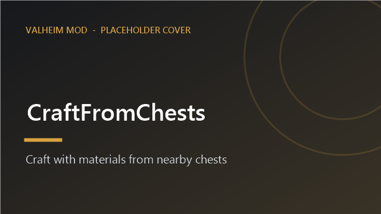
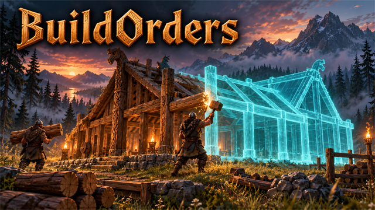

<div align="center">

# ⚒️ Valheim Mods

**Quality-of-life mods for Valheim, built to play nicely together.**
Craft from chests. Build from chests. Plan builds as ghosts with your friends. Recycle the gear you never use.


[](LICENSE)
[](https://github.com/HardHeadHackerHead/valheim-mod-manager)

</div>

---

## 🚀 Get them in one minute

Everything here installs and updates through the in-game **[mod manager](https://github.com/HardHeadHackerHead/valheim-mod-manager)**.
It already knows about this repo, so press **F7** in game, open **Browse** and click **Install**. No downloading DLLs, no restarting the game for most updates.

New to modding? The manager repo has a one-step installer that sets up BepInEx for you.

On **native Linux**, including **Flatpak Steam**, follow the manager's
[Linux installation guide](https://github.com/HardHeadHackerHead/valheim-mod-manager/blob/main/installer/INSTALL-LINUX.md).
The installer lives in the manager repo; this repo contains the gameplay mods.

## 🧰 The mods

<table>
<tr>
<td width="50%" valign="top">

### 📦 CraftFromChests


Crafting stations (and hand-crafting) use materials from nearby chests. See lines to every chest in use and change the range from 5 to 30 m.

</td>
<td width="50%" valign="top">

### 🔨 BuildFromChests


Building with the hammer uses materials from chests near you. The build menu shows how much of everything you own in total.

</td>
</tr>
<tr>
<td valign="top">

### 🔥 FeedFromChests


Feed smelters, kilns, cooking racks, fires and fermenters straight from your chests, and let smelters and kilns run themselves: choose what they use, keep a minimum in stock, and send what they make into your assigned chests.

</td>
<td valign="top">

### 🎒 QualityOfLife


Quick gear sets on **Q**, hammer on **B**, **Stack to chests** with undo, chest assignment on **K**, and item locks on **L**.

</td>
</tr>
<tr>
<td valign="top">

### 👻 BuildOrders


Plan pieces as shared ghost build orders. Your party sees them, you can build one by just walking up and pressing **E**, and a panel totals the materials you still need.

</td>
<td valign="top">

### 🧑‍🤝‍🧑 PartyHud


A party panel with every player's Steam picture, health, stamina and distance, live and at any range.

</td>
</tr>
<tr>
<td valign="top">

### ♻️ Recycler


A buildable Recycler that turns old weapons, armor and tools back into a share of their materials. Build Presses nearby to raise the share.

</td>
<td valign="top">

### 🧪 Your mod here
Want your own mods in the manager? See [Make your own mod repo](#-make-your-own-mod-repo).

</td>
</tr>
</table>

## ⌨️ Keys at a glance

| Key | Mod | What it does |
|---|---|---|
| **F7** | Mod manager | Open the mod manager |
| **Q** | QualityOfLife | Build a quick set (inventory open) / swap to it and back |
| **B** | QualityOfLife | Jump into construction mode with your hammer, and back |
| **K** / **L** | QualityOfLife | Assign what a chest receives / lock an item |
| **E** | FeedFromChests | Open a smelter or kiln menu (auto-feed settings, Add, Fill); add items to other stations |
| **Left Alt** / **E** | BuildOrders | Toggle plan mode (placing then plans a ghost) / build the ghost you walk up to |
| **G** / **Delete** / **F9** / **F10** | BuildOrders | Select a ghost piece / remove a ghost / show or hide ghosts / show or hide the stability colours |
| Hold **E** at a ghost | BuildOrders | Build everything buildable within 12 m, lowest first |
| **F8** | PartyHud | Show or hide the party panel |

Every key and setting is configurable in `BepInEx/config`.

## 🛡️ Playing fair

These mods are about convenience, not cheating. Materials always come out of your inventory or a chest, recycling returns only part of what gear cost, and nothing is created from nothing.

## 🧑‍💻 For developers

```powershell
# build one mod and copy it into BepInEx\scripts, then press F6 in game to hot reload
dotnet build mods/CraftFromChests -c Release

# build everything and write dist/ (mod DLLs, cover images and manifest.json)
.\publish.ps1
```

Linux builds detect common native and Flatpak Steam locations. For a custom
library, set `VALHEIM_DIR` (or pass `-p:ValheimDir=/path/to/Valheim`):

```bash
export VALHEIM_DIR="$HOME/.var/app/com.valvesoftware.Steam/.local/share/Steam/steamapps/common/Valheim"
dotnet build mods/CraftFromChests -c Release
pwsh -NoProfile -File ./publish.ps1   # PowerShell 7; publishing does not deploy to the game
```

Use `-p:DeployToGame=false` to compile without changing the installed mods.
With both repos checked out side by side, after pulling them run:

```bash
python3 ../valheim-mod-manager/installer/install-linux.py --mods-only --mods-repo .
```

This syncs the manager from its repo and gameplay mods from this one. Press F6
after it finishes, or restart if the installer reports a mod that requires it
(such as Recycler).

- Each mod is a folder under `mods/` with its own `.csproj`, `Plugin.cs`, `DESCRIPTION.txt` (first paragraph is the summary, the rest is shown under **Details**), `CHANGELOG.txt` (first paragraph is "what is new") and an optional `cover.png`.
- Bump the `Version` constant in `Plugin.cs` for every change people should get.
- A mod that cannot be reloaded in game gets a `RESTART_REQUIRED.txt` explaining why.
- Set `VALHEIM_DIR` for a custom game library; you do not need to edit shared build settings.
- Release: `.\publish.ps1`, then `git add -A; git commit; git push`.

## 🧱 Make your own mod repo

This repo is a **mod repo**: mod folders plus a `dist/` folder that the manager reads. Anyone can have one.
Copy the `template/` folder from the [mod manager repo](https://github.com/HardHeadHackerHead/valheim-mod-manager/tree/main/template), and to be watched by everyone by default, open a pull request there that adds your repo to `sources.json`.

## 📄 License

[MIT](LICENSE). Mods run inside your game with full access to your PC, so only install code you trust.
