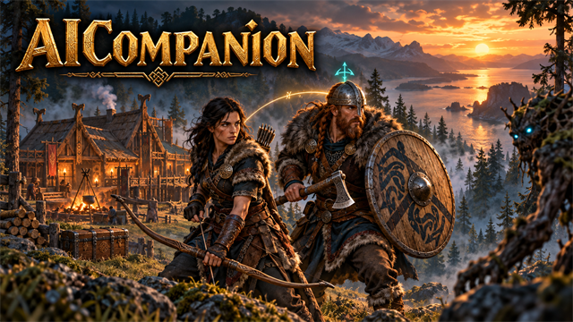
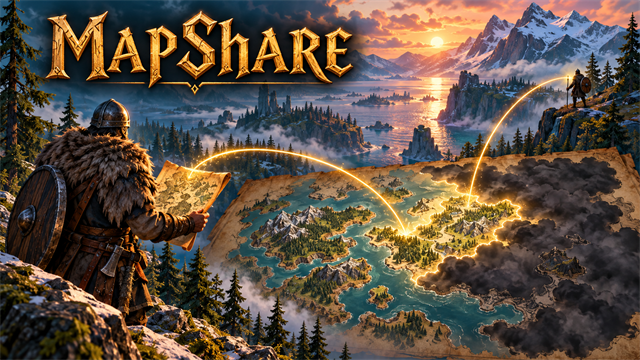
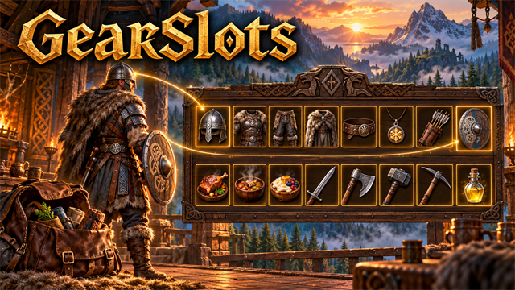
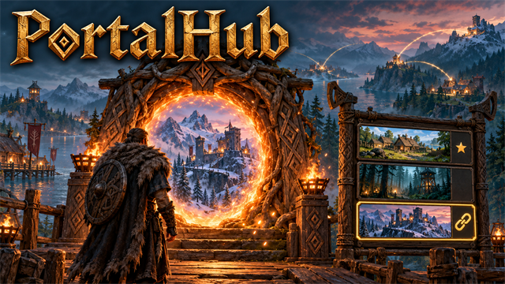
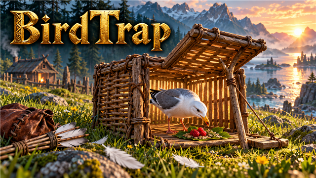
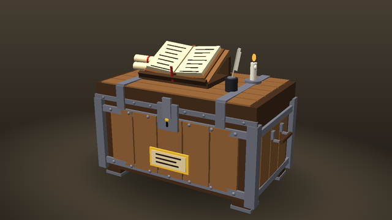
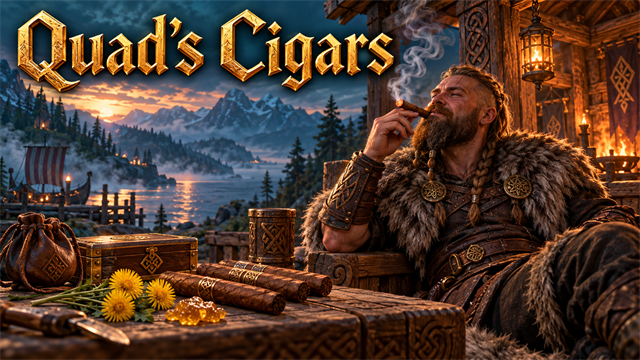
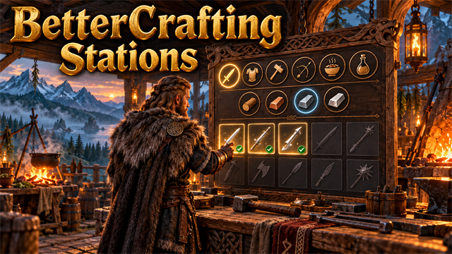
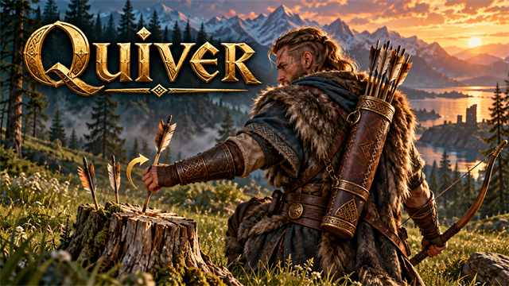

<div align="center">

# ⚒️ Valheim Mods

**Quality-of-life mods, a companion who plays like a player, and new things to build for Valheim, made to play nicely together.**
Craft and build from chests. Bring a viking companion on your adventures. Plan builds as ghosts with your friends. Wear gear from its own slots. Take on group bounties, trap birds for feathers, recycle old gear, link portals from a list, and try your luck at a slot machine.


[](LICENSE)
[](https://github.com/HardHeadHackerHead/valheim-mod-manager)

</div>

---

## 🚀 Install

Everything here installs and updates through the in-game **[mod manager](https://github.com/HardHeadHackerHead/valheim-mod-manager)** (**F7**).
Pick whichever way suits you; all three end the same way.

### Option 1: the one-step installer (Windows, Steam), easiest

It installs BepInEx (the mod loader), ScriptEngine (lets mods reload without restarting), the mod manager and every mod in this repo.
Close Valheim, open **PowerShell** and paste:

```powershell
[Net.ServicePointManager]::SecurityProtocol = [Net.SecurityProtocolType]::Tls12
Invoke-WebRequest "https://raw.githubusercontent.com/HardHeadHackerHead/valheim-mod-manager/main/installer/install.ps1" -OutFile "$env:TEMP\install-valheim-mods.ps1"
powershell -ExecutionPolicy Bypass -File "$env:TEMP\install-valheim-mods.ps1"
```

If it cannot find the game, add `-ValheimDir "D:\SteamLibrary\steamapps\common\Valheim"` to the last line (in Steam: right-click Valheim,
*Manage*, *Browse local files* shows the folder). It is a short script, so you can open it and read it first. With an AI assistant such as
[Claude Code](https://claude.com/claude-code), just ask it to follow
[`installer/INSTALL.md`](https://github.com/HardHeadHackerHead/valheim-mod-manager/blob/main/installer/INSTALL.md) for you.

Then start Valheim from Steam, load a world and press **F7**: the manager lists every mod, installed and up to date.

### Option 2: by hand (you already use BepInEx, or you want to pick and choose)

1. **BepInEx:** install [BepInExPack_Valheim](https://thunderstore.io/c/valheim/p/denikson/BepInExPack_Valheim/): copy the contents of its
   `BepInExPack_Valheim` folder into your Valheim folder (next to `valheim.exe`). Start the game once and close it.
2. **ScriptEngine:** from [BepInEx.Debug releases](https://github.com/BepInEx/BepInEx.Debug/releases) download `ScriptEngine_*.zip` and copy its
   `BepInEx` folder over yours, so you have `BepInEx\plugins\ScriptEngine.dll`. Create the folder `BepInEx\scripts`. Then open
   `BepInEx\config\com.bepis.bepinex.scriptengine.cfg` (start the game once if it is not there yet) and set `LoadOnStart = true` under
   `[General]`; it is off by default, and without it the mods only load after you press **F6**.
3. **The mods:** from [`dist/`](dist/) here download each mod you want, **both** its `.dll` and its `.pdb`, into `BepInEx\scripts`. Take
   `ModUpdater.dll` and `.pdb` from the [manager's `dist/`](https://github.com/HardHeadHackerHead/valheim-mod-manager/tree/main/dist) too, so
   you get updates with **F7** from then on.
4. Start Valheim. In a world, a chat line such as `[Mod]: CraftFromChests v1.3.4 loaded` shows each mod is running.

### Option 3: Linux (native game, standard or Flatpak Steam)

Follow the manager's [Linux installation guide](https://github.com/HardHeadHackerHead/valheim-mod-manager/blob/main/installer/INSTALL-LINUX.md).
The installer lives in the manager repo; this repo contains the gameplay mods.

### Playing together

Every player installs the mods they want for themselves. A few need more than that:

| Mod | Who needs it |
|---|---|
| **AICompanion** | Everyone in the world, **the host too**: without it the game deletes saved companions. |
| **Recycler, BountyBoard, SlotMachine, BirdTrap, LedgerChest, Quad's Cigars, SkalTavern** (new build pieces and items) | Everyone, and **the host above all**: a game without the mod deletes the pieces when their area loads. Restart after installing or updating them. |
| **PortalHub, BountyBoard** | The host (it keeps the portal links and the contracts), and everyone who wants their menus. |
| Everything else | Only the players who want it. |

On a dedicated server, put the host's mods in the server's `BepInEx\scripts` (with BepInEx and ScriptEngine installed there too).

### Updating and removing

- **Update:** press **F7** in game, then **Update all**. Most mods reload on the spot; mods that add build pieces ask you to restart.
- **Remove one mod:** delete its `.dll` and `.pdb` from `BepInEx\scripts` (or click **Disable** in F7).
- **Remove everything:** delete `BepInEx`, `winhttp.dll`, `doorstop_config.ini`, `.doorstop_version` and `doorstop_libs` from the Valheim
  folder (Steam's *Verify integrity of game files* does not remove them). Pieces from mods you remove (a Recycler, a trap) disappear from your world.

## 🧰 The mods

### 🧔 AICompanion: a companion who plays like a player


Press **J** to summon a viking companion. It comes on your adventures and fights like a player: timed parries, rolls out of sweeps, gets round
behind what you are hitting, kites with a bow, drinks the right mead, and follows you through portals, crypts, doors and onto boats. Point with
**H** and it attacks, chops a whole patch of trees, mines, picks things up, sorts its bag into your chests or pulls a cart. Back home it lives its
own life: picks its next upgrade, gathers exactly what it needs, crafts and upgrades at your workbench and forge, hunts, cooks, keeps the fires
burning, repairs your base, sleeps in its bed, takes better gear from your chests, and catches up on all of it while you are away. Its own gear
slots, a journal, small talk, missions, and one-click errands in its menu ("restock food", "gear up", "repair the base"). Give it home duties
in the order you want (keep your chests stocked with good meals, wood and ore; build your BuildOrders plans, fetching or making what a plan
lacks), and while you are away every duty makes progress. Everyone in the world needs it installed.

<table>
<tr>
<td width="50%" valign="top">

### 📦 CraftFromChests


Crafting stations (and hand-crafting) use materials from nearby chests. See lines to every chest in use and change the range from 5 to 30 m.

</td>
<td width="50%" valign="top">

### 🔨 BuildFromChests


Building with the hammer uses materials from chests near you. The build menu shows how much of everything you own in total.

</td>
</tr>
<tr>
<td valign="top">

### 🔥 FeedFromChests


Feed smelters, kilns, cooking racks, fires and fermenters straight from your chests, and let smelters and kilns run themselves: choose what they use, keep a minimum in stock, and send what they make into your assigned chests.

</td>
<td valign="top">

### 🎒 QualityOfLife


Quick gear sets on **Q**, hammer on **B**, a **Sort** button that joins stacks, **Stack to chests** with undo, chest assignment on **K** (look at a chest to see what it receives), **Sort chests** to send everything in the chests around you to the chest assigned it, item locks on **L**, your ships on the map with their own icon, and tap **P** next to a boat to push it.

</td>
</tr>
<tr>
<td valign="top">

### 👻 BuildOrders


Plan pieces as shared ghost build orders. Your party sees them, you can build one by just walking up and pressing **E**, and a panel totals the materials you still need. Pick a blueprint in the Plans window (**F11**), turn its preview into place, and a whole structure appears as ghosts (share blueprints with your friends from the same window): ask an AI assistant to design a fort for you.

</td>
<td valign="top">

### 🧑‍🤝‍🧑 PartyHud


A party panel with every player's Steam picture, health, stamina and distance, live and at any range.

</td>
</tr>
<tr>
<td valign="top">

### ♻️ Recycler


A buildable Recycler, with its own look in the build menu, that turns old weapons, armor and tools back into a share of their materials. Build Presses nearby to raise the share.

</td>
<td valign="top">

### 🗺️ MapShare


Share the map you uncover with everyone in the world, live, as you run through the fog. New players get the whole map when they join.

</td>
</tr>
<tr>
<td valign="top">

### 🛡️ GearSlots


A Gear panel next to your inventory: Head, Chest, Legs, Cape, Belt, Trinket, Ammo and Shield slots (drop gear in and you wear it), three Food slots, and five Quick slots with hotkeys that also show in a row under your hotbar. Your shield follows your one-handed weapon, and worn gear moves into its slot by itself.

</td>
<td valign="top">

### 🌀 PortalHub


Press **E** on a portal and pick where it goes from a list of every portal in the world: nearest first, searchable, with favourites. Every portal shows on the map with lines between linked ones. One click links it both ways, and no more matching names on two portals. (Install it on the host too.)

</td>
</tr>
<tr>
<td valign="top">

### 📜 BountyBoard


A buildable notice board with contracts the whole server works on together: hunt, clear out regions, slay starred creatures or bring in loot, and get paid in coins and materials that match how far you have got (bronze, iron, silver...). Harder contracts as you beat bosses, and a tracker you can keep on screen.

</td>
<td valign="top">

### 🎰 SlotMachine


Odin's Fortune: build a slot machine, put coins in, pull the lever and watch three reels spin. Wins are spat out of the tray, and you can change the bet. It pays back about 93% over time, so it is for fun.

</td>
</tr>
<tr>
<td valign="top">

### 🤖 ClaudeTools


Lets an AI assistant like [Claude Code](https://claude.com/claude-code) see your game and help, through a **request mailbox** of files on your computer: pictures from any angle, ground surveys, your status, inventory, what is nearby and what you look at, the chests around you and what each is assigned, the mods running and their settings, the log, a message on screen or a pin on your map. Other mods add their own commands (BuildOrders: place, check and photograph blueprints). No network port; it never moves your character. Off until you switch requests on.

</td>
<td valign="top">

### 🪤 BirdTrap


A buildable bird trap with its own hand-made look. Bait it with berries or seeds and leave it under the open sky: a gull hops in, the prop
falls and the door drops. Pluck it for feathers and let it go. Birds come while you are away and at first light, so after a night's sleep every
baited trap has its bird. A few traps keep you in arrow feathers.

</td>
</tr>
<tr>
<td valign="top">

### 📒 LedgerChest


A chest you build that shows everything in every chest within 30 m, in the game's own chest window: search it, pick a category button
(Wood, Ores & metals, Food, Weapons...), and click to take what you need from wherever it is. It keeps nothing itself: drop things on it and
each goes on to the chest assigned it (QualityOfLife's **K**), else to a chest with nothing assigned.

</td>
<td valign="top">

### 🚬 Quad's Cigars


Tobacco from the wild plant to the cigar in your mouth. Three strains grow in the Meadows, the Black Forest and the Plains; farm them with the
cultivator, dry the leaves on a rack, age them in a barrel, and roll four kinds of cigar (Connecticut, Maduro, Corojo, Habano) at a Cigar
Rolling Table, with a Humidor for the finer ones. Each has its own status effect, and you are seen smoking it: in your hand, brought up for a
puff, or kept in your mouth when you hold a weapon.

</td>
</tr>
<tr>
<td valign="top">

### 🔧 BetterCraftingStations


Filter chips above the crafting list at every station: pick a type (weapons, armor, tools, ammo, food, potions), how far into the game it is
(wood and flint, bronze, iron, silver...), or just what you can make now, each with how many recipes it has. The list below is the game's own,
narrowed; crafting and upgrading are unchanged.

</td>
<td valign="top">

### 🏹 Quiver


Pick your arrows back up. Those that hit the ground, a tree or a wall are all kept as arrows you pick up; of those that hit a creature, three
in four drop with its loot when it dies. A quiver hangs on your back while you have arrows equipped, with the arrows you carry sticking out of it.
Only you need the mod.

</td>
</tr>
<tr>
<td valign="top">

### 🍺 SkalTavern

Ale and mead that actually get you tipsy. Four drinks from the cauldron (ale, honey mead, blueberry wine, skaldic mead), each the real tankard
in your hand. A little warms you and gives some stamina; more and the view sways and your feet wander; very drunk and you stagger; too much and
you fall, and a big night ends in a hangover. Press **B** to raise a cup: friends who toast with you, and your companions, get a **Skål!** buff.

</td>
<td valign="top">
</td>
</tr>
</table>

## ⌨️ Keys at a glance

| Key | Mod | What it does |
|---|---|---|
| **F7** | Mod manager | Open the mod manager |
| **J** / hold **J** | AICompanion | Summon your companion or open its menu / your companions come with you, or go home |
| **B** | SkalTavern | Raise a cup: toast with friends and companions beside you for a Skål! buff |
| **H** | AICompanion | Point: attack it, chop or mine it (a whole patch), pick it up, put its things in that chest, pull that cart, wait here |
| **E** / Shift + **E** at a bird trap | BirdTrap | Add bait (or pluck the bird) / fill it with bait |
| **Q** | QualityOfLife | Build a quick set (inventory open) / swap to it and back |
| **B** | QualityOfLife | Jump into construction mode with your hammer, and back |
| **K** / **L** | QualityOfLife | Assign what a chest receives / lock an item |
| **E** at a Ledger Chest | LedgerChest | See and search everything in the chests around it; click to take, Shift-click to choose how many |
| **E** at a Bounty Board | BountyBoard | Read the day's notices, take a contract, hand one in |
| **E** / alternate-use + **E** at a slot machine | SlotMachine | Pull the lever / change the bet |
| **E** at a portal | PortalHub | Open the portal menu and choose where it goes |
| **P** | QualityOfLife | Tap or hold next to a boat (not in it) to push it where you look |
| **Z** / **X** / **C** / **V** | GearSlots | Use what is in Quick slot 1 to 4 (equip a weapon or tool, drink a potion); the fifth slot has no key until you set one |
| **E** | FeedFromChests | Open a smelter or kiln menu (auto-feed settings, Add, Fill); add items to other stations |
| **Left Alt** / **E** | BuildOrders | Toggle plan mode (placing then plans a ghost) / build the ghost you walk up to |
| **G** / **Delete** / **F9** / **F10** | BuildOrders | Select a ghost piece / remove a ghost / show or hide ghosts / show or hide the stability colours |
| Hold **E** at a ghost | BuildOrders | Build everything buildable within 24 m (adjustable), lowest first |
| **F11** | BuildOrders | Plans window: place blueprints with a preview, move or remove placed plans, build settings |
| Hammer → **Bridge** | BuildOrders | Click where a bridge starts, walk across, click where it ends: a wooden bridge to build, posts down to the riverbed |
| Wheel / **R** / **PgUp** **PgDn** / click | BuildOrders | While placing a blueprint: turn it / turn 90° / raise or lower it / place it (right-click or Esc cancels); the ground under it is levelled when placed |
| **F12** / **Ctrl+F12** | ClaudeTools | Save a screenshot / survey the ground around where you look, for the AI assistant |
| **F8** | PartyHud | Show or hide the party panel |

Every key and setting is configurable in `BepInEx/config`.

## 🏗️ Let an AI design your builds

BuildOrders can place whole structures from **blueprint** files, and the repo ships what an AI assistant needs to write them: the real size,
material and cost of every building piece, the game's structural-support rules, a stability checker and a worked example. The first time you
play with BuildOrders it writes all of that, with a `CLAUDE.md` guide, into `BepInEx/blueprints`. Start [Claude Code](https://claude.com/claude-code)
in that folder, ask for a fort, a house or a bridge, then open the Plans window (**F11**) in game, pick it and put its green preview where you want it. You still build every piece with real materials.
It can check that a design will stand and draw previews with the game's real shapes. With the **ClaudeTools** mod (and its requests switched on) it can also look at your world, place the blueprint where you are looking, check it and photograph it from every side.
Details are in [`tools/blueprints`](tools/blueprints).

## 🛡️ Playing fair

These mods are about convenience, not cheating. Materials always come out of your inventory or a chest, and recycling returns only part of what gear cost. The two mods that do hand things out are tuned to stay fair: Bounty Board pay follows how many bosses the group has beaten, and the slot machine gives back less than it takes in.

## 🧑‍💻 For developers

```powershell
# build one mod and copy it into BepInEx\scripts, then press F6 in game to hot reload
dotnet build mods/CraftFromChests -c Release

# build everything and write dist/ (mod DLLs, cover images and manifest.json)
.\publish.ps1
```

Linux builds detect common native and Flatpak Steam locations. For a custom
library, set `VALHEIM_DIR` (or pass `-p:ValheimDir=/path/to/Valheim`):

```bash
export VALHEIM_DIR="$HOME/.var/app/com.valvesoftware.Steam/.local/share/Steam/steamapps/common/Valheim"
dotnet build mods/CraftFromChests -c Release
pwsh -NoProfile -File ./publish.ps1   # PowerShell 7; publishing does not deploy to the game
```

Use `-p:DeployToGame=false` to compile without changing the installed mods.
With both repos checked out side by side, after pulling them run:

```bash
python3 ../valheim-mod-manager/installer/install-linux.py --mods-only --mods-repo .
```

This syncs the manager from its repo and gameplay mods from this one. Press F6
after it finishes, or restart if the installer reports a mod that requires it
(such as Recycler, Bounty Board and Slot Machine, which add build pieces).

- Each mod is a folder under `mods/` with its own `.csproj`, `Plugin.cs`, `DESCRIPTION.txt` (first paragraph is the summary, the rest is shown under **Details**), `CHANGELOG.txt` (first paragraph is "what is new") and an optional `cover.png`.
- Bump the `Version` constant in `Plugin.cs` for every change people should get.
- Add-ons can submit ordinary shared ghosts through the versioned [BuildOrders planning API](docs/buildorders-api.md), without changing terrain or duplicating the planner.
- A mod that cannot be reloaded in game gets a `RESTART_REQUIRED.txt` explaining why.
- Set `VALHEIM_DIR` for a custom game library; you do not need to edit shared build settings.
- Mods with hand-made 3D looks (Bounty Board, Slot Machine, Bird Trap) are described as simple shapes in `tools/modelkit`, which draws previews and writes the C# for them; see its README.
- Before writing or changing a mod, read [`docs/modding-pitfalls.md`](docs/modding-pitfalls.md): bugs that cost players their items and buildings, and how to avoid them.
- Release: `.\publish.ps1`, then `git add -A; git commit; git push`.

## 🧱 Make your own mod repo

This repo is a **mod repo**: mod folders plus a `dist/` folder that the manager reads. Anyone can have one.
Copy the `template/` folder from the [mod manager repo](https://github.com/HardHeadHackerHead/valheim-mod-manager/tree/main/template), and to be watched by everyone by default, open a pull request there that adds your repo to `sources.json`.

## 📄 License

[MIT](LICENSE). Mods run inside your game with full access to your PC, so only install code you trust.
