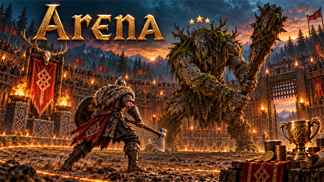
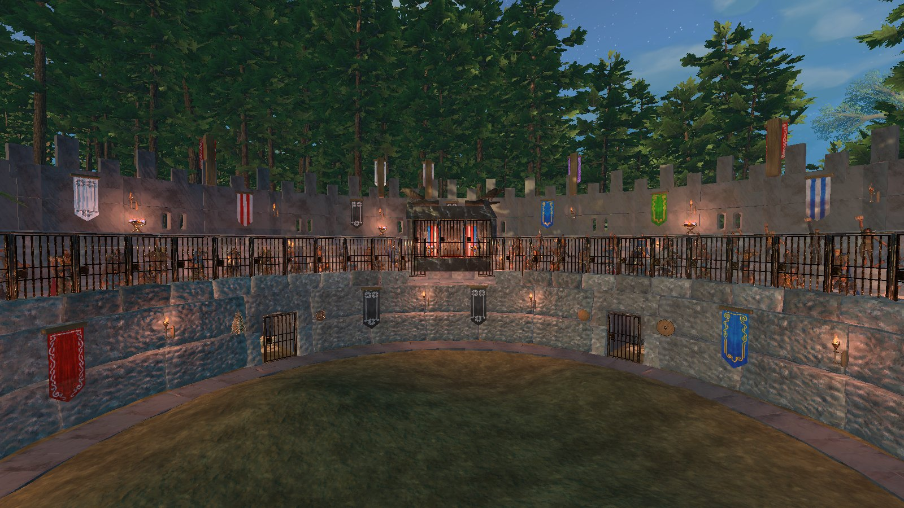
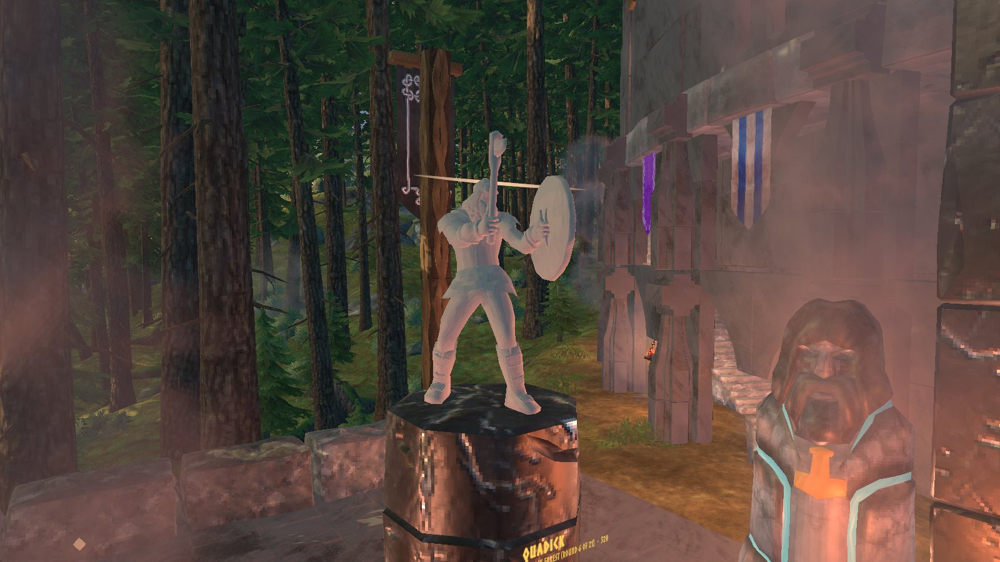
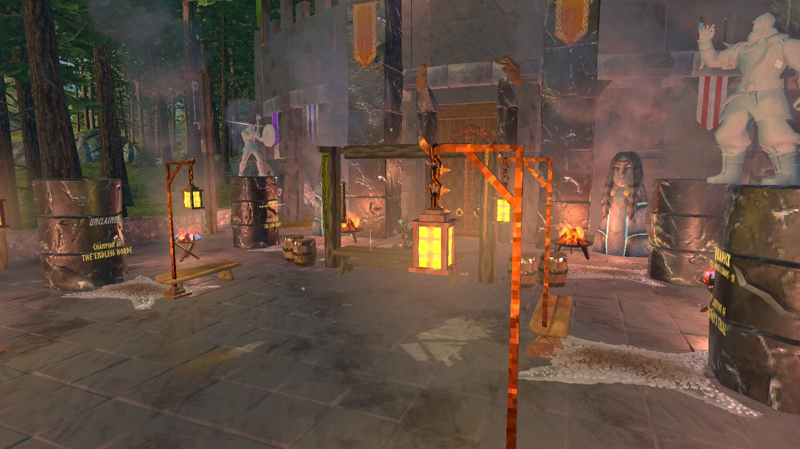
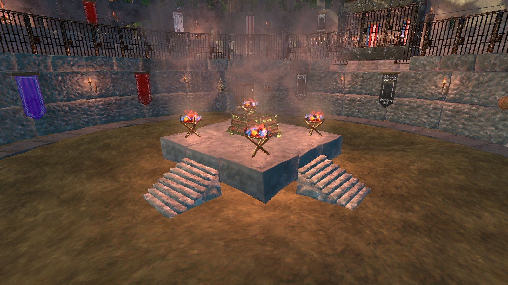
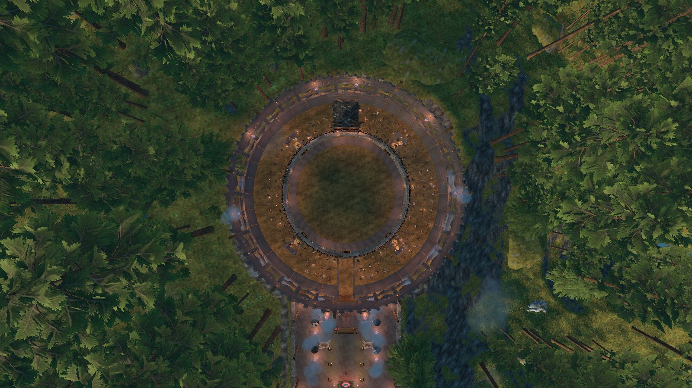

<!-- This page is made by tools/modpages/make_pages.py from the mod's DESCRIPTION.txt, CHANGELOG.txt, settings and the
     repo's README. Change those (or the HAND-WRITTEN part below), not the rest of this page. -->

# 🏟️ Arena

**Version 0.2.3**  ·  [all the mods](../../README.md)  ·  installs and updates through the in-game [mod manager](https://github.com/HardHeadHackerHead/valheim-mod-manager) (**F7**)

A stone colosseum, after the arena of the first Fable, builds itself on open ground in your world. Arena Waystones (hammer, Misc) take you
to its forecourt, where the champions of each contest stand in stone and the **Arena Master** takes your fee. Walk **the Long Road** from the
Meadows to the Ashlands, three rounds in each land with its champion in the third: the Arena Master holds your things, and the arena arms
you from a chest that rises in the ring; the fighters drop coins, and you upgrade your gear as you go from reward chests, the Armourer and the crowd, who also throw the fresh food, so play to them. Or bring your own gear to a **Champion Bout** or the
**Endless Horde**, try **Today's Trial**, or duel a friend for a wager. A crowd fills the stands, cheers, boos and throws you food. Death is
real. Everyone in the world needs it, and restart after installing.

<!-- HAND-WRITTEN: kept when this page is made again -->
## 📸 Screenshots

**The ring: banners, torches and a full house behind the bars**

**The Hall of Fame: a champion in stone on their plinth**

**The forecourt and the Arena Master's desk**

**Between lands: the platform, its braziers and the reward chest**

**From above: the colosseum, its forecourt and gateway**

<!-- END HAND-WRITTEN -->

## 🔍 How it works

The Arena: a great stone colosseum that stands in your world, where you fight for the crowd, for gold and for glory, like the arena in the first Fable.

### What is in it

- The Arena builds itself: the first time the world runs with the mod, it finds flat ground near the middle of the world, clear of everyone's buildings, levels it, clears the trees and puts up a colosseum made of the game's own stone. It is marked on the map, and it is the same for everyone. It cannot be broken, and nothing of it is saved but the levelled ground.
- Arena Waystones (hammer, Misc) take you to its forecourt and back. There stands the Hall of Fame: a stone statue of the champion of each contest (the best run of the Long Road, the Champion Bout, the Endless Horde and Today's Trial in the world), with their names. The Arena Master takes your name at his desk.
- The Long Road: from the Meadows to the Ashlands, three rounds in each land with its champion in the third, as far as you can get. The Arena Master holds everything you carry while you fight. You start in the plainest Meadows gear from a chest that rises in the ring, with whatever weapon the armourer hands you (a knife, an axe, a club, a spear or a bow), and keep it, building it up piece by piece: between lands a reward chest holds a free upgrade and the Armourer stands in the ring, selling upgrades as far as your coin goes (or another kind of weapon), fresh food and meads in the game's own trader window; the crowd throws you gear too. Fighting is hungry work: food burns faster in the ring, and the kitchen's meals are leftovers. The fighters drop coins (no loot): spend them, or walk out with them. Champions drop their trophy and the land's metal. You get your own things back when you come out, or when you rise again if you fall (then what you picked up is lost).
- Today's Trial: one land picked for the day, with its weapon and rules, in the arena's gear; worth half as much again the first time you win it.
- With your own gear: a Champion Bout (one champion, a head taller, as strong as its land allows) or the Endless Horde (wave after wave until you fall or take your purse), against a land your world has reached.
- Each contest costs an entry fee (your first fight is free). The arena's fighters never drop loot.
- You walk in through the main gate and the tunnel; the grate rises, then shuts behind you. The creatures come out of pens behind the grates round the ring. The floor has mounds and dips, and each land brings its own cover: ruins, pillars or stakes. Between lands a platform rises in the middle, with the reward chest on it.
- The crowd fills the stands, turns to watch you, cheers, boos, waves flags and sends a wave round the stands; the announcer calls every round, combo and champion. Their favour grows with kills, quick kills, parries, flawless rounds and close calls, and raises the prize.
- Play to the crowd: the arena's meals are leftovers (they start part spent), so the crowd's gifts matter. Excited, they throw you fresh food and small meads; roaring, the land's best food, bigger meads, arrows and bombs; ecstatic, strong meads, and now and then an upgrade for the gear you wear. Emotes in the ring please them (more with a foe close by, or just after a kill) and they answer in kind; cower and they laugh. Now and then they chant for something (a flex, a roar, a kill now, a perfect parry, not a scratch): answer in time and they go wild.
- Rules make it harder and worth more: bare fists, no food or potions, hard, and against the clock. Stake coins on yourself in a Champion Bout or a trial and a win pays them double.
- Every round you clear adds to your purse; between rounds you can take it and leave. Win and it is paid with a bonus, plus the champion's trophy. Give up mid-round, run out of time or leave the ring and you get half.
- Win a whole contest and it is a show: the crowd on its feet, fireworks over the stands, your name called, a prize chest rising in the ring, and the gate opening for you to walk out.
- Death is real: fall and the purse and stake are lost. You rise again in the forecourt; with your own gear, your tombstone waits for you there.
- Watch: other players climb the stairs in the arches beside the main gate to the stands (or take the waystone up), see the fight and hear the announcer. The main gate opens only for a fighter, and the Arena Master's guards show anyone else off the fighting floor.
- Duels: challenge another player at the Arena Master's desk, both put up a wager and walk into the ring, each taken to their own end of it; after a countdown PvP comes on for the fight (and goes back as it was after). The first to drop to a fifth of their health loses (nobody dies in a duel); the winner takes the pot less a tenth.
- Your titles (Pit Rat to Legend of the Arena), wins and records are kept on your character.

Settings: prizes, entry fees, real death, the map marker, the crowd (how full, gifts, announcer, volume), the yield key.

Everyone in the world needs it installed (the waystone is a building piece, and everyone needs the arena to see it). Restart after installing.

Crowd sounds from OpenGameArt: "Free Crowd Cheering Sounds" by Gregor Quendel (CC-BY 4.0) and "Crowd Shouting" by StarNinjas (CC0).

## ⌨️ Keys

| Key | What it does |
|---|---|
| **E** at the Arena Master | Pick a contest (the Long Road, a Champion Bout, the Endless Horde, today's trial), duel a player, see the champions |
| **Backspace** twice | In a contest: take your purse and leave between rounds (in a round you give up for half of it) |

## ⚙️ Settings

In `BepInEx/config/com.dhack.arena.cfg` (made the first time the game runs with the mod).

**Arena**

| Setting | Default | What it does |
|---|---|---|
| `RewardPercent` | `100` | How big the prizes are (percent). |
| `DeathIsReal` | `true` | You can die in a contest. Your tombstone is carried just outside the ring for you to collect, and the purse and stake are lost. Off: beaten, you are carried out at a third of your health with half your purse. (Duels never kill.) |
| `EntryFeePercent` | `100` | How much it costs to enter a contest (percent of the usual: 150 coins for the Long Road; today's trial 60, a Champion Bout 50 and the Endless Horde 40 in the Meadows, more in each land after). The first fight of a character is free. |
| `RespawnAtArena` | `true` | Fall in a contest and you rise again in the arena's forecourt (not at your bed). |
| `MapPin` | `true` | The Arena is marked on your map. |
| `AllTiers` | `false` | Every land's fighters can be chosen in a Champion Bout or the Endless Horde at once (normally each opens as you beat the boss before it). For trying them out: the arena still pays metals and trophies only from lands your world has reached, and today's trial stays among them. |
| `YieldKey` | `Backspace` | Press twice to give up a contest (you keep what you have earned so far, at a lower rate). |

**Crowd**

| Setting | Default | What it does |
|---|---|---|
| `Gifts` | `true` | When the crowd likes you it throws you things now and then: food and meads, then arrows, bombs and strong meads, and (on the arena's steel) the next land's weapon, more often and better the more they love you. |
| `LeftoverMeals` | `50` | On the arena's steel: how much of its time one of the kitchen's meals (yesterday's leftovers) has left once eaten, percent. 100 is a fresh meal. |
| `RingHunger` | `2.5` | On the arena's steel: how many times faster food burns (fighting is hungry work), so a fresh meal lasts about a land and the crowd's gifts matter. 1 is as outside. |
| `Spectators` | `true` | A crowd fills the stands during a fight. |
| `FullHouse` | `30` | How full the stands are during a fight (percent of the seats). Fewer is lighter on the frame rate. |
| `Announcer` | `true` | The announcer's calls across the top of the screen. |
| `Volume` | `0.5` | How loud the crowd is. |

## 👥 Playing together

Everyone in the world needs it, **the host above all**. It adds a new build piece (the Arena Waystone). Restart the game after updating so it registers cleanly.

## 📜 Changes

- **0.2.3** The arena is dressed for it: a paved border round the fighting floor, shields of old fights flanking every pen's gate, straw, bones and skulls in the pens, torches round the top of the stands and at the stairs for night fights, and a forecourt with a bear rug before the Arena Master's desk, benches, barrels and fires. A champion's entrance comes with a fanfare and a burst of fire at its gate. Duels: walking in, each duellist is taken to their own end of the ring, facing the other, and held there through a five-second countdown; PvP comes on at FIGHT!, stays on (it cannot be switched off mid-fight) and goes back as it was after. Between lands the floor is always the same: a platform in the middle with the reward chest on it, and each land's own cover goes up with its first round. Cover never traps you: put up where you stand, it lifts you onto it or moves you clear. Today's Trial never has the no-food rule (on the arena's gear it left you 25 health), and it and the metals and trophies the arena pays follow the bosses your world has really beaten. The stands over the main gate are whole again.
- **0.2.2** The hollow under the Arena Master's box is filled (nobody falls through the stands there), and you can sit on his throne. Champions are as strong as their land's gear can take: their stars now depend on how much health they have and how hard they hit (a boar or a greydwarf gets both stars, a bear, a troll or an abomination none), with two fighters beside them instead of three. Playing together, another player's game no longer takes away the chest standing in the ring for a fighter, and an Armourer is never left standing after the mod reloads.
- **0.2.1** The arena looks the part: a third storey with windows and masts of banners round the top, columns before every arch, fires hanging in the arches, banners all round, black marble towers at the gate, a canopy over the Arena Master's box and a lantern-lit forecourt with its own gateway. The main gate is a pair of doors that open only for a fighter (and anyone else found on the fighting floor is shown out). The stairs to the stands start clear of the gate's towers, and the hole at their top is closed.
- **0.2.0** The Long Road is a run you build up: start with a random Meadows weapon and the plainest gear, keep it from land to land and build it up piece by piece, from a reward chest and the Armourer (the game's own trader window) between lands, or from the crowd. The fighters drop coins instead of loot; spend them on upgrades, fresh food and meads, or walk out with them. Play to the crowd: food burns faster in the ring and the kitchen's meals are leftovers, so their gifts keep you going, and the more they love you the better they throw; emotes in the ring please them, and they chant for a flex, a kill or a perfect parry. Winning a whole contest is a show (the crowd on its feet, fireworks, your name called, a prize chest). Fall in a contest and you rise again at the arena, with no tombstone in the ring and no death marker on the map. Each land's champion is picked at random from several.
- **0.1.0** New: the Arena. A stone colosseum builds itself in your world: travel there by Arena Waystone, see the Hall of Fame, sign up with the Arena Master and walk the Long Road from the Meadows to the Ashlands on the arena's own steel, fight a Champion Bout, the Endless Horde or Today's Trial for a roaring crowd, a purse and the champion's trophy, or duel a friend for a wager. Death is real, but your tombstone waits in the forecourt.
