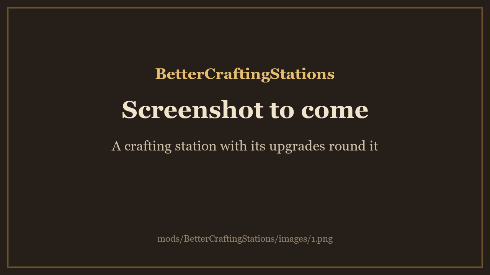
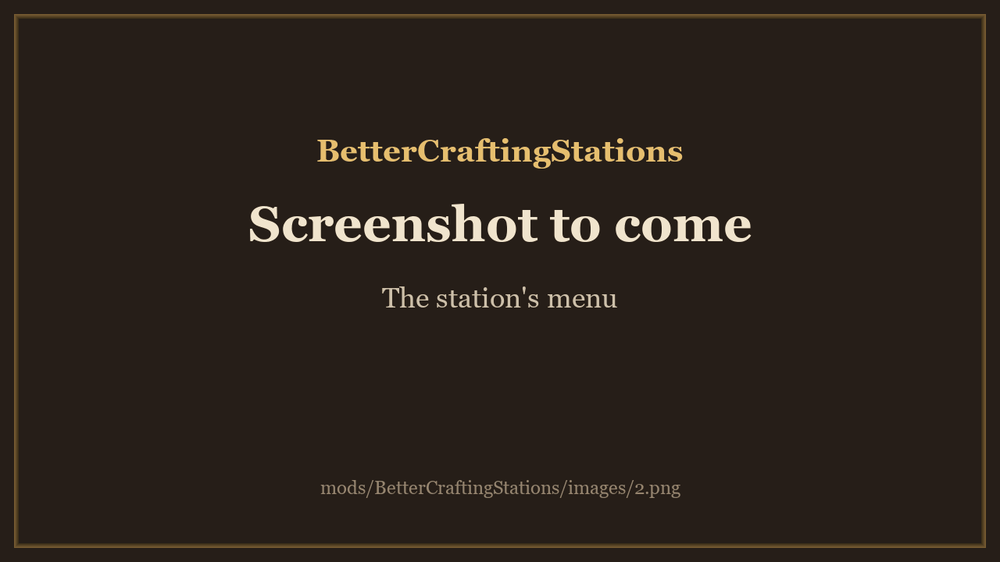

<!-- This page is made by tools/modpages/make_pages.py from the mod's DESCRIPTION.txt, CHANGELOG.txt, settings and the
     repo's README. Change those (or the HAND-WRITTEN part below), not the rest of this page. -->

# 🔧 BetterCraftingStations

**Version 0.1.1**  ·  [all the mods](../../README.md)  ·  installs and updates through the in-game [mod manager](https://github.com/HardHeadHackerHead/valheim-mod-manager) (**F7**)

Filter chips above the crafting list at every station: pick a type (weapons, armor, tools, ammo, food, potions), how far into the game it is
(wood and flint, bronze, iron, silver...), or just what you can make now, each with how many recipes it has. The list below is the game's own,
narrowed; crafting and upgrading are unchanged.

<!-- HAND-WRITTEN: kept when this page is made again -->
## 📸 Screenshots

**A crafting station with its upgrades round it**

**The station's menu**

## ⚠️ Known clashes

- None known. It narrows the game's own recipe list in place (it never swaps the list for another), so other mods that change the list see
  the same one.
<!-- END HAND-WRITTEN -->

## 🔍 How it works

Filter chips above the crafting list: pick a type, a tier or what you can make now.

### What is in it

- At the workbench, forge, cauldron and the other stations, two rows of chips sit above the recipe list. The first row is the type of thing (weapons, armor, tools, ammo, food, potions), with All and Can craft; the second is how far into the game it is (wood and flint, bronze, iron, silver, black metal, Mistlands, Ashlands).
- Each chip shows how many recipes it has, given what the other row has chosen. Click a chip to pick it, click it again to clear it. All clears everything.
- Only what that station makes shows, and each station remembers its own choice while the game runs.
- The list below is the game's own, narrowed: crafting, upgrading and the Upgrade tab are unchanged.

The only setting is Enabled.

## ⚙️ Settings

In `BepInEx/config/com.dhack.bettercraftingstations.cfg` (made the first time the game runs with the mod).

**General**

| Setting | Default | What it does |
|---|---|---|
| `Enabled` | `true` | Show the filter chips above the crafting list. Off, the list is the game's own. |

## 👥 Playing together

See [who needs which mod](../../README.md#playing-together) on the front page.

## 📜 Changes

- Fix: the chips no longer swap the game's recipe list for a new one (other mods that change the list now see what is shown), the chips can't be pressed by the gamepad buttons of the real tabs any more and no longer cause errors every frame, and clicking a chip no longer writes a line to the log.
- New: filter chips above the crafting list at every station: a type (weapons, armor, tools, ammo, food, potions), how far into the game (wood and flint, bronze, iron, silver...) or just what you can make now, each with its count.
