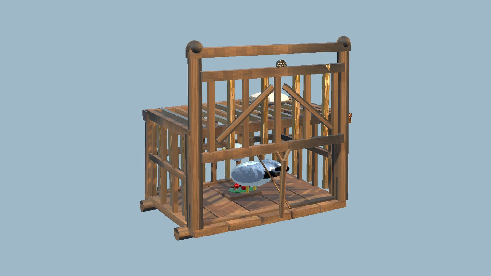
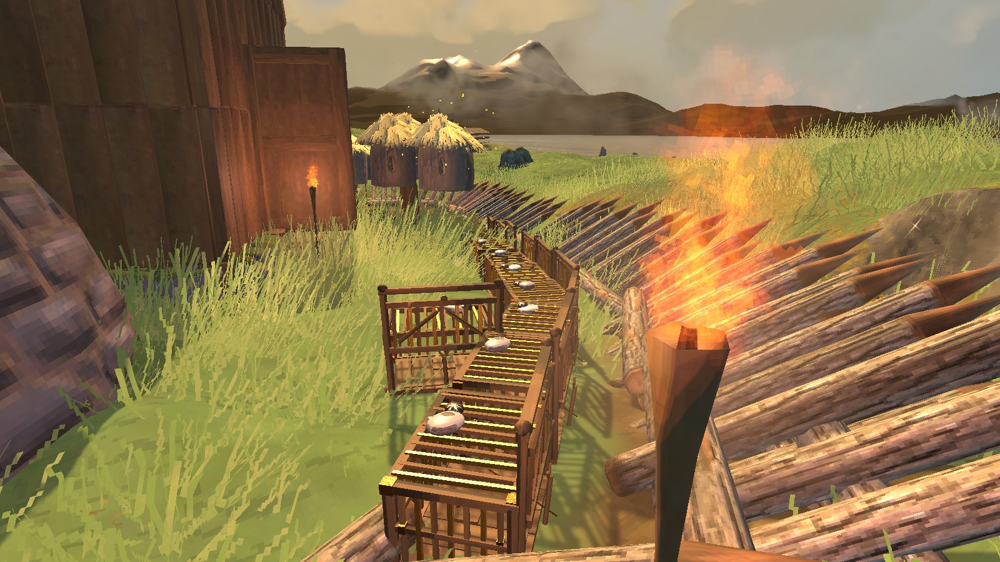

<!-- This page is made by tools/modpages/make_pages.py from the mod's DESCRIPTION.txt, CHANGELOG.txt, settings and the
     repo's README. Change those (or the HAND-WRITTEN part below), not the rest of this page. -->

# 🪤 BirdTrap

**Version 1.0.1**  ·  [all the mods](../../README.md)  ·  installs and updates through the in-game [mod manager](https://github.com/HardHeadHackerHead/valheim-mod-manager) (**F7**)

A buildable bird trap with its own hand-made look. Bait it with berries or seeds and leave it under the open sky: a gull hops in, the prop
falls and the door drops. Pluck it for feathers and let it go. Birds come while you are away and at first light, so after a night's sleep every
baited trap has its bird. A few traps keep you in arrow feathers.

<!-- HAND-WRITTEN: kept when this page is made again -->
## 📸 Screenshots

**The Bird Trap**

**A row of traps along the fence**

<!-- END HAND-WRITTEN -->

## 🔍 How it works

A buildable bird trap: bait it with berries or seeds, leave it under the open sky, and come back to a gull to pluck for feathers.

### How it works

- Build it with the hammer at a workbench (8 Wood, 2 Leather Scraps). It is a slatted box with a drop-door propped up by a stick tied to the bait pedal.
- Use it to put bait in: raspberries, blueberries, cloudberries, barley, or beech, birch, carrot, turnip or onion seeds. Hold the alternate-place key (Shift) and use it to fill it at once. It holds five.
- Baited and with open sky above it, a bird comes in 8 to 14 minutes (game time, so it keeps going while you are away). It eats one bait, the prop falls and the door drops.
- Birds roost at night, and come at first light: sleep through the night and every trap you baited the day before has its bird in the morning. Under a roof none come, and the trap tells you why.
- Use it again to pluck the gull (2 or 3 feathers) and let it go. The door goes back up, and with bait left the next bird is on its way.
- Look at it to see how much bait is left and about how long until a bird. Build a few for a steady supply of feathers for arrows.
- It has its own hand-made look: wicker slats, a drop-door on a forked prop stick, berries on a leaf, and a grey-and-white gull that hops about and pecks once it's caught.

## ⌨️ Keys

| Key | What it does |
|---|---|
| **E** / Shift + **E** at a bird trap | Add bait (or pluck the bird) / fill it with bait |

## ⚙️ Settings

In `BepInEx/config/com.dhack.birdtrap.cfg` (made the first time the game runs with the mod).

**Catching**

| Setting | Default | What it does |
|---|---|---|
| `MinutesMin` | `8` | Shortest wait (real minutes, in game time) from baiting to a bird. |
| `MinutesMax` | `14` | Longest wait (real minutes, in game time) from baiting to a bird. |
| `BaitHeld` | `5` | How many pieces of bait a trap holds (each bird eats one). |
| `NeedsOpenSky` | `true` | Birds only come to a trap with open sky above it (not under a roof). |
| `BirdsRoostAtNight` | `true` | No birds come at night: one due then comes in the morning. |

**Plucking**

| Setting | Default | What it does |
|---|---|---|
| `FeathersMin` | `2` | Fewest feathers a bird gives. |
| `FeathersMax` | `3` | Most feathers a bird gives. |

## 👥 Playing together

Everyone in the world needs it, **the host above all**. It adds a new build piece. Restart the game after updating so it registers cleanly.

## 📜 Changes

- Fix: no more stutter every 5 seconds. Looking for Claude Tools searched everything the game had loaded; it now asks BepInEx's list of mods.
- First version: the Bird Trap. Bait it with berries or seeds under the open sky, and pluck the gull it catches for feathers.
