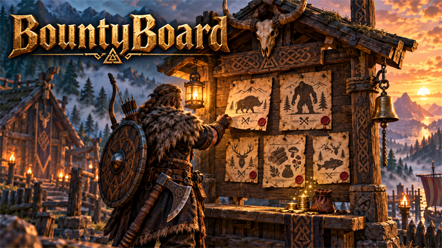
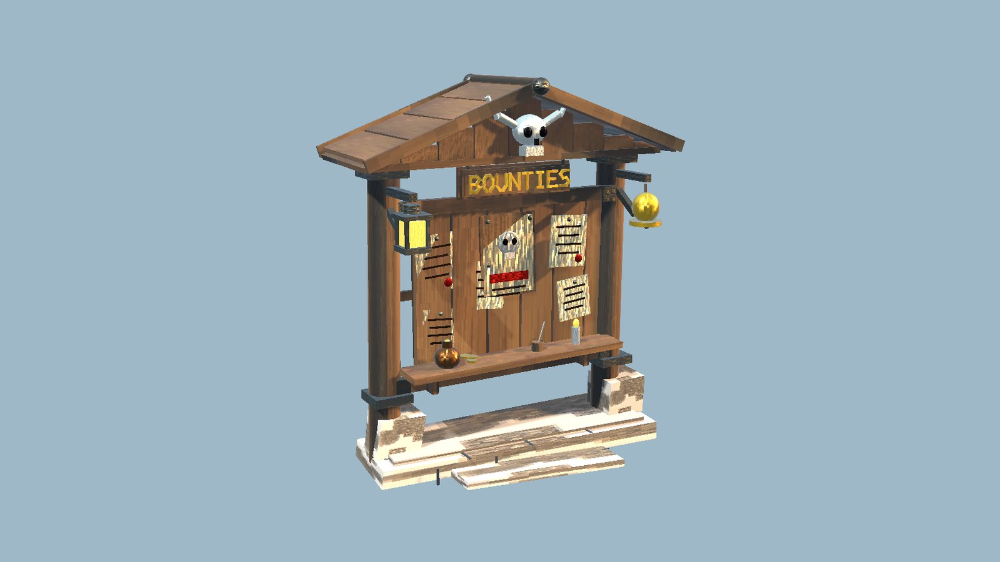
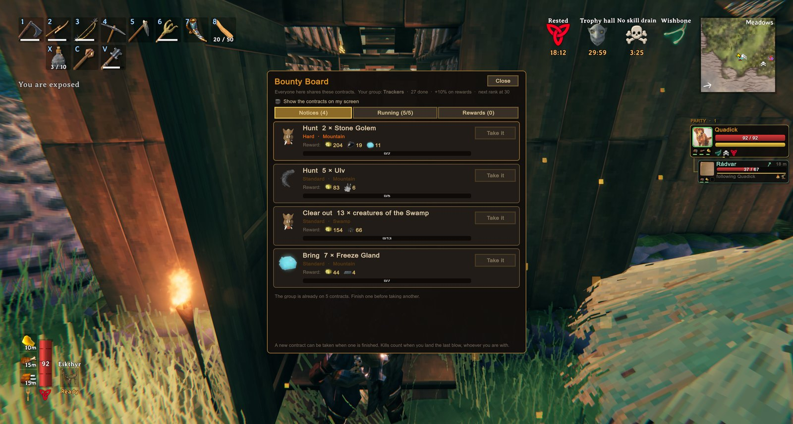

<!-- This page is made by tools/modpages/make_pages.py from the mod's DESCRIPTION.txt, CHANGELOG.txt, settings and the
     repo's README. Change those (or the HAND-WRITTEN part below), not the rest of this page. -->

# 📜 BountyBoard

**Version 1.1.3**  ·  [all the mods](../../README.md)  ·  installs and updates through the in-game [mod manager](https://github.com/HardHeadHackerHead/valheim-mod-manager) (**F7**)

A buildable notice board with contracts the whole server works on together: hunt, clear out regions, slay starred creatures or bring in loot, and get paid in coins and materials that match how far you have got (bronze, iron, silver...). Harder contracts as you beat bosses, and a tracker you can keep on screen.

<!-- HAND-WRITTEN: kept when this page is made again -->
## 📸 Screenshots

**The Bounty Board**

**The day's notices: hunts, clear-outs and fetch jobs**

<!-- END HAND-WRITTEN -->

## 🔍 How it works

A buildable notice board with contracts for the whole group, paid in coins and the materials of the stage you have reached.

### How it works

- Build it with the hammer at a workbench (Wood, Leather Scraps and Flint) and press E on it. Every board shows the same notices.
- Five notices are posted each in-game day: hunt a number of one creature, clear out a region's creatures, slay starred ones, or bring in loot.
- The whole server shares the contracts. The group can run three at a time, and a new one can only be taken when one is finished. Everyone's kills count towards them, and loot is handed in by whoever has it.
- When a contract is finished, every player collects their own reward at a board.
- The further you get, the harder it gets: each boss you beat opens the next region's creatures, and Hard and Brutal contracts (more to kill, better pay) show up more often.
- Rewards are materials you will actually use, matched to progress: resin and flint early, then copper, tin and bronze after Eikthyr, iron after the Elder, silver after Bonemass, black metal after Moder, and on up to Ashlands metals. Coins come too.
- Finished contracts raise the group's rank (Newcomers up to Legends), which adds a bonus to every reward.
- A switch in the board's menu shows the running contracts and their progress on your screen, so you can hunt with them in mind.
- It has its own hand-made look: a gabled roof, a horned skull, a hanging rune sign, pinned notices, a lantern and a bell.

The contracts are kept by the host's game, so BountyBoard has to be installed on the host too.

## ⌨️ Keys

| Key | What it does |
|---|---|
| **E** at a Bounty Board | Read the day's notices, take a contract, hand one in |

## ⚙️ Settings

In `BepInEx/config/com.dhack.bountyboard.cfg` (made the first time the game runs with the mod).

**Contracts**

| Setting | Default | What it does |
|---|---|---|
| `MostAtOnce` | `3` | How many contracts the group can have going at once. A new one can only be taken when one is finished. |
| `RewardPercent` | `100` | Pay as a percentage of the standard rate (50 = half, 200 = double). |

**Notices**

| Setting | Default | What it does |
|---|---|---|
| `DaysBetweenNewNotices` | `1` | How many in-game days before the board posts new notices. |
| `NoticesPerBoard` | `5` | How many notices are posted. |

**Tracker**

| Setting | Default | What it does |
|---|---|---|
| `ShowOnScreen` | `false` | Show the group's contracts and their progress on your screen (also a switch in the board's menu). |
| `X` | `14` | Distance from the left edge of the screen (UI pixels). |
| `Y` | `330` | Distance from the top of the screen (UI pixels). |
| `Scale` | `1` | Size of the tracker. |

## 👥 Playing together

Everyone in the world needs it, **the host above all**. It adds a new build piece. Restart the game after updating so it registers cleanly.

## 📜 Changes

- Fix: after a fresh game start the board was not registered until the mods were reloaded, so the game deleted any it found standing in the world. It is now registered as the world loads. Ones already lost can't be brought back; build them again. Fix: kills by any player now count in multiplayer (before, a kill only counted when the killer's own game was handling that creature). Fix: hosting a different world without restarting the game no longer carries the last world's contracts over and overwrites the new one's. Contracts are now kept by the world's id, so two worlds with the same name no longer share them (your existing contracts carry over).
- The sign on the board now reads BOUNTIES in gold carved letters (the old marks sat too close to the board and partly disappeared). Restart the game to see it on boards already built.
- The on-screen tracker is easier to read: taller progress bars with a larger, outlined 3/6, bigger text and more room between contracts.
