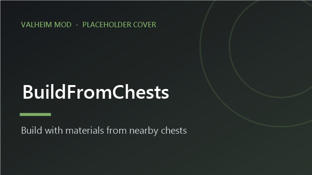

<!-- This page is made by tools/modpages/make_pages.py from the mod's DESCRIPTION.txt, CHANGELOG.txt, settings and the
     repo's README. Change those (or the HAND-WRITTEN part below), not the rest of this page. -->

# 🔨 BuildFromChests

**Version 1.3.0**  ·  [all the mods](../../README.md)  ·  installs and updates through the in-game [mod manager](https://github.com/HardHeadHackerHead/valheim-mod-manager) (**F7**)

Building with the hammer uses materials from chests near you. The build menu shows how much of everything you own in total.

<!-- HAND-WRITTEN: kept when this page is made again -->
## 📸 Screenshots

**Building with the hammer: what each piece needs counts what is in the chests around you**

<!-- END HAND-WRITTEN -->

## 🔍 How it works

Building with the hammer uses materials from chests near you, not just your inventory.

### How it works

- Pieces you place take materials from your inventory first, then from chests within range (default 20 m).
- The build menu shows how many of each material you have in total, so you can see what is possible before you place anything.
- Works together with CraftFromChests; each can be turned off on its own.

Settings: range and whether the counts show.

## ⚙️ Settings

In `BepInEx/config/com.dhack.buildfromchests.cfg` (made the first time the game runs with the mod).

**Display**

| Setting | Default | What it does |
|---|---|---|
| `ShowHaveCounts` | `true` | In the build menu, show how many of each material you HAVE (inventory + chests) next to how many you need. |

**General**

| Setting | Default | What it does |
|---|---|---|
| `Enabled` | `true` | Turn the mod on or off. |
| `Radius` | `20` | How far (in meters) from YOU a chest can be and still be used while building (also for BuildOrders: building its ghosts, hold E to build all, and its fetch key). Raise it to build far from your storehouse: 60 reaches across a big base. Chests only count while their area is loaded around you (about 100 m and more). Takes effect at once. |

## 👥 Playing together

See [who needs which mod](../../README.md#playing-together) on the front page.

## 📜 Changes

- Radius can now be set anywhere from 2 to 150 m (a slider in the configuration manager), and takes effect at once: raise it to build far from your storehouse, for instance a big BuildOrders blueprint at the edge of your base (BuildOrders' ghosts, hold-E build-all and fetch key use the same range).
- Fix: in multiplayer, building with materials from a chest another player had open could lose or duplicate items. Chests in use are now left alone.
- Lets BuildOrders fetch materials from the chests around you into your inventory (a small shared function it leaves for it).
