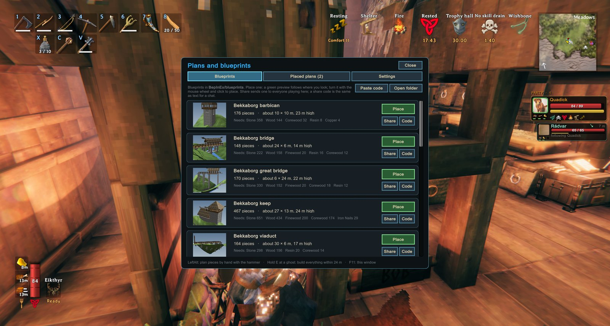
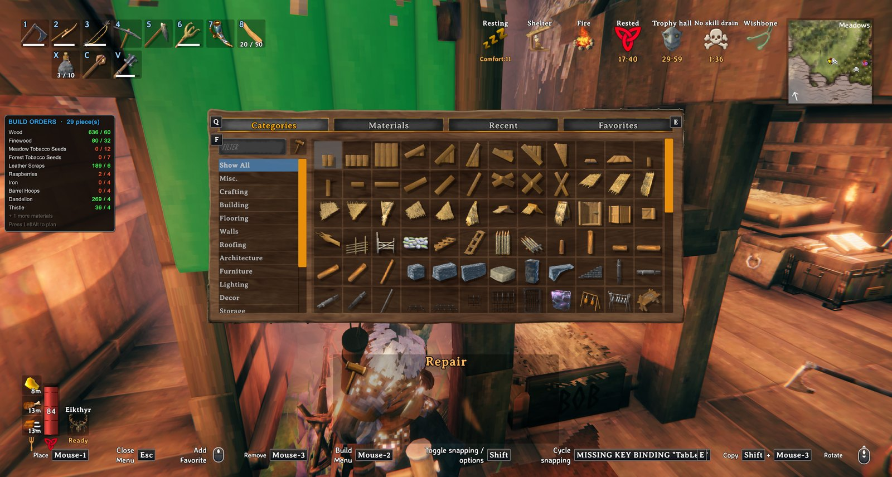

<!-- This page is made by tools/modpages/make_pages.py from the mod's DESCRIPTION.txt, CHANGELOG.txt, settings and the
     repo's README. Change those (or the HAND-WRITTEN part below), not the rest of this page. -->

# 👻 BuildOrders

**Version 1.12.1**  ·  [all the mods](../../README.md)  ·  install it from [Thunderstore](https://thunderstore.io/c/valheim/p/Quads_Lab/Quads_Build_Orders/) (r2modman, Thunderstore Mod Manager) or the in-game [mod manager](https://github.com/HardHeadHackerHead/valheim-mod-manager) (**F7**)

Plan pieces as shared ghost build orders. Your party sees them, you can build one by just walking up and pressing **E**, and a panel totals the materials you still need. Pick a blueprint in the Plans window (**F11**), turn its preview into place, and a whole structure appears as ghosts (share blueprints with your friends from the same window): ask an AI assistant to design a fort for you.

<!-- HAND-WRITTEN: kept when this page is made again -->
## 📸 Screenshots

**The Plans window (F11): blueprints to place, with their size and cost**

**Building a plan: what it still needs, in the corner**

<!-- END HAND-WRITTEN -->

## 🔍 How it works

Plan pieces as shared ghost build orders for everyone in your party, and build them by just walking up and pressing E.

### How it works

- With the hammer out, press Left Alt to turn plan mode on (press it again, or put the hammer away, to turn it off). In plan mode, placing a piece plans it instead of building it. It shows as a see-through ghost that other players see too. (A setting lets you hold the key instead.)
- Walk up to a ghost and tap E to build it: no hammer needed, on land or in the water. It builds even if nothing supports it yet (so you can build the structure around it afterwards). It costs the normal materials, from your inventory and then nearby chests (with BuildFromChests), and needs the piece to be unlocked and the spot not to be protected.
- Hold E at a ghost to build every ghost within 24 m (changeable in the F11 window) that you can afford, lowest first. Short of materials? It builds the part you can pay for, and only pieces that will stand on what is built (so nothing falls and nothing is wasted); come back with more and hold E again to carry on.
- Aiming at a ghost shows what that piece costs, what the whole plan still needs against what you have, and how many pieces holding E would build right now.
- Stability: while planning, ghosts are coloured by how well they would be supported (blue solid, green to red weaker, red would fall), worked out from the same rules the game uses. F10 shows or hides the colours any time, and the prompt says how well the ghost you are looking at would hold. It is an estimate; the game does the real check once a piece is built.
- In plan mode, ghosts act like real pieces: you can aim at them and your next piece snaps onto their snap points, so you can lay out a whole structure with the normal snapping and build it later, piece by piece.
- When you build for real, your placement snaps onto a ghost of the same piece, and the ghost disappears once the real piece is built.
- U selects the piece you are looking at to build more like it, and Delete removes a ghost. F9 shows or hides all ghosts.
- A panel totals the materials your orders still need.

Settings: ghost opacity, view distance, snap distance, how close you must be to build with E, and the keys.

Swimming: your hammer stays out in the water (setting BuildWhileSwimming), so you can plan and build from it. Equip the hammer before you jump in, because the game does not let you equip things while swimming.

Fetching materials: with the hammer out and a piece selected, a hint appears when your inventory is short of materials that the chests nearby have. Press Y (FetchKey) to take one stack of each of those materials out of the chests and into your inventory. It uses BuildFromChests for the chest access, so that mod has to be installed.

### Bridge builder

- Pick Bridge in the hammer's build menu (Misc tab). Click where the bridge starts and walk or swim across (a ghost of it stretches after you, with its length and cost), then click where it ends.
- A Bridge panel opens beside the ghost: width (2, 4 or 6 m), material (wood; core wood, stronger and reaching deeper water; darkwood; stone, with a pillar under every slab and a stonecutter needed), sides (handrails, half walls or none), open or covered (a pitched roof on tall posts), supports down to the riverbed (auto, every 2 m, every 4 m), straight or gently arched, ends (a deck sloping from bank to bank, or a level deck with steps down at the lower end, stopping at the waterline), and torches every 8 m. The ghost changes as you choose and the panel shows what it takes against what you have. Confirm places it; Change end lets you aim the end again; Cancel or Esc drops it. Your choices are kept for next time.
- The deck slopes evenly from end to end (kept above the water, so a pier works too). Build it with E or hold E like any plan; Remove and take-down work as usual. The ground is not levelled, and a bridge is not moved (its posts are cut to the riverbed where it stands). It warns when it is very steep, the water is too deep for the posts, or there is no workbench within reach of an end.

### Plans window (F11)

- Blueprints: your library from BepInEx/blueprints, with each one's size, piece count and materials. Place one and a green preview of the whole structure follows where you look: mouse wheel turns it (Shift for fine steps), R turns it 90°, PgUp/PgDn raise or lower it, Home resets the height, click places it, right-click or Esc cancels. Nothing is built for free.
- Level ground, always: when you place a plan, the ground under all of it is set to its floor height, with a gentle 3 m slope back to the natural ground around it, and painted as dirt (a brown pad shows where in the preview). The ghosts appear once it is done, about a second later. The game moves ground at most 8 m, and warded ground is left alone. It pauses if you walk more than 60 m away. Removing or moving the plan puts the ground back exactly as it was (unless some of it is already built; finishing a build never resets anything). Placed plans also have a Level ground button to level again.
- Placed plans: every plan with its pieces left, how far away and which way, and the materials you have against what it needs. Build nearby builds every ghost within the build-all radius; Move picks the plan up into the preview again so you can put it somewhere better or turn it; Remove takes it away (click twice); if part of it is built, choose Remove ghosts only, or Also take down what is built: those pieces come down as with the hammer and their materials go straight into your inventory (the same materials the game gives back). You can also remove every ghost within a radius you choose, up to 150 m.
- Pictures: every blueprint gets a picture in the Plans window, made in the game from the blueprint itself (or put your own image next to the file, same name, .png or .jpg).
- Sharing: Share on a blueprint sends it (and its picture) to everyone playing with you; it shows up in their Plans window under "Shared with you" (Place, Save to library, Dismiss). Not playing together? Code copies it as a short text code to paste in a chat, and Paste code adds a code to your library. A shared blueprint is only a list of pieces: it never places itself, and you place it where you look.
- Settings: build-all radius (up to 64 m), reach for E, ghost view distance, opacity, how many ghosts show at once, and switches for the main features. Changes save straight away.
- Ask an AI assistant to design a build for you: BuildOrders writes a design guide (CLAUDE.md), every piece's size, snap points, cost and rules, and helper scripts (placing, a stability check, previews) into BepInEx/blueprints. Start Claude Code in that folder, ask for a fort or a house, then place it from the F11 window.
- With the Claude Tools mod installed, an AI assistant can also see your game and place, check, photograph, build and take down blueprints for you through its request mailbox (BepInEx/claude). BuildOrders adds those commands to it by itself; without Claude Tools nothing changes.

## ⌨️ Keys

| Key | What it does |
|---|---|
| **Left Alt** / **E** | Toggle plan mode (placing then plans a ghost) / build the ghost you walk up to |
| **G** / **Delete** / **F9** / **F10** | Select a ghost piece / remove a ghost / show or hide ghosts / show or hide the stability colours |
| Hold **E** at a ghost | Build everything buildable within 24 m (adjustable), lowest first |
| **F11** | Plans window: place blueprints with a preview, move or remove placed plans, build settings |
| Hammer → **Bridge** | Click where a bridge starts, walk across, click where it ends: a wooden bridge to build, posts down to the riverbed |
| Wheel / **R** / **PgUp** **PgDn** / click | While placing a blueprint: turn it / turn 90° / raise or lower it / place it (right-click or Esc cancels); the ground under it is levelled when placed |

## ⚙️ Settings

In `BepInEx/config/com.quad.buildorders.cfg` (made the first time the game runs with the mod).

**Blueprints**

| Setting | Default | What it does |
|---|---|---|
| `ImportKey` | `F11` | Opens the Plans window: place blueprints from BepInEx/blueprints with a preview, see and remove placed plans, change build settings. |

**Bridge**

| Setting | Default | What it does |
|---|---|---|
| `Width` | `2` | Deck width in metres (2, 4 or 6). The last bridge's choices are kept. |
| `Material` | `Wood` | Wood; CoreWood (round logs from pines: stronger, reaches deeper water); Darkwood (needs tar); Stone (stone floors on stone pillars, needs a stonecutter). |
| `Sides` | `Rails` | Rails (posts and a handrail), HalfWalls (a low wall along each side) or None (cheapest). |
| `Roof` | `false` | A roof over the deck on tall posts (a covered bridge). |
| `Supports` | `Auto` | Posts down to the riverbed: Auto (every 2 m in deep water, else 4 m), Every2m (strongest) or Every4m (cheapest). Stone always has a pillar under every slab. |
| `Shape` | `Straight` | Straight from end to end, or Arched (the middle raised in a gentle curve). |
| `Ends` | `Sloped` | Sloped (the deck slopes from one bank's height to the other's) or Steps (a level deck, with steps down at the lower end). |
| `Torches` | `false` | Standing torches along the deck every 8 m (wood and resin). |

**General**

| Setting | Default | What it does |
|---|---|---|
| `Enabled` | `true` | Turn the mod on or off. |
| `ShowGhosts` | `true` | Show the glowing ghosts of planned pieces. |
| `BuildByPressingUse` | `true` | Walk up to a ghost and press E to build it, no hammer needed. It costs the normal materials (from your inventory, then nearby chests if BuildFromChests is installed). |
| `BuildWhileSwimming` | `true` | Keep your hammer in your hand while swimming so you can plan and build from the water (equip it before you jump in: the game does not let you equip things while swimming). |
| `BuildAllRadius` | `24` | Holding E at a ghost (or Build nearby in the Plans window) builds every ghost within this many metres, lowest first, as far as your materials go. In multiplayer the server's value applies. |
| `StabilityInPlanMode` | `true` | Show the stability colours automatically while plan mode is on. |
| `UseReach` | `6` | How close (in metres) you must be to a ghost to build it by pressing E. In multiplayer the server's value applies. |
| `ViewDistance` | `80` | Ghosts further than this many metres away are hidden (saves performance). |
| `MaxGhosts` | `600` | Most ghosts shown at once (the nearest first). Big plans need more; very high numbers can cost frame rate. |
| `SnapDistance` | `1.5` | When you're placing the same piece as a nearby order, your placement ghost snaps onto the order if it's within this many metres. |

**Keys**

| Setting | Default | What it does |
|---|---|---|
| `FetchKey` | `Y` | With the hammer out and a piece selected: press this to take exactly what it needs out of the chests around you (topping you up to one piece's worth, or another piece's worth when you have enough) and put it in your inventory (needs BuildFromChests). |
| `StabilityKey` | `F10` | Show or hide the estimated stability colours on the ghosts (blue = solid, green to red = weaker, red = would fall). |
| `PlanKey` | `LeftAlt` | With the hammer out, press this to turn plan mode on or off (or hold it, see PlanIsToggle). In plan mode, placing a piece records a build order instead of building it. Costs nothing. |
| `PlanIsToggle` | `true` | On: press the plan key once to turn plan mode on, again to turn it off (it also ends when you put the hammer away). Off: plan mode only while the key is held. |
| `SelectKey` | `U` | Aim at a build order and press this to select that piece in your hammer. (Pick a key the game doesn't use: G, the old default, also opens the game's radial menu.) |
| `RemoveKey` | `Delete` | Aim at a build order and press this to remove it. Hold Shift to remove every order within 8 m of it. |
| `ToggleGhostsKey` | `F9` | Show or hide all the ghosts. |

**Look**

| Setting | Default | What it does |
|---|---|---|
| `GhostOpacity` | `0.18` | How solid the ghosts are: 0.05 = barely there, 0.3 = clearly visible, 1 = solid. (Aimed-at ghosts are shown more solid.) |
| `GhostShader` | `` | Advanced: force a particular shader name for the ghosts. Leave blank to pick the best transparent one automatically (the choice is written to the BepInEx log). |

**Panel**

| Setting | Default | What it does |
|---|---|---|
| `AlwaysShow` | `false` | Show the materials panel all the time. Off = only while you're building (hammer equipped). |
| `OffsetX` | `10` | Gap from the left edge of the screen (UI pixels). |
| `OffsetY` | `260` | Gap from the top of the screen (UI pixels). |

## 👥 Playing together

See [who needs which mod](../../README.md#playing-together) on the front page.

## 🤖 Made with AI

Made with the help of Claude (Anthropic), with Claude Code: designed, written and checked together, and tried in the game.

## 📜 Changes

- **1.12.1** A new id, com.quad.buildorders (it was com.dhack.buildorders): your settings move over by themselves the first time it starts, and the old settings file is kept as a backup. Restart the game after this update. If an old copy is still installed beside it, this one stands down and says which file to delete, so the two never both run. The DLL now says it was made with AI, as Thunderstore asks.
- **1.12.0** Fix: removing a levelled plan could bring other buildings down. Putting the ground back now waits until everything standing there has loaded, never touches the ground on or next to any piece (anyone's), and only puts back ground still exactly as the levelling left it (later digging stays); when in doubt the level ground stays. Levelling also leaves the ground under and around pieces already standing there alone. (Plans levelled by older versions keep their level ground.) Fix: with Adventure Backpacks, pressing E on a ghost could build it for free: building by hand now takes the materials first and places the piece only when the full cost was taken (otherwise you get them back). The select key's default is now U (G also opened the game's radial menu; if you keep G it no longer unbinds the radial menu, and if you change it the radial menu gets G back). In multiplayer the server decides UseReach (now 2 to 10 m) and BuildAllRadius. The list of deleted orders forgets ids after 60 days, is saved once per batch and sent compressed to players who join. The windows use the game's fonts, and a game update renaming its ground fields only switches levelling off instead of stopping the mod.
- Fix: no more stutter every 5 seconds. Looking for Claude Tools searched everything the game had loaded; it now asks BepInEx's list of mods.
- New: a blueprint can be made for the land as it is: "level": false in its file places its ghosts straight onto the ground, never levelling it (for builds that follow a hillside or bridge a creek, with posts down to the ground). Placed by its world coordinates, it fits exactly.
- Add-ons can plan a whole building at once: TryCreateBuildingShell takes up to 2,048 pieces, checks every pose, unlock, reach and protected area before adding any ghost (so a bad piece never leaves a partial plan), and undo takes down only what is still a ghost. Also a ghost-ray query and a planning-input check for shape tools (from Bob, for Hallwright and BuildShapes), and the helper hooks a companion uses to build your plans.
- A helper that builds your plans can now ask why pieces cannot be built (DHack.BuildOrders.Blockers): pieces you have not unlocked, pieces whose station is not by them, and pieces on protected ground.
- New: helpers can build your plans. A companion at home (AICompanion 0.21) now builds the ghosts you planned within its home: BuildOrders publishes three small functions (how many pieces are planned near a spot, which to build next, and build one) that never touch your materials; the helper pays for the pieces itself. The pieces it picks are only ones that will stand with what is built, in the order the support runs, exactly as Build all does (that check is now shared).
- **1.9.9** Raise the atomic whole-building planning API and add-on undo bound to 2,048 pieces for larger Hallwright storeys and ornamentation. Validate the complete batch before mutation; the original 256-piece API remains unchanged.
- **1.9.8** Add a bounded atomic whole-building planning API for Hallwright (1–1,024 pieces). Validate all poses, unlocks, reach and protected areas before adding any ghosts; keep the existing 256-piece API unchanged. Add-on undo supports the larger plan and preserves built pieces. Keep completed add-on piece records while matching built pieces remain, so takedown still works after the ghosts are finished or F6 reloads. Include reload-safe planning-input and ghost-ray helpers for BuildShapes. No terrain edits or material consumption.
- Fix: Build all could put up a building that then fell down. Pieces whose station was not near you (stone needs a stonecutter) were counted as if they would be built, so the walls and floors that rest on them went up on nothing. Now a piece whose station is out of reach is left out (and the message says so: "65 need a Stonecutter near you"), and Build all builds in the order the support runs: each piece after the pieces that hold it up, and anything resting on a piece that could not be built waits for it.
- Fix: Build all (hold E, or Build nearby) could build pieces that then fell, taking the rest down with them: a wall over a stone course not yet built (short of stone) counted as standing, because the check went by each ghost's whole outline. It now works out support exactly as the game does: each piece's own colliders, turned with it and grown by 0.15 m, the ground and the pieces inside those, the game's losses over the distance between centres of mass, and a full cascade (what rests on a piece that breaks is worked out again). So Build all only builds what will stand with what is already there; the rest waits until the pieces under it are built. The check also no longer stops at 400 pieces, so the stability colours and the check request cover a big plan whole.
- Fetch from chests (Y) takes exactly what the selected piece needs instead of a whole stack: holding less than one piece's worth, it tops you up to one; holding enough, each press brings another piece's worth. The panel shows only while you are short.
- Fix: the select key (G) also opened the game's radial menu. The game's key for it is now unbound (once, and you are told in chat); bind it again in Settings, Controls if you want it.
- New: a planning API for add-ons (from Bob): other mods can submit shared ghost plans, such as the curves drawn by Bob's BuildShapes, and remove their unbuilt ghosts, without touching terrain or anything built; Move and Level are switched off for those plans. See docs/buildorders-api.md. Also: blueprints can now have up to 5000 pieces (was 1500) and levelling covers bigger sites; for AI-designed builds, the design guide explains the one-time setup that lets previews show pieces as they really look (pip install UnityPy, then python tools/extract_meshes.py), and the export finds your game wherever it is installed.
- Fix: after a fresh game start the Bridge tool was missing from the hammer until the mods were reloaded. Fix: taking down a plan with a full inventory no longer loses the materials (they drop at your feet). Removing a plan from far away no longer loses its levelled ground: it is put back the next time you are near it. Plans still waiting for their ground now survive walking away, dying, logging out or restarting. Plans and their records are now kept per world, so two worlds with the same name no longer mix up their build orders, and reusing a plan name no longer mixes in the old plan's records. Any player can now take down what was built of a plan and get the materials back (the ground is put back by the game of the player who placed it). Placing mode and the Plans window no longer carry over into the next world after a disconnect.
- New: bridge options. After you click where a bridge ends, a panel opens beside the ghost: width (2, 4 or 6 m), material (wood, core wood, darkwood, stone), sides (handrails, half walls or none), open or covered (a roof on tall posts), supports (auto, every 2 m, every 4 m), straight or arched, ends (a sloped deck, or a level deck with steps down at the lower end) and torches. The ghost changes as you choose; Confirm places the plan, Change end lets you aim again. Your choices are kept for the next bridge. The cheapest bridge is 2 m wide wood, no sides, supports every 4 m.
