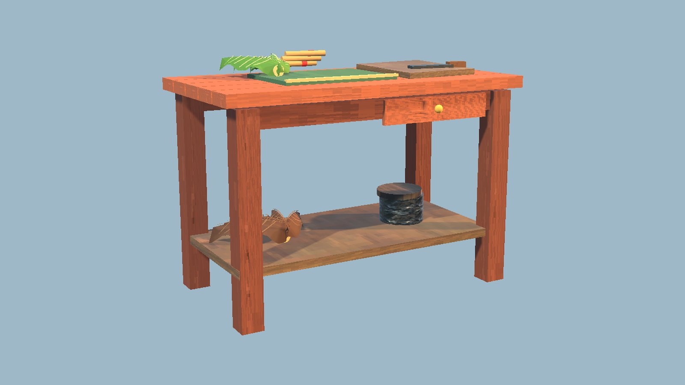
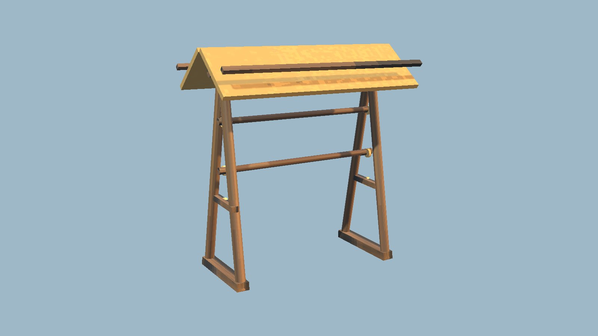
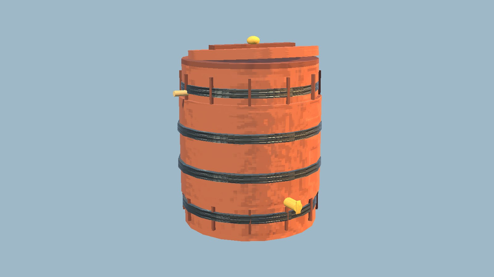
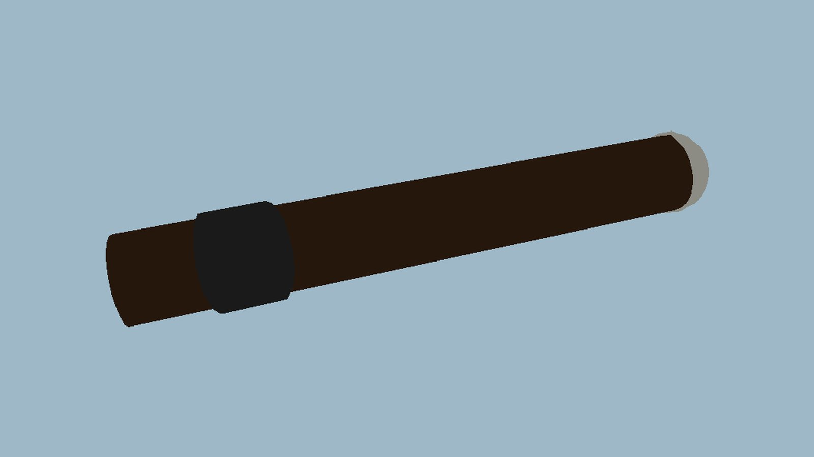
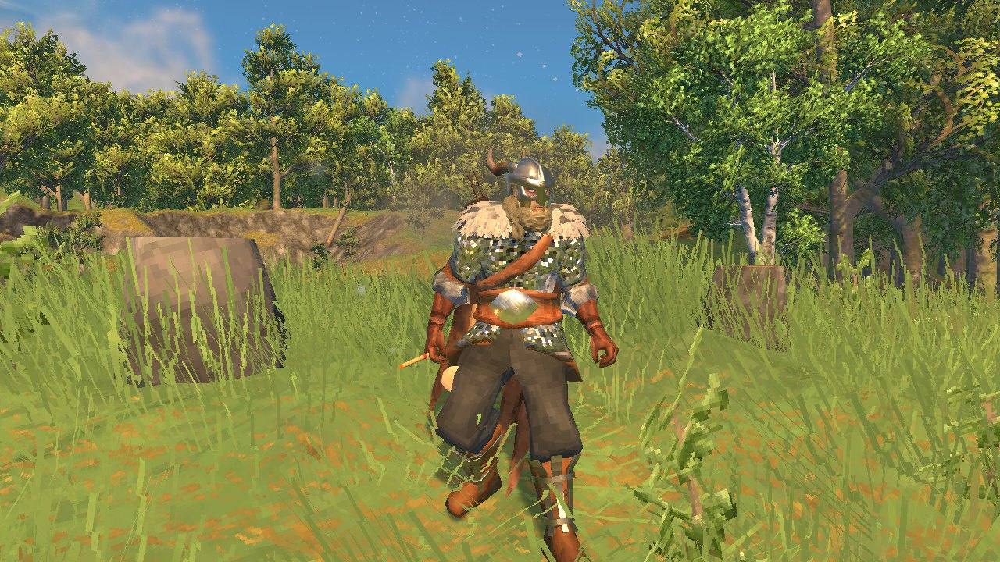

<!-- This page is made by tools/modpages/make_pages.py from the mod's DESCRIPTION.txt, CHANGELOG.txt, settings and the
     repo's README. Change those (or the HAND-WRITTEN part below), not the rest of this page. -->

# 🚬 Quad's Cigars

**Version 0.2.2**  ·  [all the mods](../../README.md)  ·  installs and updates through the in-game [mod manager](https://github.com/HardHeadHackerHead/valheim-mod-manager) (**F7**)

Tobacco from the wild plant to the cigar in your mouth. Three strains grow in the Meadows, the Black Forest and the Plains; farm them with the
cultivator, dry the leaves on a rack, age them in a barrel, and roll four kinds of cigar (Connecticut, Maduro, Corojo, Habano) at a Cigar
Rolling Table, with a Humidor for the finer ones. Each has its own status effect, and you are seen smoking it: in your hand, brought up for a
puff, or kept in your mouth when you hold a weapon.

<!-- HAND-WRITTEN: kept when this page is made again -->
## 📸 Screenshots

**The Cigar Rolling Table**

**The tobacco Drying Rack**

**The Curing Barrel**

**A Maduro cigar**

**Out in the Meadows with a cigar**

<!-- END HAND-WRITTEN -->

## 🔍 How it works

Grow tobacco, cure it, roll your own cigars and smoke them: a real part of the game, from the wild plant to the cigar in your mouth.

### How it works

- Find wild tobacco growing in the Meadows, the Black Forest and the Plains. Each biome has its own strain, a little different in leaf and flower. Picking a plant gives leaves and seeds.
- Sow seeds with the cultivator in cultivated soil. A plant grows tall in about 25 minutes and gives leaves and more seeds. Every strain can be farmed in the Meadows, the Black Forest and the Plains.
- Build a Tobacco Drying Rack: hang fresh leaves on it and take them back dried. Then pack the dried leaves into a Tobacco Curing Barrel to age them.
- Build a Cigar Rolling Table (near a workbench) and roll cigars in the game's own crafting menu. Build a Humidor beside the table to roll the finer cigars.
- Light a cigar from your inventory or hotbar. You smoke for 5 minutes with a cigar in your hand or mouth, an ember and drifting smoke; with a weapon in your right hand it stays in your mouth. Other players with the mod see it too.

The cigars (one at a time; lighting another starts it fresh):
- Connecticut (Dried Meadow Leaf, Resin): Relaxed, stamina regenerates 15% faster.
- Maduro (Aged Forest Leaf, Honey, Resin; needs a Humidor): Smooth, health regenerates 40% faster.
- Corojo (Aged Forest Leaf, Thistle, Resin; needs a Humidor): Shadow, you make less noise and are harder to spot.
- Habano (Aged Plains Leaf, Cloudberries, Resin; needs a Humidor): Fired Up, attacks and sprinting cost less stamina.

Settings: how long a cigar lasts, how strong the bonuses are, how long plants grow and leaves dry and cure, and whether the smoke and glow are drawn.

Wild tobacco only appears in parts of the world you have not visited yet. It adds new items, pieces and plants. Restart the game after installing or updating it.

## ⚙️ Settings

In `BepInEx/config/com.dhack.cigarsmoking.cfg` (made the first time the game runs with the mod).

**Growing**

| Setting | Default | What it does |
|---|---|---|
| `TobaccoGrowMinutes` | `25` | How long a tobacco plant takes to grow (minutes). Needs a restart. |
| `DryingMinutes` | `2` | How long a batch of leaves takes to dry on the rack (minutes). Needs a restart. |
| `CuringMinutes` | `6` | How long a batch of leaves takes to age in the barrel (minutes). Needs a restart. |

**Look**

| Setting | Default | What it does |
|---|---|---|
| `DrawSmoke` | `true` | Draw the smoke curling up from smoking players. |
| `DrawGlow` | `true` | Give the ember a small flickering light (nice at night). |

**Smoking**

| Setting | Default | What it does |
|---|---|---|
| `Minutes` | `5` | How long one cigar lasts (minutes). |
| `EffectStrength` | `100` | How strong the cigars' bonuses are (percent of the default). 0 for none. |

## 👥 Playing together

Everyone in the world needs it, **the host above all**. It adds a new item. Restart the game after updating so the Cigar registers cleanly (a Cigar in your bag or on the ground is lost if the game starts without the mod).

## 📜 Changes

- **0.2.2** Public smoking API v1 lets add-ons register status-effect names and share the one-active-smoke rule with cigars. Lighting a cigar stops registered pipe effects; add-ons can stop cigars before lighting. Registrations belong to the live plugin and are re-established after reloads.
- Fixes: a Drying Rack or Curing Barrel you built had nothing to turn leaves into (its list was only on the build-menu copy), so it took no leaves: it now works from the strains themselves. Tobacco items dropped on the ground could not be picked up (now on the item layer). When your bag is full, the rest of what a rack, barrel or plant gives you lands at your feet as a stack (it used to drop one and lose the rest), with a message. Leaves taken from a rack or barrel count from any world level. And a model that ever comes out with invalid points (seen once at game start) is made again, with a note in the log naming it.
- New: a whole tobacco system. Three strains grow wild in the Meadows, Black Forest and Plains and can be farmed with the cultivator. Dry leaves on a Drying Rack, age them in a Curing Barrel, and roll four kinds of cigar (Connecticut, Maduro, Corojo, Habano) at a Cigar Rolling Table, with a Humidor for the finer ones. Each cigar has its own look and status effect. Smoking now holds the cigar in your hand and brings it up for a puff.
