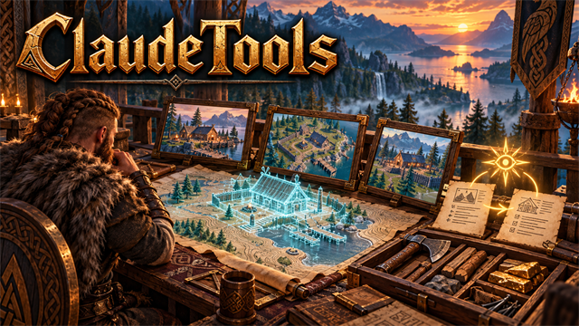
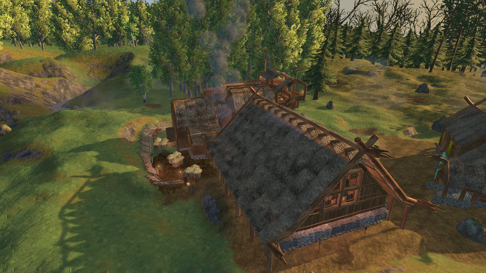
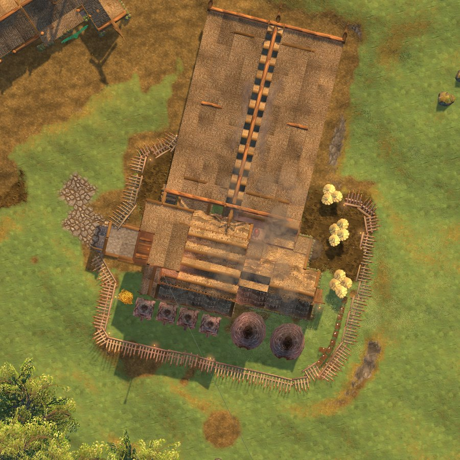

<!-- This page is made by tools/modpages/make_pages.py from the mod's DESCRIPTION.txt, CHANGELOG.txt, settings and the
     repo's README. Change those (or the HAND-WRITTEN part below), not the rest of this page. -->

# 🤖 ClaudeTools

**Version 1.2.1**  ·  [all the mods](../../README.md)  ·  installs and updates through the in-game [mod manager](https://github.com/HardHeadHackerHead/valheim-mod-manager) (**F7**)

Lets an AI assistant like [Claude Code](https://claude.com/claude-code) see your game and help, through a **request mailbox** of files on your computer: pictures from any angle, ground surveys, your status, inventory, what is nearby and what you look at, the chests around you and what each is assigned, the mods running and their settings, the log, a message on screen or a pin on your map. Other mods add their own commands (BuildOrders: place, check and photograph blueprints). No network port; it never moves your character. Off until you switch requests on.

<!-- HAND-WRITTEN: kept when this page is made again -->
## 📸 Screenshots

**A picture the assistant took with its own camera, over your base**

**Straight down over a place (the top command)**

<!-- END HAND-WRITTEN -->

## 🔍 How it works

Lets an AI assistant like Claude Code see your game and help you, through files on your computer: no network port, and it only moves your character or presses keys for you (the shoot command, for screenshots) where the game allows cheats.

### How it works

- The assistant writes a request (a text file of commands) into BepInEx/claude/requests. While you are in a world, the game carries it out and writes the answer next to it. Pictures go to BepInEx/claude/shots.
- It can take pictures (your view, a separate camera anywhere, all round a place, straight down), survey the ground, and find out your status, inventory, what is nearby, what you are looking at, which mods are running, their settings and the log. It can show you a message and put a pin on your map.
- Other mods add their own commands. With BuildOrders, the assistant can design blueprints, place them, photograph and check them.
- F12 saves a screenshot for the assistant; Ctrl+F12 surveys the ground where you look.
- For mod makers: modcheck <mod> before a release (mistakes that lose players' things or break other mods), who and clashes (which popular mods change the same things as yours), game (the game's real code instead of guesses) and gameupdate (what a game update broke). Skills for Claude Code and modkit (the same commands with the game closed) are written to BepInEx/claude. What the top 100 Thunderstore mods patch is built in; DownloadMods keeps it fresh and keeps their code to read on your computer (never loaded, never shared). Type claude <command> in the game's console (F5) to run any command yourself.
- The assistant's guide is written to BepInEx/claude/CLAUDE.md: start Claude Code in that folder (or in BepInEx/blueprints to design builds).

Requests are off until you switch AllowRequests on (BepInEx/config/com.dhack.claudetools.cfg). Changing mods' settings by request needs AllowConfigChanges as well. Only switch requests on while you work with an assistant.

## ⌨️ Keys

| Key | What it does |
|---|---|
| **F12** / **Ctrl+F12** | Save a screenshot / survey the ground around where you look, for the AI assistant |

## ⚙️ Settings

In `BepInEx/config/com.dhack.claudetools.cfg` (made the first time the game runs with the mod).

**Keys**

| Setting | Default | What it does |
|---|---|---|
| `ScreenshotKey` | `F12` | Save a screenshot (and where you stand and look) into BepInEx/claude/shots for the assistant. |
| `SurveyKey` | `F12 + LeftControl` | Write the ground heights, water and buildings around where you look into BepInEx/claude/_survey.json. |
| `SurveyRadius` | `24` | How far a survey reaches (metres). |

**Library**

| Setting | Default | What it does |
|---|---|---|
| `DownloadMods` | `false` | Keep a library of the most-downloaded Valheim mods on Thunderstore in BepInEx/claude/library: what each one patches in the game, and a code-only copy of its DLL (never loaded or run). For seeing which mods change the same things as yours. Downloads only the DLLs. |
| `TopMods` | `10` | How many of the most-downloaded mods to keep (mod managers, BepInEx and modpacks don't count). |
| `RefreshDays` | `7` | Check for new versions and a new top list after this many days. |
| `AlsoKeep` | `` | More mods to keep whatever their rank, as Namespace-Name separated by commas (e.g. Azumatt-AzuCraftyBoxes, Vapok-AdventureBackpacks). |
| `Skip` | `ebkr-r2modman, denikson-BepInExPack_Valheim, Kesomannen-GaleModManager` | Packages that are not mods, left out of the top list (Namespace-Name, separated by commas). |

**Requests**

| Setting | Default | What it does |
|---|---|---|
| `AllowRequests` | `false` | Carry out request files an AI assistant drops into BepInEx/claude/requests (pictures, surveys, what you carry and see, and commands other mods add, such as placing blueprint ghosts). Only files on this computer can do this; nothing moves your character or presses keys. Turn it on while you work with an assistant. |
| `AllowConfigChanges` | `false` | Also let requests change mods' settings (config set). Reading settings is always allowed. |

## 👥 Playing together

See [who needs which mod](../../README.md#playing-together) on the front page.

## 📜 Changes

- New: shoot, for setting up screenshots of a mod: find pieces, stand the player somewhere looking somewhere, open the inventory, map, build menu or a mod's window, close them all, hide the HUD (moved here from Arena's own tools). shoot tp and shoot use only work where the game allows cheats. New: objects <prefab>: every object of a kind in the world, loaded or not, and objects <prefab> remove to delete them (where cheats are allowed). The pre-release check is now modcheck (BuildOrders already has a check).
- New, for mod makers: tools that keep a mod from breaking players' games or other mods. modcheck <mod> (a pre-release check of a mod's DLL: mistakes that have lost players' items and buildings or broken other mods, with why and how to fix), who <method> and clashes (which installed and popular mods change the same things, most likely clashes first), game <Type.Method> (the game's real code: signatures, callers, fields) and gameupdate (after a game update: which methods changed and which mods patch them). What the top 100 Thunderstore mods patch is built in (facts only, no code); DownloadMods keeps it fresh, and library get <mod> fetches any other mod's code to read. Six skills for Claude Code (starting a mod, the game's code, other mods, pitfalls, releasing, fixing errors) and modkit, the same commands as a program for when the game is closed, are written to BepInEx/claude. A clashes report is made after each launch, and claude <command> in the game's console (F5) runs any command.
- Faster: mods and waitfor read BepInEx's list of mods instead of searching everything the game has loaded. The guide for mod makers shows the fast way to find Claude Tools.
- New: comfort: the comfort level a set of pieces would give together (with each piece's comfort and comfort group, as the game counts them), or the player's comfort now and the pieces giving it.
- New: give <item> (put an item in your bag), use <item> (use one from your bag, as a double-click does) and grow <seconds> (age nearby plants) for trying out a mod's new items and plants. Fix: chests failed for everyone when a chest near you was not set up yet (no inventory): it is skipped now.
- New: colliders (each piece's solid colliders as the game's support check sees them, its centre of mass and material) and support (built pieces near a place with the support the game gives them now, weakest first): for checking that a build will stand, and why a piece fell. inspect now lists each part's colliders and their sizes too (how a player measures: a capsule 0.98 m across, 1.85 m tall).
- chests (the chests around you: contents, QualityOfLife assignment, whose) and chestrule (set a chest's assignment, nothing in it touched).
- New: render (a picture of any piece, item or creature on its own, with its real materials, from any angle or close up, without placing it), inspect (what an object is made of), errors (new errors since the last check) and waitfor (wait until a rebuilt mod has reloaded).
- First version: the request mailbox (BepInEx/claude/requests), pictures, surveys, status, inventory, nearby, looking, mods, settings, log, messages and map pins, and commands added by other mods (BuildOrders adds its blueprint commands).
