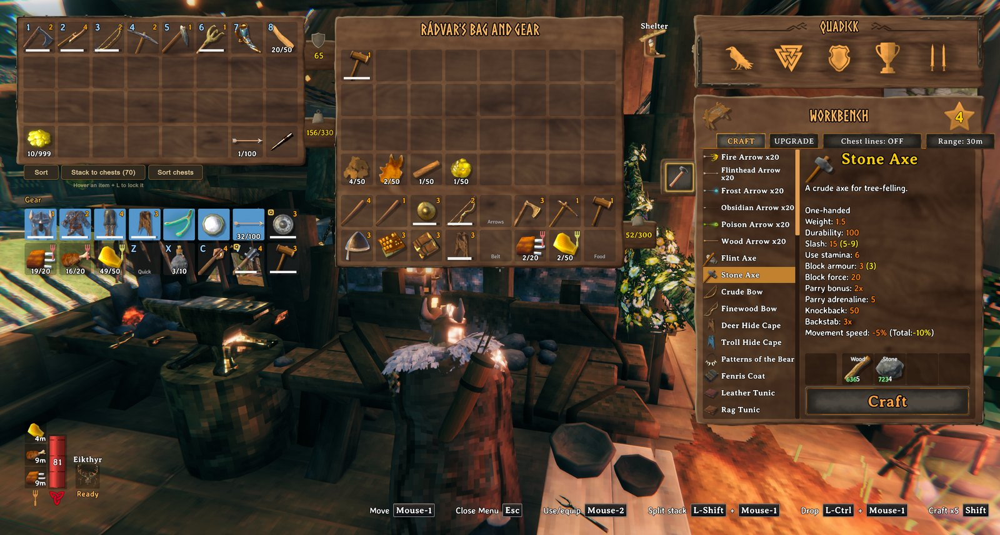
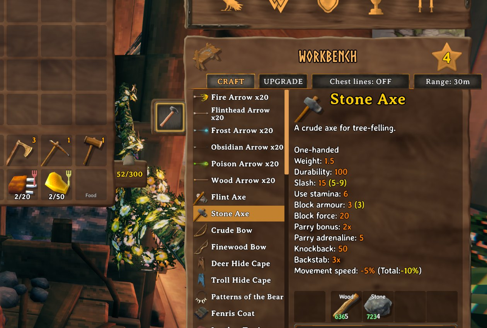

<!-- This page is made by tools/modpages/make_pages.py from the mod's DESCRIPTION.txt, CHANGELOG.txt, settings and the
     repo's README. Change those (or the HAND-WRITTEN part below), not the rest of this page. -->

# 📦 CraftFromChests

**Version 1.3.4**  ·  [all the mods](../../README.md)  ·  installs and updates through the in-game [mod manager](https://github.com/HardHeadHackerHead/valheim-mod-manager) (**F7**)

Crafting stations (and hand-crafting) use materials from nearby chests. See lines to every chest in use and change the range from 5 to 30 m.

<!-- HAND-WRITTEN: kept when this page is made again -->
## 📸 Screenshots

**The workbench: Chest lines and Range beside the tabs, and the materials counted from the chests**

**Close up: the buttons and the counts**

<!-- END HAND-WRITTEN -->

## 🔍 How it works

Crafting stations, and hand-crafting from your inventory, use materials from nearby chests.

### How it works

- Anything you can reach within the range counts toward a recipe. The game takes the materials from your inventory first, then from the chests.
- The crafting menu shows how many of each material you have in total.
- A Chest lines button beside the crafting tabs draws lines from the station to every chest in use; a Range button cycles the distance (5 to 30 m).

Settings: range (default 20 m), whether counts and lines show, and the position and size of the buttons.

## ⚙️ Settings

In `BepInEx/config/com.dhack.craftfromchests.cfg` (made the first time the game runs with the mod).

**Display**

| Setting | Default | What it does |
|---|---|---|
| `ShowHaveCounts` | `true` | In the crafting window, show how many of each material you HAVE (inventory + chests) next to how many you need. |
| `ShowLines` | `false` | Draw lines from the crafting station to every chest it can use. |
| `ToggleOffsetX` | `0` | Move the 'Chest lines' button horizontally from its default spot beside the Upgrade tab (UI pixels). |
| `ToggleOffsetY` | `0` | Move the 'Chest lines' button vertically (UI pixels). Negative = down. |
| `ToggleScale` | `1` | Size multiplier for the 'Chest lines' button. |
| `ToggleWidth` | `2` | 'Chest lines' button width as a multiple of the Upgrade tab's width. |
| `RangeButtonWidth` | `1.4` | 'Range' button width as a multiple of the Upgrade tab's width. |

**General**

| Setting | Default | What it does |
|---|---|---|
| `Enabled` | `true` | Turn the mod on or off. |
| `Radius` | `20` | How far (in meters) from the crafting station a chest can be and still be used. |

## 👥 Playing together

See [who needs which mod](../../README.md#playing-together) on the front page.

## 📜 Changes

- Fix: in multiplayer, crafting with materials from a chest another player had open could lose or duplicate items. Chests in use are now left alone.
- Smoother: the crafting-screen buttons are only looked after while the inventory is open and aren't repositioned every frame, and the chest checks are worked out once and reused (no more stutter when opening the inventory). Hand-crafting from the inventory uses nearby chests, and the crafting window shows how many of each material you have.
