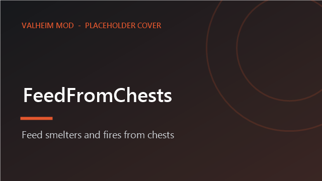
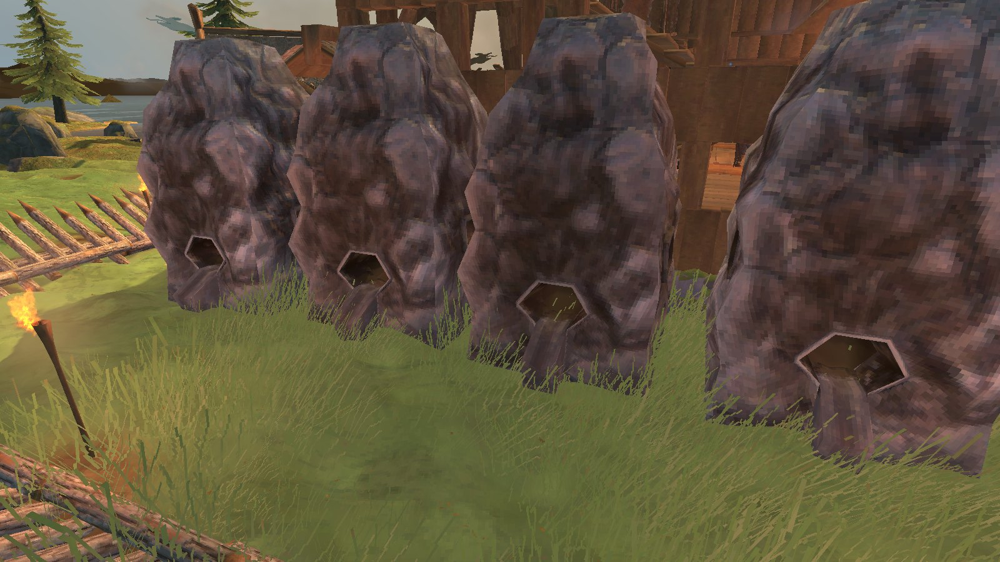

<!-- This page is made by tools/modpages/make_pages.py from the mod's DESCRIPTION.txt, CHANGELOG.txt, settings and the
     repo's README. Change those (or the HAND-WRITTEN part below), not the rest of this page. -->

# 🔥 FeedFromChests

**Version 1.6.1**  ·  [all the mods](../../README.md)  ·  install it from [Thunderstore](https://thunderstore.io/c/valheim/p/Quads_Lab/Quads_Feed_From_Chests/) (r2modman, Thunderstore Mod Manager) or the in-game [mod manager](https://github.com/HardHeadHackerHead/valheim-mod-manager) (**F7**)

Feed smelters, kilns, cooking racks, fires and fermenters straight from your chests, and let smelters and kilns run themselves: choose what they use, keep a minimum in stock, and send what they make into your assigned chests.

<!-- HAND-WRITTEN: kept when this page is made again -->
## 📸 Screenshots

**A row of smelters that feed themselves from the chests round them**

## ⚠️ Known clashes

- **ValheimPlus** with `autoDeposit` on for a smelter, kiln or the like: handled. ValheimPlus puts the output in a chest first and this mod
  then leaves it alone (before 1.6.0 both did, and the output was doubled). The same for mead from a fermenter and food from a cooking station
  when another mod delivers it.
- **CraftFromChests**, **BuildFromChests** (ours), **Adventure Backpacks**: fine together; each pays only what the others left.
- What a station makes goes only into chests a player assigned to it (by item or kind, with the chest assign menu, K, from QualityOfLife);
  with no such chest it drops as in the game.
- Only built chests are used: graves, carts, ships, a companion's bag and chest, and a backpack you carry are left alone.
<!-- END HAND-WRITTEN -->

## 🔍 How it works

Smelters, kilns, cooking racks, fires and fermenters can use items from nearby chests, and smelters and kilns can run themselves.

### How it works

- Press E at a smelter, kiln or furnace to open its menu, whatever you are carrying. Add 1 and Fill put items in by hand; the Auto-feed panel at the top sets the station up to feed itself.
- The menu also shows what is loaded inside: the ore waiting in the queue, the fuel, and anything ready to collect. The same line appears when you look at the smelter.
- Auto-feed: turn it on, tick which items it may use (for a kiln, just plain wood to start with, and tick fine wood, core wood and so on if you want them used), and it keeps itself stocked from the chests nearby. Coal comes first, then the lowest-tier item you ticked.
- Limits that fit the station: a kiln makes coal until the chests hold 100 (or what you set); a smelter always leaves some coal; a windmill always leaves 20 barley for planting; ovens, spits and fermenters stop once you have enough of each food or mead. The menu says why each item is or is not being fed.
- Output to chests: what the station makes goes into the chests assigned to that item (the chest assign menu from QualityOfLife, K), nearest first. With none assigned it drops on the ground as usual.
- Cooking stations (spit, iron spit, oven): food that is done comes off by itself, so it never burns: into a chest assigned to it or to Food, else it slides off the side of the spit towards you. E takes everything that is done into your inventory, or opens the menu (what is cooking, Add 1 / Fill, auto-feed with the raw food you tick). Alternate-place key + E puts food on by hand.
- Torches, sconces and braziers keep themselves lit: when one has room for more resin or coal, it takes one from a chest near it. One setting for all of them (on); campfires and hearths can do the same with wood (off unless you turn it on). They always leave 10 of the fuel in the chests.
- Fermenters load themselves with the mead bases you tick (from chests, only when they have their roof), tap themselves when ready, and put the mead into a chest assigned to it or to Potions, or one that already holds it. E on an empty one opens its menu.
- Beehives empty themselves into a chest (assigned to honey or to Food, or one that already has honey), so they never stop full; their tooltip says when the next honey comes, or why none is coming (biome, too much cover).
- Other stations: press E when you carry nothing it takes and a chest has some, and one is added for you (a menu opens if there is a choice). Turn on AlwaysOpenMenu in the config to always get the menu.
- Nothing is created from nothing: every item comes out of a chest or your inventory, and a station that is full is left alone.

Settings: range (default 15 m), auto-feed on or off, how often it tops up, how near you must be for it to run, and the Fill limit.
- Shield generators keep their fuel, ballistas reload themselves, and sap extractors empty into a chest, all from nearby chests.

## ⌨️ Keys

| Key | What it does |
|---|---|
| **E** | Open a smelter or kiln menu (auto-feed settings, Add, Fill); add items to other stations |

## ⚙️ Settings

In `BepInEx/config/com.quad.feedfromchests.cfg` (made the first time the game runs with the mod).

**AutoFeed**

| Setting | Default | What it does |
|---|---|---|
| `Enabled` | `true` | Allow smelters, kilns and furnaces to be set to keep themselves stocked from nearby chests (set up in the station's menu). |
| `FeedRadius` | `30` | How far (in metres) from a smelter or kiln a chest can be and still be used to keep it stocked automatically. In multiplayer the server's value applies. |
| `OutputRadius` | `30` | How far (in metres) from a smelter or kiln a chest can be and still receive what it makes (only chests assigned to it, with the chest assign menu, K). In multiplayer the server's value applies. |
| `Interval` | `1` | Seconds between automatic top-ups of each station. |
| `PlayerRange` | `40` | Automatic feeding only runs while you are within this many metres of the station (the game only loads chests near players). In multiplayer the server's value applies. |

**Beehives**

| Setting | Default | What it does |
|---|---|---|
| `CollectHoney` | `true` | Beehives near you put their honey into a chest (one assigned to honey or to Food with K, else one that already has honey), so they never sit full: a full hive stops making honey. With no such chest within OutputRadius the honey stays in the hive. |

**Cooking**

| Setting | Default | What it does |
|---|---|---|
| `TakeOffCooked` | `true` | Food on a cooking station comes off by itself the moment it is done, so it never burns: into a chest assigned to it or to Food (the chest assign menu, K), else it slides off the side of the spit. Each station can also be switched off in its menu (E). |

**Defenses**

| Setting | Default | What it does |
|---|---|---|
| `FuelShieldGenerators` | `true` | Shield generators near you take their fuel (bones and the like) from chests within FeedRadius as they have room, so the shield never runs dry. All of them at once. |
| `ReloadBallistas` | `true` | Ballistas near you are reloaded from chests within FeedRadius: with the ammo they hold, or when empty the first ammo they take that the chests have. |
| `CollectSap` | `true` | Sap extractors near you empty themselves into a chest assigned to sap or Materials (K), else one that already holds sap, so they never sit full. |

**Fires**

| Setting | Default | What it does |
|---|---|---|
| `RefuelTorches` | `true` | Every torch, sconce and brazier keeps itself lit: when it has room for more fuel (resin, coal...), one is taken from a chest within FeedRadius of it. For all of them at once, no setup per torch. Runs while you are within PlayerRange; never uses your inventory. |
| `RefuelCampfires` | `false` | The same for fires that burn wood (campfires, hearths, bonfires): keep them topped up with wood from nearby chests. |
| `KeepFuel` | `10` | Torches and fires never take the last of a fuel: this many of it (resin, coal, wood...) always stay in the chests, for crafting. |

**General**

| Setting | Default | What it does |
|---|---|---|
| `Enabled` | `true` | Turn the mod on or off. |
| `Radius` | `15` | How far (in metres) from the station a chest can be and still be used. In multiplayer the server's value applies. |
| `AutoFeedOnUse` | `true` | Pressing E at a station when you carry nothing it takes, but a nearby chest has some: add it for you (or open the menu if there's a choice). |
| `AlwaysOpenMenu` | `false` | Pressing E at a station when you rely on chests: off = add one automatically if there's only one kind to add (menu only for a choice); on = always open the menu (so Fill is always at hand). |
| `FillLimit` | `100` | Safety limit: the most of one item the menu's Fill button will put in at once. (Fill stops sooner when the station is full or you run out.) |

## 👥 Playing together

See [who needs which mod](../../README.md#playing-together) on the front page.

## 🤖 Made with AI

Made with the help of Claude (Anthropic), with Claude Code: designed, written and checked together, and tried in the game.

## 📜 Changes

- **1.6.1** A new id, com.quad.feedfromchests (it was com.dhack.feedfromchests): your settings move over by themselves the first time it starts, and the old settings file is kept as a backup. Restart the game after this update. If an old copy is still installed beside it, this one stands down and says which file to delete, so the two never both run. The DLL now says it was made with AI, as Thunderstore asks.
- Fix: fuel, ore and food could be added for free when a chest was opened or emptied while a station was being filled, or when the mod reloaded during a Fill. Each item now comes out of a chest before the station is asked to take it, and goes back if the station doesn't. Fix: with ValheimPlus' autoDeposit on, smelter output was put in the chests twice; now whichever mod delivers it first does, once. Graves, carts, ships, a companion's bag and chest and a backpack are no longer fed from or filled. The menu uses the game's fonts. In multiplayer the server's ranges apply (Radius, FeedRadius, OutputRadius, PlayerRange).
- New: the things that look after a base keep themselves going from nearby chests, all at once: shield generators take their fuel so the shield never runs dry (Defenses, FuelShieldGenerators), ballistas are reloaded with the ammo they hold (ReloadBallistas), and sap extractors empty themselves into a chest assigned to sap or Materials (K), or one that already holds sap (CollectSap). Fuel and ammo leave KeepFuel of each in the chests.
- Each kind of station now has the limits that make sense for it, in its own words, instead of one "keep at least" for everything. A kiln: "Make coal until the chests hold 100" (counting what is already in the kiln), and optionally some wood it never uses. A smelter or blast furnace smelts all the ore you tick and only asks how much coal to always leave in the chests. A windmill or spinning wheel always leaves 20 barley or flax for planting, and can stop at a target too. An eitr refinery: a target and a fuel reserve. An oven bakes each kind until the chests hold your target; a spit does the same and can keep some raw meat back for taming; a fermenter brews each mead until you have enough of it, so it skips the ones you have plenty of. The menu says for each ticked item why it is or is not being fed. Torches and fires now always leave 10 of their fuel in the chests, for crafting (Fires, KeepFuel).
- New: fermenters look after themselves. Press E on an empty one for its menu: what is in the barrel and how long is left, Add 1, and auto-load (tick the mead bases it may use: when it is empty and has its roof, it takes one from a chest near it). When the mead is ready it taps itself, and the mead goes into a chest assigned to it or to Potions (K), or one that already holds it; otherwise it drops as usual. Also in this release: new: beehives near you put their honey into a chest (one assigned to honey or to Food with K, or one that already has honey), so they never sit full: a full hive (4 honey) stops making any. Looking at a hive now says when the next honey comes (one every 20 minutes), or why none is coming: the wrong biome (Meadows, Black Forest and Plains only) or too much cover over it (under 60% needed).
- New for cooking stations (spit, iron spit, oven): food that is done comes off by itself the moment it is ready, so it never burns. It goes into a chest assigned to it or to Food (the chest assign menu, K), otherwise it slides gently off the side of the spit towards you. Pressing E takes everything that is done straight into your inventory; otherwise E opens the station's menu: what is on each slot and how far it has cooked, Add 1 / Fill from your inventory and chests, and auto-feed to keep it stocked with the raw food you tick. Your alternate-place key + E puts food on by hand as before. Also new: torches, sconces and braziers keep themselves lit with resin or coal from chests near them, all of them at once (Fires, RefuelTorches, on); campfires and hearths can do the same with wood (RefuelCampfires, off).
- Fix: in multiplayer, feeding stations from a chest (or sending smelter output into one) while another player had it open could lose or duplicate items. Chests in use are now left alone.
- The auto-feed panel now shows, for each ticked item, how many the chests hold against the minimum and whether it is feeding, and warns if the fuel is not ticked. A leftover "reserved" count can no longer make chest stock look lower than it is, and auto-feed pauses during a Fill.
