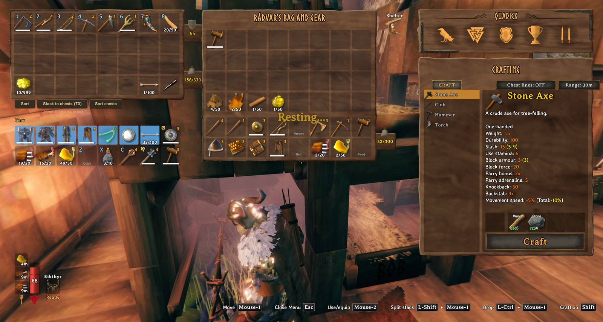

<!-- This page is made by tools/modpages/make_pages.py from the mod's DESCRIPTION.txt, CHANGELOG.txt, settings and the
     repo's README. Change those (or the HAND-WRITTEN part below), not the rest of this page. -->

# 🛡️ GearSlots

**Version 1.1.0**  ·  [all the mods](../../README.md)  ·  installs and updates through the in-game [mod manager](https://github.com/HardHeadHackerHead/valheim-mod-manager) (**F7**)

A Gear panel next to your inventory: Head, Chest, Legs, Cape, Belt, Trinket, Ammo and Shield slots (drop gear in and you wear it), three Food slots, and five Quick slots with hotkeys that also show in a row under your hotbar. Your shield follows your one-handed weapon, and worn gear moves into its slot by itself. Auto-eat keeps you fed: the food slots are eaten when a meal is below 20% of its time left, so your food goes about 1.6 times as far.

<!-- HAND-WRITTEN: kept when this page is made again -->
## 📸 Screenshots

**The Gear panel beside your inventory: armour, cape, belt, trinket, ammo and shield slots**

<!-- END HAND-WRITTEN -->

## 🔍 How it works

Extra inventory slots for what you wear, eat and use, in a Gear panel next to your inventory.

### What is in it

- Head, Chest, Legs, Cape, Belt, Trinket, Ammo and Shield slots: drop a matching piece in and you put it on. Armor and arrows no longer take room in your bag, and gear you are already wearing moves into its slot by itself.
- The shield follows your weapon: switch to a one-handed weapon and the shield from the Shield slot comes out with it (two-handed weapons and bows put it away).
- Three Food slots: keep your best meals in their own place (right-click to eat). Optional auto-eat is in the settings.
- Five Quick slots (Z, X, C, V by default; the fifth is unbound) for a weapon, tool, potion or anything else: press the key to equip or use it. With the inventory closed they show in a row under your hotbar, with their keys.
- Slots only accept the right kind of item, and Sort and Stack to Chests (QualityOfLife) leave them alone.
- Nothing is stored in a new place: the slots are extra rows of your real inventory, so saving, weight, crafting and dragging work as normal. Before removing the mod, move your gear-slot items into your bag: without it the game drops anything in those rows at your feet the next time you spawn.

Every key and option is in the settings (the manager's Mod settings tab).

## ⌨️ Keys

| Key | What it does |
|---|---|
| **Z** / **X** / **C** / **V** | Use what is in Quick slot 1 to 4 (equip a weapon or tool, drink a potion); the fifth slot has no key until you set one |

## ⚙️ Settings

In `BepInEx/config/com.dhack.gearslots.cfg` (made the first time the game runs with the mod).

**Food**

| Setting | Default | What it does |
|---|---|---|
| `AutoEat` | `false` | Eat from your Food slots by yourself: when a food you have in a slot is not active (and you have a free food slot), or its effect has dropped below half. Off by default. |
| `EatBelowPercent` | `20` | Auto-eat a food you are already under only once its time left drops below this percent (the game allows it from 50). Lower saves food: a meal then lasts 80% of its time instead of 50%, and its effect weakens a little towards the end. |

**General**

| Setting | Default | What it does |
|---|---|---|
| `ShowPanel` | `true` | Show the Gear panel next to your inventory. (Turn off and your gear slots hide; the items stay where they are.) |
| `ShowMessages` | `true` | Short messages when something happens (auto-eat, a quick slot is empty). |
| `ShieldFollowsWeapon` | `true` | When you switch to a one-handed weapon, put on the shield from your Shield slot too. (Two-handed weapons and bows take the shield off, as in the game.) |
| `AutoFill` | `true` | When you put on a piece of gear (or the game loads with it on), move it into its matching gear slot if that slot is empty. |

**Layout**

| Setting | Default | What it does |
|---|---|---|
| `Gap` | `6` | Space between the Gear panel and the inventory (UI pixels). |
| `OffsetX` | `0` | Move the Gear panel right (negative = left). |
| `OffsetY` | `0` | Move the Gear panel up (negative = down). |

**Quick slots**

| Setting | Default | What it does |
|---|---|---|
| `ShowUnderHotbar` | `true` | Show what is in your Quick slots, with their keys, in a row under the hotbar (the 1-8 on screen) while the inventory is closed. |
| `Key1` | `Z` | Press to use what is in quick slot 1: equips or unequips a weapon, tool or shield, or drinks a potion. Set to None to turn it off. If the game uses the same key for something (V: auto-pickup, X: sit, C: walk), the game's key is unbound once, so only this one works; bind it again in the game's Settings, Controls. |
| `Key2` | `X` | Press to use what is in quick slot 2: equips or unequips a weapon, tool or shield, or drinks a potion. Set to None to turn it off. If the game uses the same key for something (V: auto-pickup, X: sit, C: walk), the game's key is unbound once, so only this one works; bind it again in the game's Settings, Controls. |
| `Key3` | `C` | Press to use what is in quick slot 3: equips or unequips a weapon, tool or shield, or drinks a potion. Set to None to turn it off. If the game uses the same key for something (V: auto-pickup, X: sit, C: walk), the game's key is unbound once, so only this one works; bind it again in the game's Settings, Controls. |
| `Key4` | `V` | Press to use what is in quick slot 4: equips or unequips a weapon, tool or shield, or drinks a potion. Set to None to turn it off. If the game uses the same key for something (V: auto-pickup, X: sit, C: walk), the game's key is unbound once, so only this one works; bind it again in the game's Settings, Controls. |
| `Key5` | `None` | Press to use what is in quick slot 5: equips or unequips a weapon, tool or shield, or drinks a potion. Set to None to turn it off. If the game uses the same key for something (V: auto-pickup, X: sit, C: walk), the game's key is unbound once, so only this one works; bind it again in the game's Settings, Controls. |

## 👥 Playing together

See [who needs which mod](../../README.md#playing-together) on the front page.

## 📜 Changes

- Auto-eat now waits until a food you are already under is below 20% of its time left (setting Food / EatBelowPercent, 1 to 50; the game allows eating again from 50%). A meal lasts 80% of its time instead of half, so your food goes about 1.6 times as far; its effect weakens a little towards the end.
- Fix: quick slots 2-4 (X, C, V) also did the game's sit, walk and auto-pickup toggle: pressing V for quick slot 4 turned auto-pickup off. The game's own key for those is now unbound (once, and you are told in chat), so only the quick slot happens; give them another key in the game's Settings, Controls if you want them. Auto-pickup is switched back on if it was left off.
- Fix: everything in the gear slots was dropped on the ground each time you spawned after starting the game (the game resets the inventory size on spawn since inventory rows can be bought). The gear rows now stay, and if you buy a row they move down under it.
- First release: a Gear panel with Head, Chest, Legs, Cape, Belt, Trinket, Ammo and Shield slots, three Food slots and five Quick slots (shown under the hotbar), a shield that follows your one-handed weapon, auto-fill of worn gear, and optional auto-eat.
