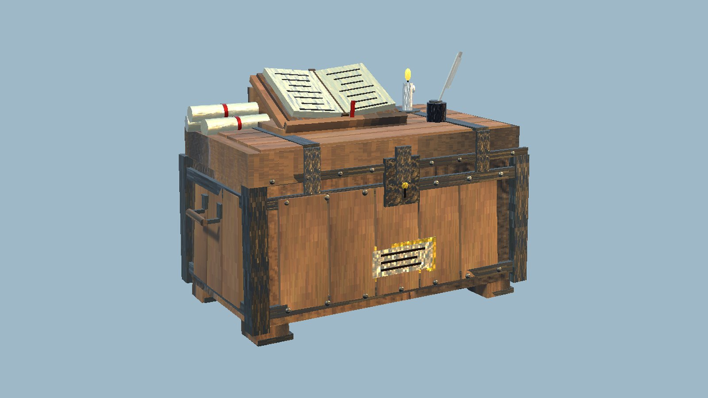
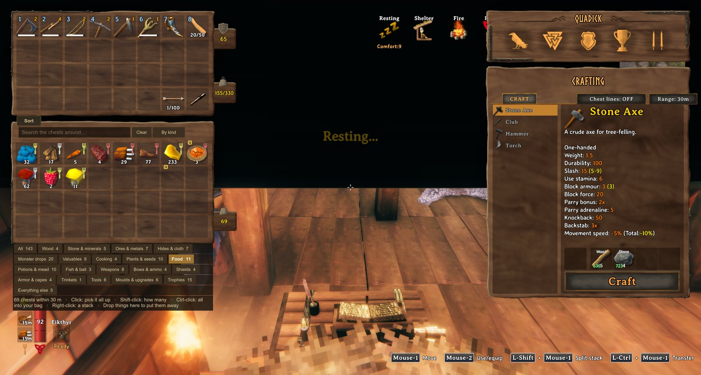

<!-- This page is made by tools/modpages/make_pages.py from the mod's DESCRIPTION.txt, CHANGELOG.txt, settings and the
     repo's README. Change those (or the HAND-WRITTEN part below), not the rest of this page. -->

# 📒 LedgerChest

**Version 1.0.2**  ·  [all the mods](../../README.md)  ·  installs and updates through the in-game [mod manager](https://github.com/HardHeadHackerHead/valheim-mod-manager) (**F7**)

A chest you build that shows everything in every chest within 30 m, in the game's own chest window: search it, pick a category button
(Wood, Ores & metals, Food, Weapons...), and click to take what you need from wherever it is. It keeps nothing itself: drop things on it and
each goes on to the chest assigned it (QualityOfLife's **K**), else to a chest with nothing assigned.

<!-- HAND-WRITTEN: kept when this page is made again -->
## 📸 Screenshots

**The Ledger Chest**

**Everything in the chests around it, in one searchable list**

## 👥 Who needs it

**The server (or host) and every player.** The Ledger Chest is a real chest that holds things: a game without this mod doesn't know the piece,
and when its area loads there (a dedicated server above all) it deletes every Ledger Chest **with what is in it**. Restart after installing or
updating it. What fits in no chest around it and not in your inventory either stays in the Ledger Chest, and you are told so.

## ⚠️ Known clashes

- None known. It only reads the chests around it and moves items with the game's own moves; graves, carts, ships and a companion's bag and
  chest are never listed.
<!-- END HAND-WRITTEN -->

## 🔍 How it works

A chest you build that shows everything in every chest around it, with a search: find anything in your storehouse and take it from wherever it is.

### How it works

- Build the Ledger Chest with the hammer at a workbench (10 Wood, 4 Fine Wood, 4 Leather Scraps, 2 Resin). It keeps nothing itself: it is the counter of your storehouse.
- Open it (E): in place of a chest's slots, the ledger shows every kind of item in the chests within 30 m, one slot each with how many there are in all. It is the game's own chest window, with its tooltips.
- A search in its title bar narrows it down (several words: all must match); list by kind, A to Z or most first.
- Category buttons under it (Wood, Stone & minerals, Ores & metals, Hides & cloth, Cooking, Food, Weapons, Armor, Trophies and more), each with how many things it holds: press one to see only those. Under them: which chests hold what is under your mouse.
- Click an item to pick all of it up, and put it down on a slot of your inventory: as much as fits comes out of the nearest chests that have it, into that slot first and then wherever there's room. Shift-click to choose how many (the game's own split slider). Ctrl-click: all that fits, straight into your inventory. Right-click: a stack, straight in. Put it back on the ledger (or outside the windows, or right-click) and nothing moves.
- Drop things onto it (or Ctrl-click them in your inventory) to put them away: each goes straight on to a chest around it. A chest assigned that item first (QualityOfLife's K), then one assigned its category, then a chest with nothing assigned (one already holding it first). When no chest has room it comes back to you.
- Hover a line to see which chests hold it and how far away they are.
- Items come out exactly as they went in (upgrades, wear). Chests someone else has open are left alone, and so are carts, ships, tombstones and companions' own chests.
- It has its own hand-made look: an iron-bound strongbox with the ledger open on a reading stand, a quill in its inkpot, scrolls and a candle.

## ⌨️ Keys

| Key | What it does |
|---|---|
| **E** at a Ledger Chest | See and search everything in the chests around it; click to take, Shift-click to choose how many |

## ⚙️ Settings

In `BepInEx/config/com.dhack.ledgerchest.cfg` (made the first time the game runs with the mod).

**Ledger**

| Setting | Default | What it does |
|---|---|---|
| `Radius` | `30` | How far from the Ledger Chest (metres) the chests it lists can be. |
| `Scale` | `1` | Size of the list beside the chest. |

## 👥 Playing together

Everyone in the world needs it, **the host above all**. It adds a new build piece. Restart the game after updating so it registers cleanly.

## 📜 Changes

- Things that fit in no chest and not in your inventory either stay in the Ledger Chest, and now you're told so. The page now says plainly that the server and every player need the mod (a game without it deletes the Ledger Chests with what is in them), and a problem drawing its look can no longer stop it being registered.
- Fix: no more stutter every 5 seconds. Looking for Claude Tools searched everything the game had loaded; it now asks BepInEx's list of mods.
- First version: the Ledger Chest. Open it to see and search everything in the chests around it, by category (a button for each kind of thing), and take what you need. It keeps nothing itself: put things in it and they go on to the chest assigned them (QualityOfLife's chest assignments), else to a chest with nothing assigned, else back to you.
