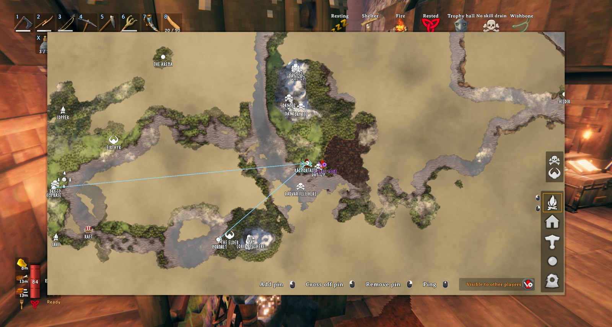

<!-- This page is made by tools/modpages/make_pages.py from the mod's DESCRIPTION.txt, CHANGELOG.txt, settings and the
     repo's README. Change those (or the HAND-WRITTEN part below), not the rest of this page. -->

# 🗺️ MapShare

**Version 1.1.1**  ·  [all the mods](../../README.md)  ·  install it from [Thunderstore](https://thunderstore.io/c/valheim/p/Quads_Lab/Quads_Map_Share/) (r2modman, Thunderstore Mod Manager) or the in-game [mod manager](https://github.com/HardHeadHackerHead/valheim-mod-manager) (**F7**)

Share the map you uncover with everyone in the world, live, as you run through the fog. New players get the whole map when they join.

<!-- HAND-WRITTEN: kept when this page is made again -->
## 📸 Screenshots

**One map for everyone: what each player has explored, and their pins**

## Playing on a server

General/AllowSharing is the server's when the server has this mod: turned off there, nobody's map is shared while they play on it. A
server without the mod sends nothing, and each player's own settings apply.
<!-- END HAND-WRITTEN -->

## 🔍 How it works

Share the map you uncover with everyone in the world, live, as you run through the fog of war.

### How it works

- The cartography table only shares a map by hand: you write your map to the table, then others read it one visit at a time. This mod does it automatically instead.
- Every few seconds, the new parts of the map you uncovered are sent to the other players and appear on their maps.
- When someone joins, one of the players already there sends them the whole map, and the newcomer sends theirs back, so everyone ends up with the same explored area.
- Only the explored area is shared, not pins. Players without the mod do not take part.

Settings: turn sending or receiving on or off, and how often updates go out.

## ⚙️ Settings

In `BepInEx/config/com.quad.mapshare.cfg` (made the first time the game runs with the mod).

**General**

| Setting | Default | What it does |
|---|---|---|
| `ShareMyMap` | `true` | Send the parts of the map you uncover to the other players in the world. |
| `ReceiveSharedMap` | `true` | Show the parts of the map other players uncover on your own map. |
| `SendInterval` | `2` | Seconds between sending newly uncovered map cells. |
| `AllowSharing` | `true` | Players with this mod share the map they uncover with each other. A server that wants everyone to explore for themselves turns  |

## 👥 Playing together

See [who needs which mod](../../README.md#playing-together) on the front page.

## 🤖 Made with AI

Made with the help of Claude (Anthropic), with Claude Code: designed, written and checked together, and tried in the game.

## 📜 Changes

- **1.1.1** A new id, com.quad.mapshare (it was com.dhack.mapshare): your settings move over by themselves the first time it starts, and the old settings file is kept as a backup. Restart the game after this update. If an old copy is still installed beside it, this one stands down and says which file to delete, so the two never both run. The DLL now says it was made with AI, as Thunderstore asks.
- New: General/AllowSharing, decided by the server in multiplayer: a server where everyone should explore for themselves can turn map sharing off for all. Fix: a map that arrived only partly (its sender left) was kept in memory for the rest of the session, and a shared map is now only unpacked up to the size of this world's map, so nobody can send something that unpacks to a huge size.
- Fix: a player joining could miss the map explored so far when someone online did not have MapShare or had sharing off. Everyone who shares now sends it.
- First version: live sharing of the explored map between players, plus a full sync when someone joins.
