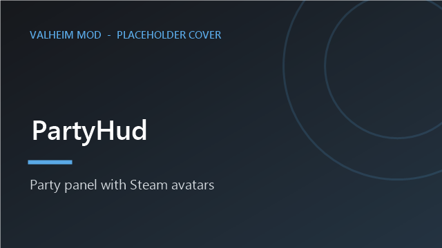
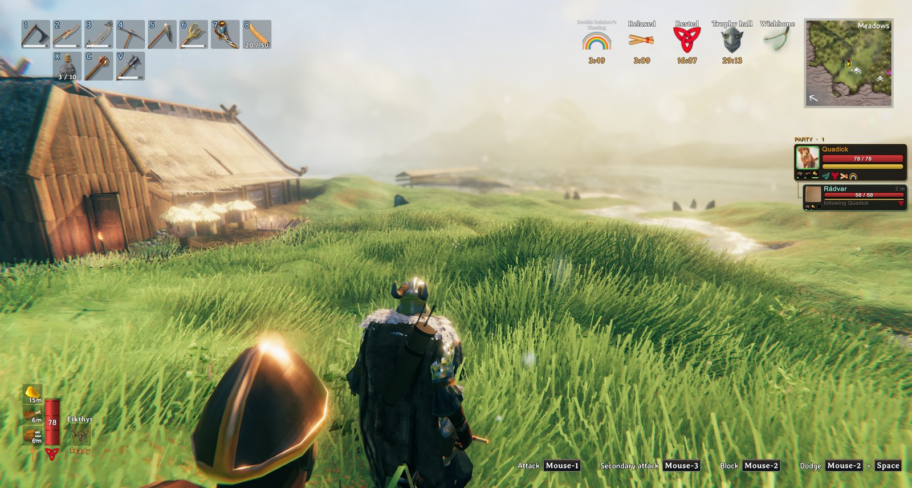
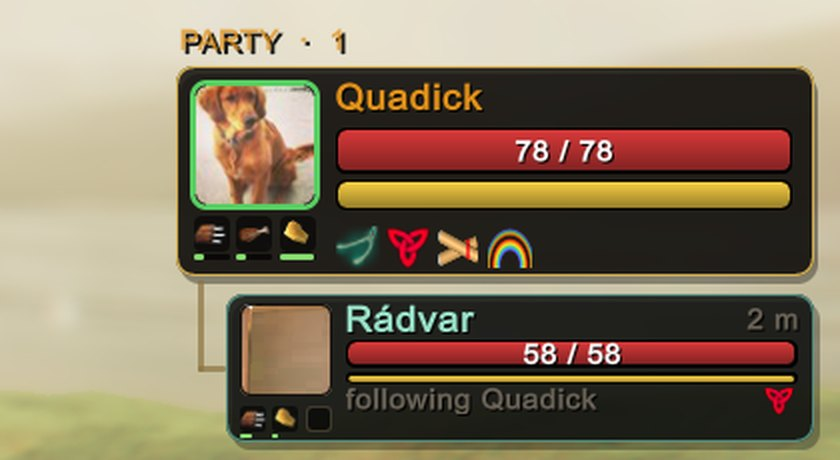

<!-- This page is made by tools/modpages/make_pages.py from the mod's DESCRIPTION.txt, CHANGELOG.txt, settings and the
     repo's README. Change those (or the HAND-WRITTEN part below), not the rest of this page. -->

# 🧑‍🤝‍🧑 PartyHud

**Version 1.8.1**  ·  [all the mods](../../README.md)  ·  install it from [Thunderstore](https://thunderstore.io/c/valheim/p/Quads_Lab/Quads_Party_HUD/) (r2modman, Thunderstore Mod Manager) or the in-game [mod manager](https://github.com/HardHeadHackerHead/valheim-mod-manager) (**F7**)

A party panel with every player's Steam picture, health, stamina and distance, live and at any range.

<!-- HAND-WRITTEN: kept when this page is made again -->
## 📸 Screenshots

**The party panel on the right of the screen**

**Close up: health, stamina, distance and the arrow to each player**

## What is shared

Each player with this mod sends their exact health, stamina, Eitr, food and buffs to the others a few times a second, at any distance.
Sharing/ShareMyStats switches off your own; Sharing/AllowSharing is the server's (in multiplayer its value applies to everyone), for PvP
servers that want each player to see only what the game shows of players near them.
<!-- END HAND-WRITTEN -->

## 🔍 How it works

A party panel on the right of the screen showing every player in your world.

### What it shows

- Each player's Steam picture, name, health, stamina and distance, live, at any range.
- Each picture has a ring that is green, amber or red by how healthy that player is, and an arrow next to their distance points the way they are, relative to where you are looking. F8 hides or shows the panel (handy for screenshots). It hides itself while menus are open.

Settings: how many players, size, opacity, position, left or right edge, a Compact mode, and whether to show yourself, portraits, distance and the arrow. While you steer a ship the panel moves out of the way of the ship display.
- With the AICompanion mod: each player's companion shows under them (health, distance, what it is doing).

## ⌨️ Keys

| Key | What it does |
|---|---|
| **F8** | Show or hide the party panel |

## ⚙️ Settings

In `BepInEx/config/com.quad.partyhud.cfg` (made the first time the game runs with the mod).

**General**

| Setting | Default | What it does |
|---|---|---|
| `Enabled` | `true` | Show the party panel. |
| `ShowSelf` | `true` | Include yourself in the panel. |
| `ShowPortraits` | `true` | Show each player's Steam profile picture. Off (or no picture available) = a coloured initial. |
| `ShowDistance` | `true` | Show how far away each player is. |
| `HideInMenus` | `true` | Hide the panel while the inventory, crafting window, build menu, trader or big map is open, so it doesn't overlap them. |
| `MaxPlayers` | `8` | Most players to show (you first, then the rest alphabetically). |
| `ToggleKey` | `F8` | Press to hide or show the panel (handy for screenshots). |
| `ShowDirectionArrow` | `true` | Next to each player's distance, an arrow pointing the way they are, relative to where you are looking. |
| `ShowFood` | `true` | Show three food slots under each player's picture: what they are eating and how long it has left. Only for players who also have this mod. |
| `ShowStatusEffects` | `true` | Show each player's buffs and debuffs (food, rested, wet, poison...) as small icons under their bars. Only for players who also have this mod. |
| `ShowCompanions` | `true` | With the AICompanion mod: show each player's companion under them (health, distance, what it is doing). |

**Layout**

| Setting | Default | What it does |
|---|---|---|
| `OffsetX` | `10` | Gap from the right edge of the screen (UI pixels). |
| `OffsetY` | `300` | Gap from the top of the screen (UI pixels). Raise it if it overlaps your minimap. |
| `Scale` | `1` | Size of the panel (1 = normal, 1.25 = bigger). |
| `AvoidShipHud` | `true` | While you are steering a ship, move the panel down so it does not cover the wind indicator and the rest of the ship display. |
| `Compact` | `false` | A smaller, tighter panel: a small picture and thinner bars, for when you want it out of the way. |
| `OnLeft` | `false` | Put the panel on the left edge of the screen instead of the right. |
| `Opacity` | `0.85` | How solid the panel background is (0.2 to 1). |

**Sharing**

| Setting | Default | What it does |
|---|---|---|
| `ShareMyStats` | `true` | Send your health, stamina, Eitr, food and buffs to the other players who have this mod (a few times a second, at any distance). Off: they only see what the game itself shows of you when you are near. |
| `AllowSharing` | `true` | Players with this mod share their exact health, stamina, Eitr, food and buffs with each other at any distance. A PvP server may want this off (each player then sees only what the game shows of players near them). In multiplayer the server's value applies. |

## 👥 Playing together

See [who needs which mod](../../README.md#playing-together) on the front page.

## 🤖 Made with AI

Made with the help of Claude (Anthropic), with Claude Code: designed, written and checked together, and tried in the game.

## 📜 Changes

- **1.8.1** A new id, com.quad.partyhud (it was com.dhack.partyhud): your settings move over by themselves the first time it starts, and the old settings file is kept as a backup. Restart the game after this update. If an old copy is still installed beside it, this one stands down and says which file to delete, so the two never both run. The DLL now says it was made with AI, as Thunderstore asks.
- New: Sharing/ShareMyStats (on by default): turn it off and your game stops sending your health, stamina, Eitr, food and buffs to the other players; they then see only what the game itself shows of you nearby. Sharing/AllowSharing is decided by the server in multiplayer, so a PvP server can switch the sharing off for everyone. The panel's names and numbers are now in the game's own lettering.
- A fallen companion's row says its things are in a tombstone (they keep the gear they wore since AICompanion 0.8), not "gear in a crate".
- New: a companion's row shows its three food slots under its picture, as players' rows do (empty slots: it is hungry and does not heal).
- New: a companion's row shows a little picture of its face (AICompanion 0.3.0 takes it) instead of its initial.
- New: with the AICompanion mod installed, each player's companion shows under them in the panel: its name, health, how far away it is and which way, and what it is doing (or that it has fallen), its stamina, and its buffs (a boss power, meads). General, ShowCompanions turns it off.
- Three food slots under each player's picture show what they are eating, with a line for how long each has left (red when nearly gone). The arrow and buff icons are as in 1.5.0.
