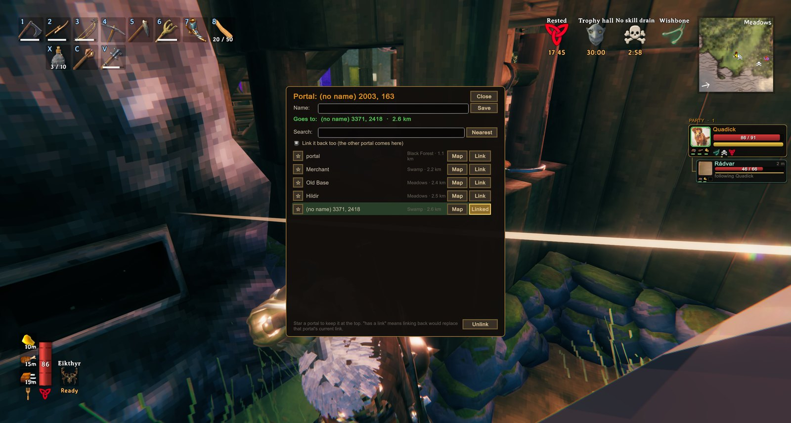

<!-- This page is made by tools/modpages/make_pages.py from the mod's DESCRIPTION.txt, CHANGELOG.txt, settings and the
     repo's README. Change those (or the HAND-WRITTEN part below), not the rest of this page. -->

# 🌀 PortalHub

**Version 1.2.1**  ·  [all the mods](../../README.md)  ·  install it from [Thunderstore](https://thunderstore.io/c/valheim/p/Quads_Lab/Quads_Portal_Hub/) (r2modman, Thunderstore Mod Manager) or the in-game [mod manager](https://github.com/HardHeadHackerHead/valheim-mod-manager) (**F7**)

Press **E** on a portal and pick where it goes from a list of every portal in the world: nearest first, searchable, with favourites. Every portal shows on the map with lines between linked ones. One click links it both ways, and no more matching names on two portals. (Install it on the host too.)

<!-- HAND-WRITTEN: kept when this page is made again -->
## 📸 Screenshots

**Pick where a portal goes from the list: names, lands, distances**

## Good to know

- **E on any portal opens the PortalHub menu** instead of the game's name box (press **Shift+E** for the game's own name box).
- **Protected areas:** a portal inside someone else's switched-on ward can't be relinked or renamed by you, and "link it back" leaves such a
  portal as it is (you get a one-way link). The host checks this, whatever a player's game says. With `HideWardedPortals` on (the host's
  choice), those portals also stay out of your list and map.

## Known clashes

- **XPortal** (`yay.spikehimself.xportal`) links portals its own way and skips the game's portal pairing that PortalHub's links rely on
  (they would stop working after a restart), and both want E. With XPortal installed, PortalHub stands down (it says so in the log): use
  one or the other.
<!-- END HAND-WRITTEN -->

## 🔍 How it works

Portals you can actually use: press E on a portal and pick where it goes from a list.

### What is in it

- The list shows every portal in the world, nearest first, with its biome and distance. Search it, sort it by name, or star the ones you use most to keep them at the top.
- One click links this portal to the one you pick, and (by default) links that one back, so there is no more matching names on both ends.
- Every portal shows on the map with its name, and the big map draws a line from each portal to where it goes (an arrow when it only goes one way). A Map button next to each portal in the menu opens the map at that spot.
- Look at a portal and it tells you where it goes.
- Rename a portal right in the menu. Portals you never choose a destination for work the old way, by matching names, so nothing you built breaks.
- Teleport rules are unchanged: you still cannot carry ores or other blocked items through a portal.
- Needs to be installed on the host's game (and on yours to use the menu). Players without it can still walk through linked portals.

## ⌨️ Keys

| Key | What it does |
|---|---|
| **E** at a portal | Open the portal menu and choose where it goes |

## ⚙️ Settings

In `BepInEx/config/com.quad.portalhub.cfg` (made the first time the game runs with the mod).

**General**

| Setting | Default | What it does |
|---|---|---|
| `Enabled` | `true` | Use the portal menu when you press E on a portal. (Off: portals work like in the base game.) In multiplayer the server's value applies. |
| `HideWardedPortals` | `false` | Leave portals inside someone else's protected area (a switched-on ward you are not on) out of each player's list and map, and refuse links to them. (Portals in such an area can never be changed by others either way.) In multiplayer the server's value applies. |
| `ShowDestinationOnHover` | `true` | When you look at a portal, show where it goes. |

**Map**

| Setting | Default | What it does |
|---|---|---|
| `ShowPortals` | `true` | Show every portal on the map with its name. |
| `ShowLinks` | `true` | On the big map, draw a line from each portal to where it goes (an arrow if it only goes one way). |

**Menu**

| Setting | Default | What it does |
|---|---|---|
| `LinkBothWays` | `true` | Picking a destination also links that portal back to this one. |
| `Favorites` | `` | Portals you starred (managed by the menu; you do not need to edit this). |

## 👥 Playing together

See [who needs which mod](../../README.md#playing-together) on the front page.

## 🤖 Made with AI

Made with the help of Claude (Anthropic), with Claude Code: designed, written and checked together, and tried in the game.

## 📜 Changes

- **1.2.1** A new id, com.quad.portalhub (it was com.dhack.portalhub): your settings move over by themselves the first time it starts, and the old settings file is kept as a backup. Restart the game after this update. If an old copy is still installed beside it, this one stands down and says which file to delete, so the two never both run. The DLL now says it was made with AI, as Thunderstore asks.
- **1.2.0** Fix: anyone could relink a portal inside someone else's protected area, and "link it back" changed the other portal even in someone's base. The host now checks the wards itself and refuses to change a portal in a switched-on ward you are not on; linking to such a portal only goes one way. A new host setting, HideWardedPortals (off by default), keeps those portals out of other players' lists and maps. In multiplayer the server decides Enabled and HideWardedPortals. With XPortal installed PortalHub now stands down (the two undo each other's links). The menu uses the game's font.
- Fix: away from portals, PortalHub looked for portals nearby every frame; it now looks once a second.
- Fix: after restarting the game, linked portals sent you to a random place (the game renumbers everything when a world loads, and links were saved by number). Each portal now keeps its own id, so links and starred portals survive restarts. Links made with the old version are cleared once: link your portals again in the menu. Also: the last world's portals no longer show on a new world's map, and a newly built portal no longer lists itself as a destination.
- Portals now show on the map with their names, and the big map draws a line (with an arrow if one-way) between linked portals. Rename a portal inside the menu. The list warns when linking back would replace another portal's link.
