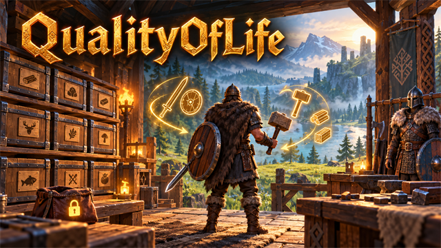
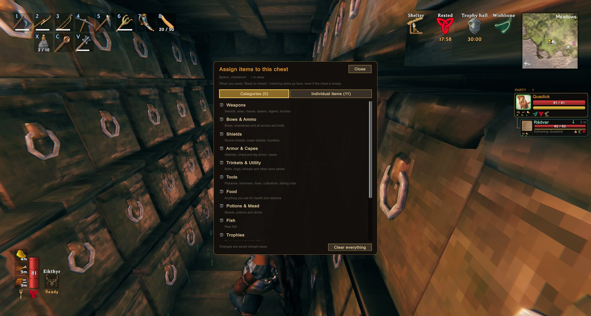

<!-- This page is made by tools/modpages/make_pages.py from the mod's DESCRIPTION.txt, CHANGELOG.txt, settings and the
     repo's README. Change those (or the HAND-WRITTEN part below), not the rest of this page. -->

# 🎒 QualityOfLife

**Version 1.10.0**  ·  [all the mods](../../README.md)  ·  installs and updates through the in-game [mod manager](https://github.com/HardHeadHackerHead/valheim-mod-manager) (**F7**)

Quick gear sets on **Q**, hammer on **B**, a **Sort** button that joins stacks, **Stack to chests** with undo, chest assignment on **K** (look at a chest to see what it receives), **Sort chests** to send everything in the chests around you to the chest assigned it, item locks on **L**, your ships on the map with their own icon, and tap **P** next to a boat to push it. It will not let you plant a seed, sapling or crop where it has no room to grow up.

<!-- HAND-WRITTEN: kept when this page is made again -->
## 📸 Screenshots

**Choosing what a chest receives (K)**

<!-- END HAND-WRITTEN -->

## 🔍 How it works

Small controls that make the game nicer to play, each with its own switch.

### What is in it

- Q: build a quick set from items you hover in your inventory; outside the inventory it swaps to the set and back.
- B: jump into construction mode with your hammer, and back to what you had.
- Sort: a button under your inventory joins split stacks and puts everything in order (hotbar and gear slots stay put).
- Stack to chests: a button under your inventory moves matching items into nearby chests, with Undo and sounds.
- K opens the chest assignment menu (choose what each chest receives); L locks items so they are never stacked.
- Boat push: tap or hold P next to a boat to shove it where you look (gentle, with a speed cap).
- Far zoom: scroll the camera out to 20 m on foot and 40 m on a boat (the game stops at 6); the steps grow as you zoom out.
- Planting: you cannot plant a seed, sapling or crop where it has no room to grow up (the ghost turns red and says so), instead of finding out after it never grows.

Keys are configurable. Q and B work while you are running.

## ⌨️ Keys

| Key | What it does |
|---|---|
| **Q** | Build a quick set (inventory open) / swap to it and back |
| **B** | Jump into construction mode with your hammer, and back |
| **K** / **L** | Assign what a chest receives / lock an item |
| **P** | Tap or hold next to a boat (not in it) to push it where you look |

## ⚙️ Settings

In `BepInEx/config/com.dhack.qualityoflife.cfg` (made the first time the game runs with the mod).

**BoatPush**

| Setting | Default | What it does |
|---|---|---|
| `Enabled` | `true` | Turn boat pushing on or off. |
| `Key` | `P` | Tap (or hold) this next to a boat, not in it, to push it the way you are looking. |
| `Strength` | `3` | How hard you push (metres per second, per second). Higher gets a heavy boat moving faster. |
| `MaxSpeed` | `2.5` | The fastest your pushing can move a boat (metres per second). Walking pace is about 5. |
| `Seconds` | `3` | One tap of the key keeps pushing for this long (holding it keeps pushing as long as you hold). |
| `Range` | `3` | How close you have to be to the boat's hull (metres). |

**Camera**

| Setting | Default | What it does |
|---|---|---|
| `FarZoom` | `true` | Let the scroll wheel zoom the camera out further than the game allows. |
| `MaxDistance` | `20` | How far out the camera can go on foot (metres). The game's own limit is 6. |
| `MaxDistanceBoat` | `40` | How far out the camera can go while steering a boat (metres). |

**General**

| Setting | Default | What it does |
|---|---|---|
| `ShowMessages` | `true` | Show a short message in the top-left when something happens. |

**Hammer**

| Setting | Default | What it does |
|---|---|---|
| `Enabled` | `true` | Turn the hammer shortcut on or off. |
| `Key` | `B` | Press to equip your hammer and start building. Press again to go back to what you had equipped. |

**Map**

| Setting | Default | What it does |
|---|---|---|
| `ShowShips` | `true` | Show every ship in the world on the minimap and the map, with a longship icon, wherever it is. |
| `ShipPinType` | `Icon4` | Which of the map's pin kinds the ship pins count as (their picture is the longship either way). Hiding that kind with the map's pin filters hides them too. |

**Planting**

| Setting | Default | What it does |
|---|---|---|
| `NeedRoomToGrow` | `true` | A seed, sapling or crop can only be planted where it has the room to grow up: the same check the game makes later (a plant with another plant, a rock, a tree or a building too close never grows), made before you plant, so the ghost turns red and you are told. Takes effect at once. |

**QuickSet**

| Setting | Default | What it does |
|---|---|---|
| `Enabled` | `true` | Turn the quick-set feature on or off. |
| `Key` | `Q` | Inventory open: hover an item and press to add/remove it from your quick set. Inventory closed: press to swap to the quick set, press again to go back to what you had. |
| `ShowBadges` | `true` | Mark quick-set items in your inventory with a small gold badge. |

**QuickStack**

| Setting | Default | What it does |
|---|---|---|
| `Enabled` | `true` | Turn the quick-stack buttons and item locking on or off. |
| `Radius` | `20` | How far (in metres) from you a chest can be and still be used by Stack to chests and Sort chests. Raise it to put things away into your storehouse from across a big base: 60 reaches a long way. Chests only count while their area is loaded around you (about 100 m and more). Takes effect at once. |
| `LockKey` | `L` | Inventory open: hover an item and press this to lock it (it will never be moved by the buttons) or unlock it. |
| `StackKey` | `None` | Optional key that does 'Stack to chests' while your inventory is open (useful with a controller). None = off. |
| `ProtectHotbar` | `true` | Never move items in your top inventory row (the hotbar). |
| `ShowButtons` | `true` | Show the buttons under your inventory when a chest is in range. |
| `PlaySounds` | `true` | Play the chests' own sounds when you stack (a thunk from each chest that takes items) and when you undo. |
| `ShowChestLabels` | `true` | Show what a chest is assigned to receive: under its Assign button when it's open, and in the hover text when you look at it. |
| `AssignKey` | `K` | Look at a chest (or have one open) and press this to choose what it should receive when you stack: whole categories or individual items. |

**Sort**

| Setting | Default | What it does |
|---|---|---|
| `Enabled` | `true` | Show a Sort button under your inventory: it joins split stacks and puts items in order. (Respects ProtectHotbar in the QuickStack settings.) |

**Stations**

| Setting | Default | What it does |
|---|---|---|
| `BuildRange` | `0` | How far (in metres) from a crafting station (workbench, stonecutter, forge, ...) you can build with it, when that is more than the station's own range (20 m, more with upgrades). 0 leaves the game's ranges. 60 reaches across a big base. Takes effect at once. |

## 👥 Playing together

See [who needs which mod](../../README.md#playing-together) on the front page.

## 📜 Changes

- New: Planting/NeedRoomToGrow: you cannot plant a seed, sapling or crop where it has no room to grow up (another plant, a rock, a tree or a building too close). The game only finds this out after planting, and then the plant never grows; now the ghost turns red and says there is not enough space. On by default.
- New: Stations/BuildRange: crafting stations (workbench, stonecutter, forge...) reach farther for building, up to 150 m, so a big build at the edge of the base needs no second workbench or stonecutter. 0 (the default) leaves the game's ranges. Only building changes: a station's base area and crafting at it stay as they were.
- Stack to chests and Sort chests can reach farther: their Radius (QuickStack) is now a 2 to 150 m slider in the configuration manager, taking effect at once.
- New: your ships on the map. Every raft, karve, longship and drakkar in the world shows on the minimap and the big map with a longship icon of its own and its kind as the name, following it as it sails, even far away (on the game hosting the world). Map: ShowShips switches it off.
- The LedgerChest mod's Ledger Chest keeps nothing, so it has no Assign button, no "Receives" line and no K assigning: assign the chests around it.
- Fix: Sort chests (and Stack to chests) treated a companion's bag as a chest: Sort chests took an AICompanion companion's armour, weapons, tools and food out of its gear slots and put them in your chests. Only built chests and carts take part now.
- Looking at a chest now shows what it receives by name ("Receives: Wood, Finewood" and up to three more on the line below, then "+N more") instead of "2 items".
- New: a Sort chests button next to Stack to chests (shown when a chest in range is assigned something). Everything in the chests around you goes to the chest assigned it: a chest assigned that item first, then one assigned its category; items already in a chest that wants them stay, and anything no chest is assigned stays where it is. It tells you what had no room left. Only chests take part (never your inventory, a companion's chest, a cart, a ship, or a chest someone has open), and every item is counted before and after.
- Stack to chests (and companions sorting into your chests) no longer puts anything into a chest a companion has taken as its own: its chest held wood, so all the wood went there.
- Companions (AICompanion) can sort what they bring home into your chests by the same rules as Stack to chests: a chest assigned that item, then its category, then one already holding it.
- New: the camera zooms out much further: up to 20 m on foot (the game stops at 6) and 40 m while steering a boat. Each scroll step grows as you zoom out, so it only takes a few notches. Camera, MaxDistance and MaxDistanceBoat set the limits; FarZoom switches it off.
- Fix: the quick-set key (Q) also triggered the game's auto-run and previous-tab keys. The game's keys are now unbound (once, and you are told in chat); bind them again in Settings, Controls if you want them.
- Fix: in multiplayer, Stack to chests, Undo and chest assignments could lose or duplicate items in a chest another player had open. Chests in use are now left alone.
- New: a Sort button next to Stack to chests (joins split stacks, puts items in order by kind and name; leaves the hotbar and GearSlots slots alone). Boat push (tap or hold P next to a boat) now defaults to P so it does not clash with BuildOrders' G. Stack to chests leaves GearSlots gear, food and quick slots alone.
