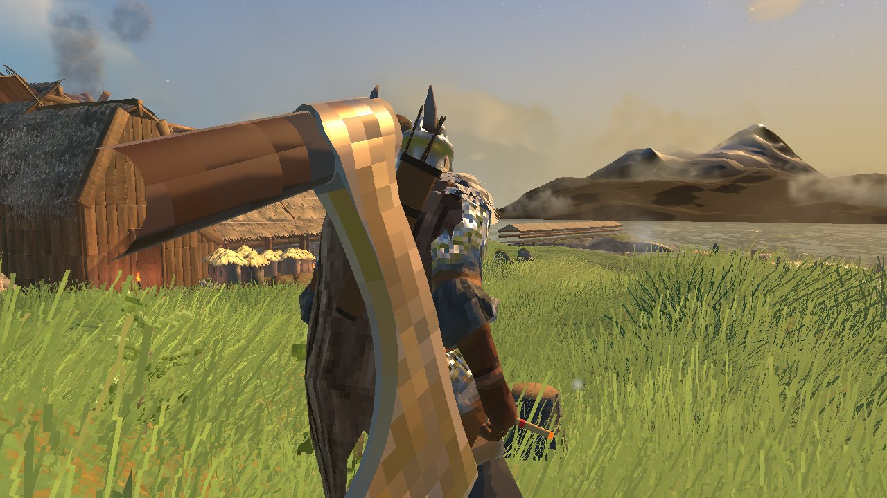

<!-- This page is made by tools/modpages/make_pages.py from the mod's DESCRIPTION.txt, CHANGELOG.txt, settings and the
     repo's README. Change those (or the HAND-WRITTEN part below), not the rest of this page. -->

# 🏹 Quiver

**Version 0.2.1**  ·  [all the mods](../../README.md)  ·  install it from [Thunderstore](https://thunderstore.io/c/valheim/p/Quads_Lab/Quads_Quiver/) (r2modman, Thunderstore Mod Manager) or the in-game [mod manager](https://github.com/HardHeadHackerHead/valheim-mod-manager) (**F7**)

Pick your arrows back up. Those that hit the ground, a tree or a wall are all kept as arrows you pick up; of those that hit a creature, three
in four drop with its loot when it dies. A quiver hangs on your back while you have arrows equipped, with the arrows you carry sticking out of it.
Only you need the mod.

<!-- HAND-WRITTEN: kept when this page is made again -->
## 📸 Screenshots

**The bow and quiver carried on your back**

## Playing on a server

The arrow settings are the server's when the server has this mod: its values apply to everyone while they play there. A server without it
sends nothing, and each player's own settings apply.

## Known clashes

- **BetterArchery**: its retrievable arrows and its quiver (both on by default) do the same jobs, so this mod's arrow recovery switches off
  while its retrievable arrows are on, and this mod's quiver isn't drawn while its quiver is on.
<!-- END HAND-WRITTEN -->

## 🔍 How it works

Pick your shot arrows back up, and carry them in a quiver on your back.

### What is in it

- Arrows (and crossbow bolts) you shoot that hit the ground, a tree, a wall or a creature come back as arrows you pick up again. Arrows that hit the ground, a tree or a wall are all kept; of those that hit a creature, three in four are kept and drop with its loot when it dies. Fire arrows are always used up. All of it is in the settings.
- A quiver hangs on your back while you have arrows or bolts equipped, with the arrows you carry sticking out of it (more of them the more you carry), made from the real model of the arrow you have equipped.
- Where the quiver hangs (back, side, height, tilt) is in the settings, and changes at once.

It works on the game that shoots, so it does not need the other players to have it.

## ⚙️ Settings

In `BepInEx/config/com.quad.quiver.cfg` (made the first time the game runs with the mod).

**Arrows**

| Setting | Default | What it does |
|---|---|---|
| `PickUpArrows` | `true` | Arrows you shoot that hit something land on the ground as arrows you can pick up again. In multiplayer the server's value applies. |
| `ChanceOnGround` | `1` | The chance an arrow that hit the ground, a tree, a wall or the like is kept. 1 keeps every one. In multiplayer the server's value applies. |
| `ChanceOnCreature` | `0.75` | The chance an arrow that hit a creature is kept: it drops with that creature's loot when it dies. 0.75 keeps three in four. In multiplayer the server's value applies. |
| `IncludeBolts` | `true` | Crossbow bolts can be picked up too. In multiplayer the server's value applies. |
| `FireArrowsBurnUp` | `true` | Fire arrows are always used up. In multiplayer the server's value applies. |
| `LogHits` | `false` | Write what each arrow hit did (kept, broke, why not) to the BepInEx log. For finding out why an arrow did not come back. |

**Quiver**

| Setting | Default | What it does |
|---|---|---|
| `Show` | `true` | A quiver on your back while you have arrows (or bolts) equipped. |
| `Back` | `0.2` | How far behind your spine the quiver hangs (metres). |
| `Side` | `0.1` | How far to your right it hangs (negative: left). |
| `Height` | `-0.03` | How far up it hangs (negative: lower). |
| `TiltSide` | `22` | How far the top leans to your right (degrees). |
| `TiltBack` | `8` | How far the top leans backwards (degrees). |

## 👥 Playing together

See [who needs which mod](../../README.md#playing-together) on the front page.

## 🤖 Made with AI

Made with the help of Claude (Anthropic), with Claude Code: designed, written and checked together, and tried in the game.

## 📜 Changes

- **0.2.1** A new id, com.quad.quiver (it was com.dhack.quiver): your settings move over by themselves the first time it starts, and the old settings file is kept as a backup. Restart the game after this update. If an old copy is still installed beside it, this one stands down and says which file to delete, so the two never both run. The DLL now says it was made with AI, as Thunderstore asks.
- The arrow settings (PickUpArrows, ChanceOnGround, ChanceOnCreature, IncludeBolts, FireArrowsBurnUp) are now decided by the server in multiplayer when it has the mod, so nobody gets every arrow back on a server that keeps fewer. With BetterArchery installed its own retrievable arrows and quiver (both on by default) take over: this mod's arrow recovery and quiver switch off, so you never get two arrows back for one or wear two quivers. Fix: an arrow picked up from the ground could count as equipped.
- New: arrows you shoot come back. Those that hit the ground, a tree or a wall are all kept as arrows you pick up; of those that hit a creature, three in four drop with its loot when it dies (only you need the mod). A quiver hangs on your back while you have arrows equipped, with the arrows you carry sticking out of it.
