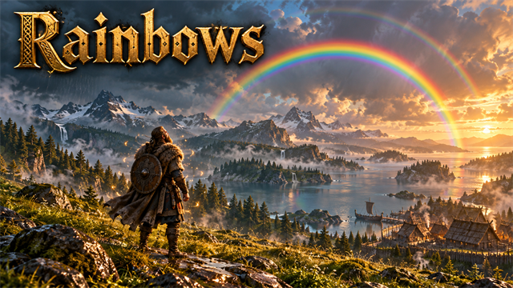
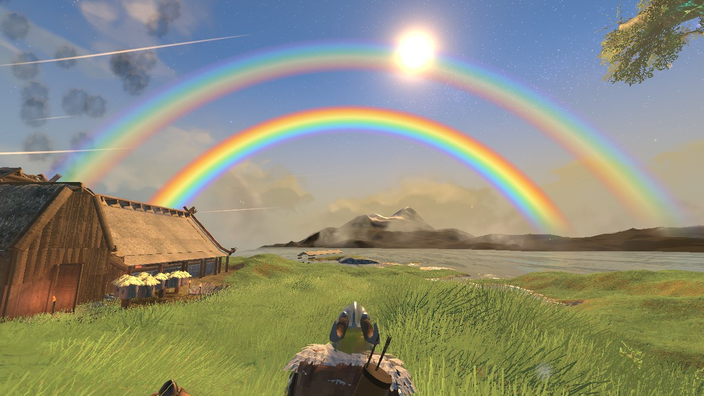
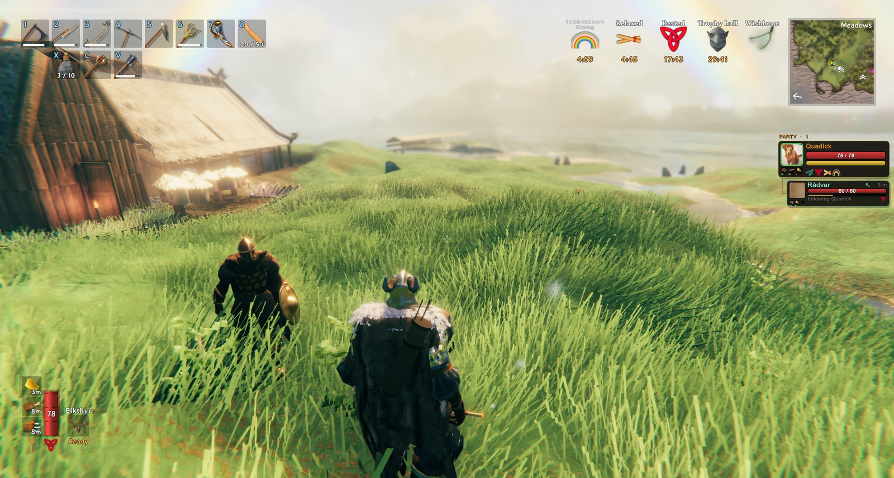

<!-- This page is made by tools/modpages/make_pages.py from the mod's DESCRIPTION.txt, CHANGELOG.txt, settings and the
     repo's README. Change those (or the HAND-WRITTEN part below), not the rest of this page. -->

# 🌈 Rainbows

**Version 0.2.2**  ·  [all the mods](../../README.md)  ·  install it from [Thunderstore](https://thunderstore.io/c/valheim/p/Quads_Lab/Quads_Rainbows/) (r2modman, Thunderstore Mod Manager) or the in-game [mod manager](https://github.com/HardHeadHackerHead/valheim-mod-manager) (**F7**)

When a good spell of rain ends and the sun is low, a rainbow arcs across the sky opposite the sun, with a soft chime. Now and then it is a double
rainbow, with a fainter second bow outside it. It follows the sun, fades into the horizon and goes after a few minutes. Look up at it for
**Rainbow's Blessing**: stamina and health come back faster and running and jumping cost less; a double rainbow gives a stronger one. Only you
need it, and nothing is saved in the world.

<!-- HAND-WRITTEN: kept when this page is made again -->
## 📸 Screenshots

**A double rainbow over the bay**

**Rainbow's Blessing in the corner**

<!-- END HAND-WRITTEN -->

## 🔍 How it works

Rainbows: a rainbow after the rain, and a blessing for looking up at it.

### What is in it

- When a good spell of rain ends and the sun is low (morning or evening), a rainbow arcs across the sky opposite the sun. Three times in ten it is a double rainbow, with a fainter second one outside it, its colours the other way round. It fades in with a soft chime, follows the sun as it moves, fades into the horizon, and fades out after a few minutes or when the sun climbs too high. If the rain stops with the sun too high, it waits a while for the sun to come down.
- Look up at it and you get Rainbow's Blessing for five minutes: stamina comes back 30% faster, health 20% faster, and running and jumping cost 20% less stamina. A double rainbow gives the Double Rainbow's Blessing, half as strong again.

Settings: how often it comes, how long it must have rained, how long it stays, brightness, how often it is a double rainbow, the chime and its volume, and the blessing and how long it lasts.

Only you need it: the sky is drawn for you from the weather the game already has, and nothing is saved in the world.

## ⚙️ Settings

In `BepInEx/config/com.quad.rainbows.cfg` (made the first time the game runs with the mod).

**Blessing**

| Setting | Default | What it does |
|---|---|---|
| `Enabled` | `true` | Look up at a rainbow and you get Rainbow's Blessing: stamina and health come back faster, and running and jumping cost less stamina. A double rainbow gives a stronger one. |
| `Minutes` | `5` | How long the blessing lasts (minutes). In multiplayer the server's value applies. |

**Rainbow**

| Setting | Default | What it does |
|---|---|---|
| `Enabled` | `true` | Rainbows after the rain. |
| `Chance` | `0.8` | How often a good spell of rain ends in a rainbow (0 never, 1 always), when the sun is low enough to show one. In multiplayer the server's value applies. |
| `MinRainSeconds` | `45` | How long it must have rained (seconds) for the end of it to be worth a rainbow. In multiplayer the server's value applies. |
| `WaitMinutes` | `8` | If the sun is too high or too low when the rain ends, how long (minutes) to wait for it to come into place before giving up. In multiplayer the server's value applies. |
| `ShowMinutes` | `3` | How long the rainbow stays (minutes), if the sun does not move it out of the sky first. |
| `Brightness` | `1` | How strong the colours are. |
| `DoubleChance` | `0.3` | How often a rainbow is a double one : a fainter second rainbow outside the first, its colours the other way round, and a stronger blessing. 0 never, 1 always. In multiplayer the server's value applies. |
| `Chime` | `true` | A soft chime when a rainbow comes out. |
| `ChimeVolume` | `0.35` | How loud the chime is. |

## 👥 Playing together

See [who needs which mod](../../README.md#playing-together) on the front page.

## 🤖 Made with AI

Made with the help of Claude (Anthropic), with Claude Code: designed, written and checked together, and tried in the game.

## 📜 Changes

- **0.2.2** Its test command for Claude Tools (rainbow ...) follows the game's cheat rule: a rainbow now, stopping it and giving the blessing work only in single player, for the host or with devcommands; status still works for everyone.
- **0.2.1** A new id, com.quad.rainbows (it was com.dhack.rainbows): your settings move over by themselves the first time it starts, and the old settings file is kept as a backup. Restart the game after this update. If an old copy is still installed beside it, this one stands down and says which file to delete, so the two never both run. The DLL now says it was made with AI, as Thunderstore asks.
- On a server, how often rainbows come (chance, how long it must rain, how long to wait for the sun, double rainbows) and how long the blessing lasts are the server's settings. It must rain at least 10 seconds, and the blessing lasts at most 30 minutes. The chime now follows the game's sound effects volume.
- Fix: no more stutter every 5 seconds. Looking for Claude Tools searched everything the game had loaded; it now asks BepInEx's list of mods.
- New: Rainbows. When the rain stops and the sun is low, a rainbow arcs across the sky (sometimes a double rainbow), and looking up at it gives Rainbow's Blessing: more stamina and health back, cheaper running and jumping, and half as strong again for a double rainbow.
