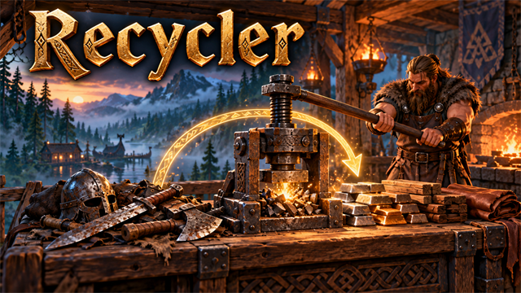
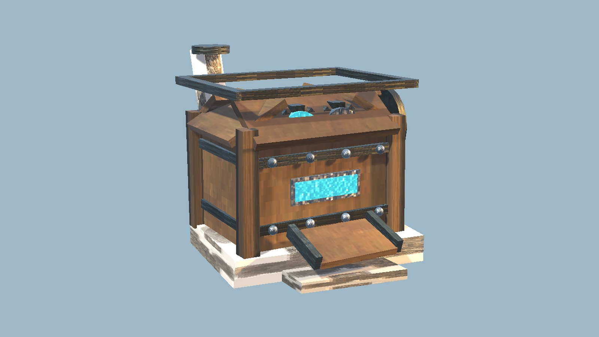

<!-- This page is made by tools/modpages/make_pages.py from the mod's DESCRIPTION.txt, CHANGELOG.txt, settings and the
     repo's README. Change those (or the HAND-WRITTEN part below), not the rest of this page. -->

# ♻️ Recycler

**Version 1.1.0**  ·  [all the mods](../../README.md)  ·  installs and updates through the in-game [mod manager](https://github.com/HardHeadHackerHead/valheim-mod-manager) (**F7**)

A buildable Recycler, with its own look in the build menu, that turns old weapons, armor and tools back into a share of their materials. Build Presses nearby to raise the share.

<!-- HAND-WRITTEN: kept when this page is made again -->
## 📸 Screenshots

**The Recycler**

## ⚠️ Known clashes

- **Adventure Backpacks**: a backpack that still holds things can't be recycled (Adventure Backpacks keeps it in your inventory, and the
  Recycler now gives nothing back for an item that didn't leave it).
- **Epic Loot** and other mods that keep data on items: gear carrying such data (enchantments, a bag's contents) asks for a second click,
  like equipped or upgraded gear, because recycling destroys it.
- Battle idols are never handed back, and levels gained at the upgrader station return nothing.
<!-- END HAND-WRITTEN -->

## 🔍 How it works

Build a Recycler with the hammer and turn old gear back into a share of the materials it was made from.

### How it works

- Look at the Recycler and press E: pick a weapon, armor piece or tool from your inventory, see what it would return, and recycle it.
- You get about half of the materials back (50% by default; leftovers are a chance of one more). Recycler Presses built within 8 m raise this to 60% and then 70%.
- The gear must be one you could craft, and the crafting station it was made at (and its level) must be nearby. Equipped or upgraded gear asks for a second click. Items locked with L are skipped.
- The Recycler needs only bronze-tier materials (fine wood, bronze and stone), so you can build it as soon as you have bronze. Each Press costs iron, bronze and stone, so the better refunds come with iron. Restart the game after installing or updating it.

Settings: refund percentages, chance rounding, which gear types are allowed.

## ⚙️ Settings

In `BepInEx/config/com.dhack.recycler.cfg` (made the first time the game runs with the mod).

**General**

| Setting | Default | What it does |
|---|---|---|
| `ShowMessages` | `true` | Show a short message in the top-left when something is recycled. |

**Refund**

| Setting | Default | What it does |
|---|---|---|
| `BasePercent` | `50` | Share of the materials you get back with no Press nearby (0-100). In multiplayer the server's value applies. |
| `OnePressBonus` | `10` | Extra percentage points with one Press within 8 m. In multiplayer the server's value applies. |
| `TwoPressBonus` | `20` | Extra percentage points with two Presses within 8 m. In multiplayer the server's value applies. |
| `ChanceRounding` | `true` | Instead of always rounding down, a leftover fraction becomes a matching chance of one more (so 50% averages out to 50%). In multiplayer the server's value applies. |

**Rules**

| Setting | Default | What it does |
|---|---|---|
| `RequireCraftingStation` | `true` | Gear can only be recycled with the crafting station (and level) it was made at nearby. In multiplayer the server's value applies. |
| `ConfirmValuable` | `true` | Ask for a second click before recycling equipped or upgraded gear, or gear carrying other mods' data (enchantments, a bag's contents). |
| `AllowWeapons` | `true` | Weapons, bows and ammo launchers. In multiplayer the server's value applies. |
| `AllowArmor` | `true` | Armor, capes and shields. In multiplayer the server's value applies. |
| `AllowTools` | `true` | Tools and torches. In multiplayer the server's value applies. |

## 👥 Playing together

Everyone in the world needs it, **the host above all**. It adds new build pieces. Restart the game after updating so they register cleanly.

## 📜 Changes

- Fix: the Recycler handed out battle idols and gave materials back for levels gained at the upgrader station; it no longer does. Fix: an item another mod refused to let go of (a backpack with things in it) was still paid for, so recycling made copies; now nothing comes back unless the item really left your inventory. Gear carrying other mods' data (enchantments, a bag's contents) asks for a second click. The window uses the game's fonts and scales with the screen. In multiplayer the server decides the share returned and the rules.
- Fix: after a fresh game start the Recycler and Press were not registered until the mods were reloaded, so the game deleted any it found standing in the world. It is now registered as the world loads. Ones already lost can't be brought back; build them again.
- The build menu now shows the Recycler and the Press themselves instead of a chest.
