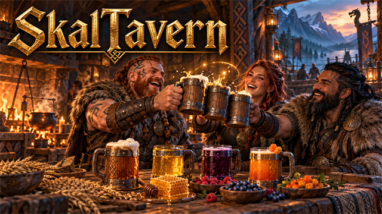
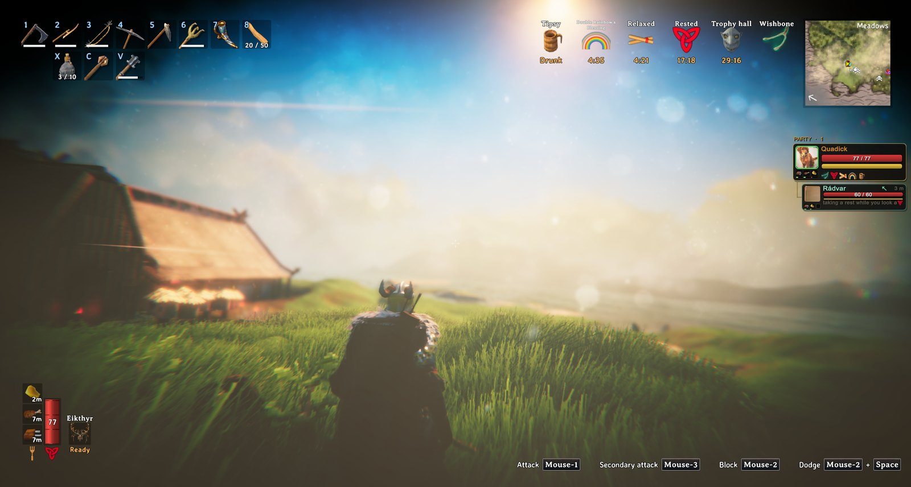
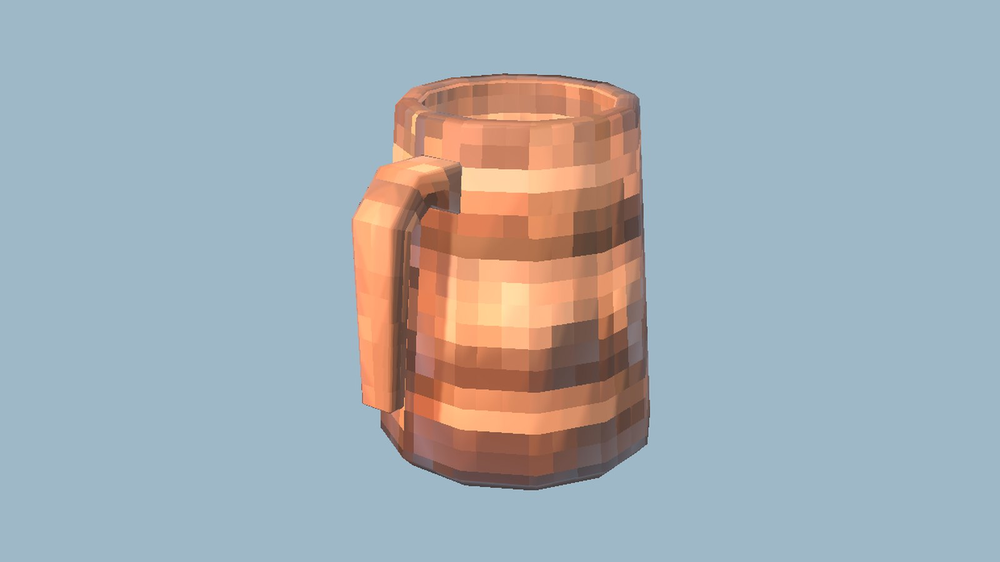

<!-- This page is made by tools/modpages/make_pages.py from the mod's DESCRIPTION.txt, CHANGELOG.txt, settings and the
     repo's README. Change those (or the HAND-WRITTEN part below), not the rest of this page. -->

# 🍺 SkalTavern

**Version 0.3.0**  ·  [all the mods](../../README.md)  ·  installs and updates through the in-game [mod manager](https://github.com/HardHeadHackerHead/valheim-mod-manager) (**F7**)

Ale and mead that actually get you drunk. Four drinks from the cauldron (ale, honey mead, blueberry wine, skaldic mead), each the real tankard
in your hand. A little warms you and gives some stamina. More and the screen darkens, blurs and doubles, colours drift, your body leans and weaves,
stars circle your head, you hiccup, you slide when you walk, your aim floats and your chat slurs. Drink too much too fast and you throw up (the
game's own effect), too much and you fall, and a big night ends in a hangover. Press **B** to raise a cup: friends who toast with you, and your
companions, get a **Skål!** buff.

<!-- HAND-WRITTEN: kept when this page is made again -->
## 📸 Screenshots

**Drunk: the world blurs, glows and sways**

**A Tankard of Ale**

<!-- END HAND-WRITTEN -->

## 🔍 How it works

Ale and mead that get you tipsy, and a toast.

### What is in it

- Four drinks from the cauldron: Tankard of Ale (barley and honey), Honey Mead (honey and raspberries), Blueberry Wine (blueberries and honey) and Skaldic Mead (honey and cloudberries). They are the real tankard in your hand and on the ground, each with its own colour.
- Each drink makes you drunker, and it wears off with time. As you get drunk the picture darkens at the edges, blurs and doubles, colours drift and the view sways; your body leans and weaves, stars circle your head, you hiccup, sounds go muffled, you slide when you walk and your aim floats, and your chat slurs. Too much too fast and you throw up (the game's own effect), which sobers you a little. A little warms you and gives some stamina. More and the view sways and your feet wander, but the cold no longer bites; very drunk and you stagger now and then; too much and you fall down. A big night ends in a hangover.
- Press B (changeable) to raise a cup. Everyone near you who has the mod and toasts within a few seconds, and your AICompanion companions standing by, drink together and get a Skal! buff: faster stamina and health for five minutes, more with more to drink with.

Every number and key is in the settings: how long to sober up, how strong the sway and wander are, whether you stumble, fall or get a hangover (on a server, the server's settings decide those). Only the player who drinks needs the mod for the drinks; a toast needs it on both sides.

## ⌨️ Keys

| Key | What it does |
|---|---|
| **B** | Raise a cup: toast with friends and companions beside you for a Skål! buff |

## ⚙️ Settings

In `BepInEx/config/com.dhack.skaltavern.cfg` (made the first time the game runs with the mod).

**Drinking**

| Setting | Default | What it does |
|---|---|---|
| `MinutesToSober` | `8` | How many minutes it takes to sober up from very drunk (100). Longer and you stay tipsy for longer. In multiplayer the server's value applies. |
| `EffectStrength` | `100` | How strong everything about being drunk is (percent): the picture, the sway, your steering, the sound. 0 for none, 200 for a night you will not remember. In multiplayer the server's value applies. |
| `ScreenSway` | `100` | How much the view sways when you are drunk (percent). 0 for none. |
| `FeetDrift` | `100` | How much your walking wanders when you are drunk (percent). 0 for none. In multiplayer the server's value applies. |
| `Stumble` | `true` | Very drunk, you stagger now and then. In multiplayer the server's value applies. |
| `PassOut` | `true` | Too much drink knocks you down (and sobers you a little). In multiplayer the server's value applies. |
| `Hangover` | `true` | After a big night you wake with a hangover: slower stamina and health for a few minutes. In multiplayer the server's value applies. |

**Effects**

| Setting | Default | What it does |
|---|---|---|
| `Picture` | `true` | The picture changes as you get drunk: dark edges, colour fringing, blur, double vision, colours that drift. |
| `Sound` | `true` | Sounds go muffled and wobbly as you get drunk. |
| `Stars` | `true` | Stars circle your head when you are drunk. |
| `Weave` | `true` | Your body leans and weaves when you are drunk. |
| `Hiccups` | `true` | Hiccups now and then, and a drunken cheer when you stand still. |
| `SlurredChat` | `true` | What you say in chat comes out slurred when you are drunk. |
| `ReversedControls` | `true` | Sloshed, your controls reverse for a moment now and then. In multiplayer the server's value applies. |
| `Puke` | `true` | Too much drink and you throw up. In multiplayer the server's value applies. |

**Toast**

| Setting | Default | What it does |
|---|---|---|
| `Key` | `B` | Raise a cup: a toast with whoever is near. Friends who toast at the same time (and your companions) give each other a Skal! buff. |
| `Window` | `6` | How many seconds apart two toasts can be and still count as together. In multiplayer the server's value applies. |

## 👥 Playing together

Everyone in the world needs it, **the host above all**. It adds new items (the four drinks). Restart the game after updating so they register cleanly.

## 📜 Changes

- The drinks no longer sell at the trader (a beehive and a cauldron made endless coins), and the cold no longer bites only once you are properly tipsy (one ale used to keep off the cold and freezing entirely). In multiplayer the server decides how drinking treats you: how long it lasts, how strong it is, how far your feet wander, staggering, falling down, throwing up, the hangover and the toast's window; the picture, sound and other looks stay your own.
- Fix: no more stutter every 5 seconds. Looking for Claude Tools searched everything the game had loaded; it now asks BepInEx's list of mods.
- Being drunk is now unmissable. The picture darkens at the edges, colours fringe, what is far goes blurry, double vision trails behind you, the colours drift and the view sways and pulses; your body leans and weaves, stars circle your head, you hiccup, and very drunk you give a drunken cheer; sounds go muffled and wobbly; you slide when you walk, your aim floats, your walk wanders and sloshed your controls reverse for a moment; and your chat slurs. You throw up (the game's own vomit effect) when you drink too much too fast, now and then when sloshed and as you fall, and that sobers you a little. One setting, Drinking: EffectStrength (0 to 300%), scales it all, and each effect has its own switch.
- Fix: drinks already in your bag, a chest or on the ground could no longer be dropped or drunk after the mod reloaded (a hot reload, or the manager updating it mid-game); they are now attached to the new copy. New: a skal command for Claude Tools (status, level, drink, drop, puke).
- New: four drinks from the cauldron that get you tipsy (sway, wandering feet, stagger, a hangover), and a toast with friends and companions for a Skal! buff.
