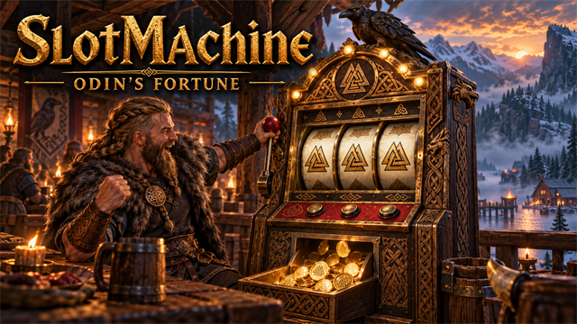
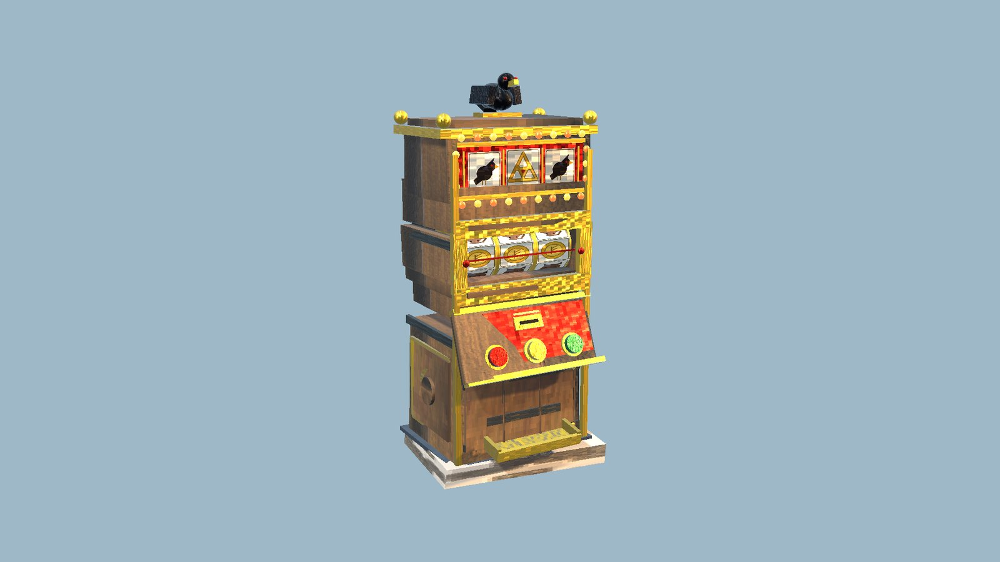
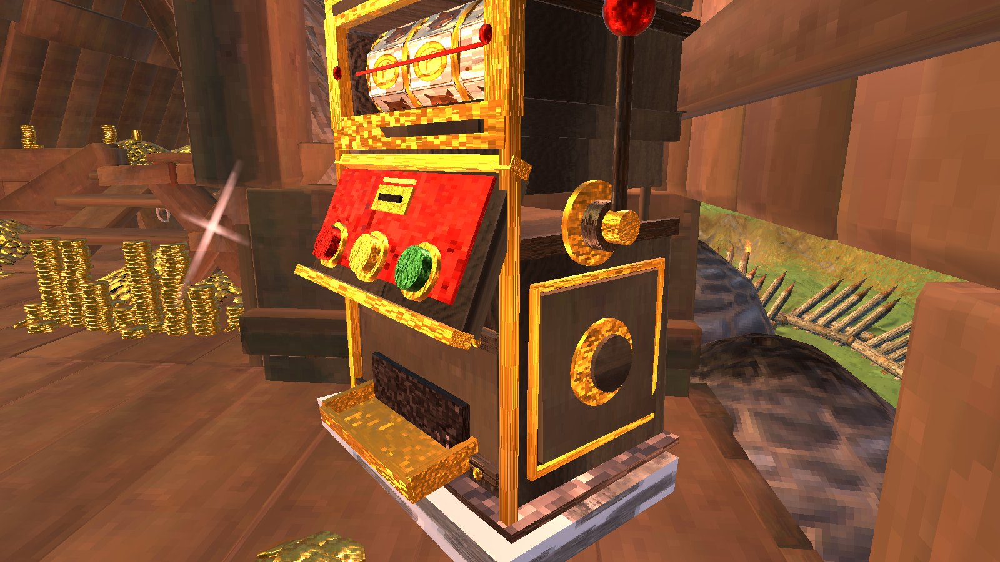
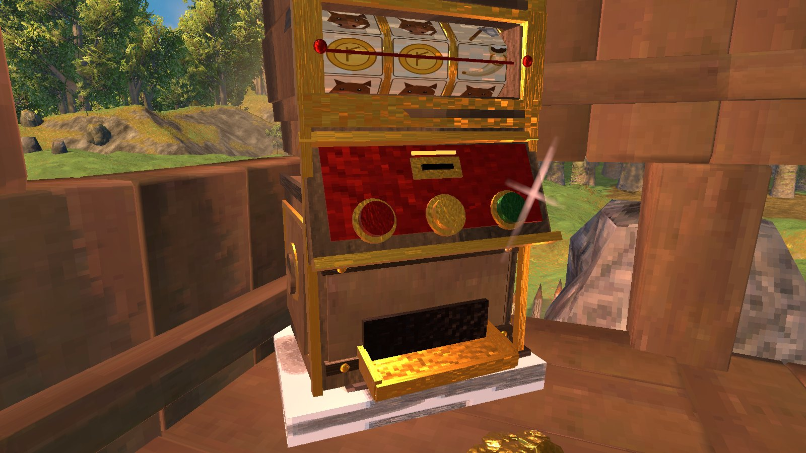

<!-- This page is made by tools/modpages/make_pages.py from the mod's DESCRIPTION.txt, CHANGELOG.txt, settings and the
     repo's README. Change those (or the HAND-WRITTEN part below), not the rest of this page. -->

# 🎰 SlotMachine

**Version 1.0.4**  ·  [all the mods](../../README.md)  ·  installs and updates through the in-game [mod manager](https://github.com/HardHeadHackerHead/valheim-mod-manager) (**F7**)

Odin's Fortune: build a slot machine, put coins in, pull the lever and watch three reels spin. Wins are spat out of the tray, and you can change the bet. It pays back about 93% over time, so it is for fun.

<!-- HAND-WRITTEN: kept when this page is made again -->
## 📸 Screenshots

**The Slot Machine**

**The machine at home, with the winnings piled up beside it**

**Its reels, its lamps and the coin tray**

<!-- END HAND-WRITTEN -->

## 🔍 How it works

Odin's Fortune: a buildable slot machine. Put coins in, pull the lever, and the winnings come out of the tray.

### How it works

- Build it with the hammer at a workbench: Fine Wood, Bronze and Stone.
- Press E to pull the lever. Your bet goes in, three reels spin and stop one after another, and a win is spat out of the tray as coins.
- Press the alternate-use key with E to change the bet (5, 10, 25, 50 or 100 coins).
- Three alike pay the most, from three Coins to three Valknuts (300 times your bet). Pairs of Coins, Ravens and Valknuts pay a little.
- Everyone nearby sees the same spin. The lamps chase each other while the reels turn and flash after a win.
- Over a long time it gives back about 93% of what goes in: a fun way to lose a few coins, not a way to make them.

It has its own hand-made look: carved dark wood and gold, a raven on top, a rune-marked marquee, a lever, buttons and a brass payout tray.

Settings let you change the bet and scale the prizes.

## ⌨️ Keys

| Key | What it does |
|---|---|
| **E** / alternate-use + **E** at a slot machine | Pull the lever / change the bet |

## ⚙️ Settings

In `BepInEx/config/com.dhack.slotmachine.cfg` (made the first time the game runs with the mod).

**Play**

| Setting | Default | What it does |
|---|---|---|
| `Bet` | `10` | Coins per pull (change it at the machine with the alternate-use key + use). |
| `PayoutPercent` | `100` | Scales every prize (100 = standard, which returns about 93% over time; 50 = half the prizes). |

## 👥 Playing together

Everyone in the world needs it, **the host above all**. It adds a new build piece. Restart the game after updating so it registers cleanly.

## 📜 Changes

- Fix: after a fresh game start the slot machine was not registered until the mods were reloaded, so the game deleted any it found standing in the world. It is now registered as the world loads. Ones already lost can't be brought back; build them again. Fix: logging out, or walking away so the machine unloads, before the reels stop no longer loses your bet's winnings: they go into your inventory.
- For testing, the machine costs a single Fine Wood (at a workbench). The real cost comes back after testing.
