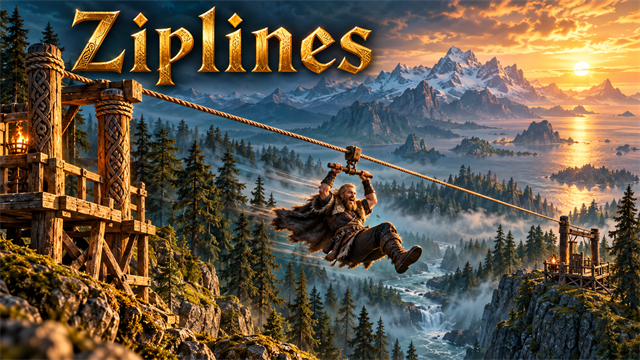
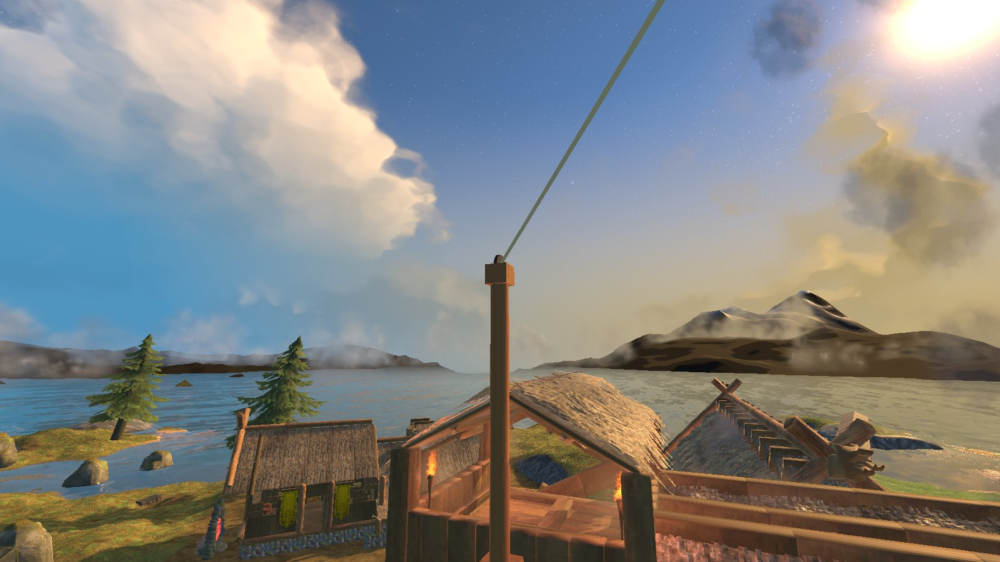
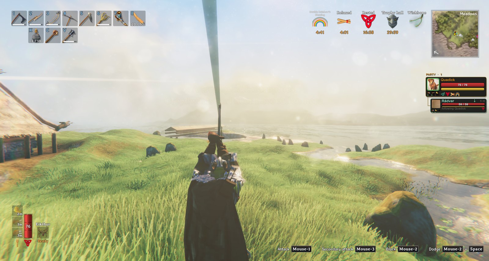
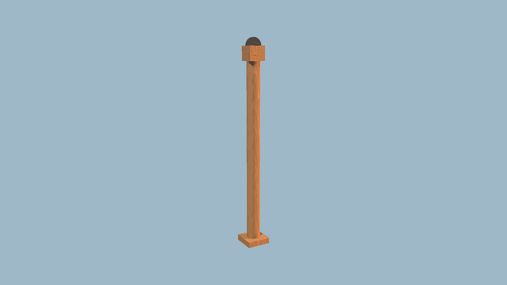

<!-- This page is made by tools/modpages/make_pages.py from the mod's DESCRIPTION.txt, CHANGELOG.txt, settings and the
     repo's README. Change those (or the HAND-WRITTEN part below), not the rest of this page. -->

# 🪢 Ziplines

**Version 0.2.1**  ·  [all the mods](../../README.md)  ·  install it from [Thunderstore](https://thunderstore.io/c/valheim/p/Quads_Lab/Quads_Ziplines/) (r2modman, Thunderstore Mod Manager) or the in-game [mod manager](https://github.com/HardHeadHackerHead/valheim-mod-manager) (**F7**)

Build two Zipline Posts (hammer, Misc) and link them with **E**: a rope runs between them, up to kilometres long. It only runs downhill. Press **E**
on the higher post, hook your axe over the rope and hang from its handle, both hands on it and your feet dangling, and slide down with the
view widening and the wind rising; longer lines are faster. Jump lets go. Everyone in the world needs it, and restart after installing.

<!-- HAND-WRITTEN: kept when this page is made again -->
## 📸 Screenshots

**A Zipline Post on the roof, its rope rising out over the bay**

**Riding down the line, hanging from your axe**

**The Zipline Post**

<!-- END HAND-WRITTEN -->

## 🔍 How it works

Ziplines: build two posts, run a rope between them and ride it, hanging from your axe.

### What is in it

- The Zipline Post is in the hammer menu (Misc). Build one, build another (a line can be kilometres long), press E on the first and then on the other, and a rope runs between them.
- A line only runs downhill: press E on the higher post to ride. You hook your axe over the rope and hang from its handle with both hands, feet dangling. Without an axe (or with the setting off) you hang from a wooden triangle instead.
- You are lifted to the rope and slide along it, faster downhill and faster on longer lines, the view widening and the wind rising, and are eased down at the far end. Press jump to let go. Shift+E on a post takes its line down.
- A line has to be rideable: it must fall enough, your feet must clear the ground all the way and nothing may stand in the way; if not, it says why.
- The lines are saved with the world (each post keeps its partner's place, so the far end need not be loaded), and others see you glide.

Settings: longest line, slope, speed (and a percentage to slow the whole ride), how far you hang below the rope, the widening view, the wind and its volume, and whether you need an axe.

Everyone in the world needs it installed (the post is a building piece: a game without the mod deletes it when its area loads). Restart after installing.

## ⚙️ Settings

In `BepInEx/config/com.quad.ziplines.cfg` (made the first time the game runs with the mod).

**Lines**

| Setting | Default | What it does |
|---|---|---|
| `MaxLength` | `12000` | The longest a zipline can be (metres). A line remembers where its other end is, so the far post does not have to be loaded: the world around you loads as you ride. In multiplayer the server's value applies. |
| `MinSlope` | `0.005` | How much a line must fall to be ridden, as a part of its length (0.005 is 5 m in every 1000). A line only runs downhill, from its higher post to its lower. In multiplayer the server's value applies. |

**Riding**

| Setting | Default | What it does |
|---|---|---|
| `LongLinesFaster` | `true` | The longer the line, the faster you go (up to eight times), so a line of kilometres takes minutes, not an hour. You slow down for the last stretch either way. In multiplayer the server's value applies. |
| `TopSpeed` | `24` | How fast you go downhill at the most (metres per second). In multiplayer the server's value applies. |
| `MinSpeed` | `5` | How fast you go on the flat or uphill at the least (metres per second). In multiplayer the server's value applies. |
| `HangBelowRope` | `2.5` | How far below the rope your feet hang (metres): your arms reach up to the handle, so this is about your height plus a little. |
| `NeedAnAxe` | `true` | You hook an axe over the rope and hang from its handle, so you need one with you to ride. Off, you hang from a wooden triangle instead. In multiplayer the server's value applies. |
| `SpeedPercent` | `50` | How fast the whole ride is, as a percent of the standard speed (50 is half as fast, 200 twice). In multiplayer the server's value applies. |
| `WindVolume` | `0.12` | How loud the wind is at full speed (0 to 1). |
| `WideView` | `true` | The view widens as you speed up, for the feel of it. |
| `WindSound` | `true` | The sound of the wind, rising with your speed. |

## 👥 Playing together

Everyone in the world needs it, **the host above all**. It adds a new build piece. Restart the game after updating so it registers cleanly.

## 🤖 Made with AI

Made with the help of Claude (Anthropic), with Claude Code: designed, written and checked together, and tried in the game.

## 📜 Changes

- **0.2.1** A new id, com.quad.ziplines (it was com.dhack.ziplines): your settings move over by themselves the first time it starts, and the old settings file is kept as a backup. Restart the game after this update. If an old copy is still installed beside it, this one stands down and says which file to delete, so the two never both run. The DLL now says it was made with AI, as Thunderstore asks. The log says so when Einherjer's Ziplines, a different mod with the same name, is installed too.
- **0.2.0** Running or taking down a line now needs the ward's leave at both posts, as building does (riding is still for anyone). In multiplayer the server decides the line and riding rules (MaxLength, MinSlope, the speeds, LongLinesFaster and NeedAnAxe). Letting go uses the game's Jump (your own key, or a gamepad), the wind follows the game's sound volume, and a problem with the post's look can no longer stop it being registered. Updating the mod now asks for a restart (it adds a build piece).
- Fix: no more stutter every 5 seconds. Looking for Claude Tools searched everything the game had loaded; it now asks BepInEx's list of mods.
- New: Zipline Posts. Build two, link them with E, and ride the downhill rope between them hanging from your axe.
